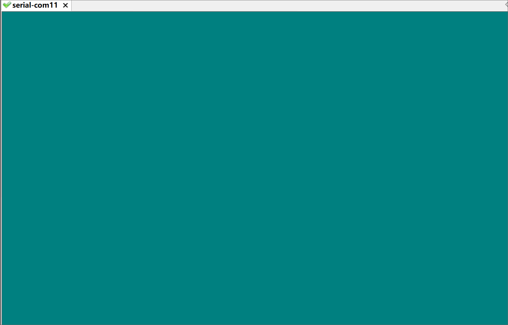

## 概述
从学嵌入式以来，还没有真正意义上的进行过uboot或Linux内核的移植，于是为了满足自己的好奇心和探索精神，打算将最新的uboot和Linux内核移植到开发板上，最近移植也接近了尾声，因此打算~~开一个深坑~~：写一篇较为完整的uboot+linux+rootfs移植的文章，如果有幸有人能读到，也是一种参考。

## 平台介绍
| 开发板 | 九鼎x210（s5pv210） |
| ------ | --------- |
| bootloader | u-boot-2017.09 |
| kernel | linux-4.10.0 |
| rootfs | build root |
| cross_compiler | arm-cortexa9-linux-gnueabihf-4.9.3 |

可以看到bootloader、kernel都是相对最新的，这也是为什么写这篇文章的原因，网上基于uboot和kernel移植的文章都太老了，也许嵌入式方向也需要一些新鲜的东西。根文件系统使用[build root](https://buildroot.org/)，build root能够简单快速地制作嵌入式根文件系统，并且能够自定义组件，可以手动添加如`git`、`zip`等常用命令，初始化进程（init system）可以选择`BusyBox`、`systemV`或者`systemd`，这里就采用`BusyBox`。
最后介绍下开发板中需要用到的资源，开发板是之前学习用的九鼎x210，芯片采用**s5pv210**，架构为Cortex-A8，主频1GHz，总共512MB的DDR内存，自带4GB的eMMC，两个SD卡插槽，网卡使用DM9000，四个LED灯（调试需要用到）。

## BSP
移植好的BSP已上传到github，[点击这里查看](https://github.com/colourfate/x210_bsp)。

## 最终效果
移植完成后最终效果如下所示：

这个版本很多驱动仍然没有移植，比如网卡驱动，LCD驱动等。就是说uboot是不支持TFTP下载，内核也是不支持NFS文件系统的，整个调试都是在SD卡中，后期会更新各个外设的驱动。

## 源码
这里给出BSP各个部分的来源：
1. uboot
从[uboot官网](ftp://ftp.denx.de/pub/u-boot/)下载的uboot，版本这里使用的是**2017.09**，可以直接点击下载，也可以右键复制链接，然后在linux中使用`wget`命令：
```bash
$ wget ftp://ftp.denx.de/pub/u-boot/u-boot-2017.09.tar.bz2
```

2. linux内核
因为使用的虚拟机，硬盘空间不够充足，就没有重新下载主线linux，而是使用的之前nanopi的linux内核，然后使用`git`命令切换到了master分支进行移植的。当前nanopi使用的是[主线内核linux-4.14](http://wiki.friendlyarm.com/wiki/index.php/Building_U-boot_and_Linux_for_H5/H3/H2+/zh)，而没有了当时我下载的4.10，不过关系不大，内核方面真正需要移植的内容较少，更多地是对内核进行配置。下载linux-4.14。
```bash
$ git clone https://github.com/friendlyarm/linux.git -b sunxi-4.14.y --depth 1
$ cd linux
$ git branch master
```
3. cross_compiler
方便起见，交叉编译工具链仍然采用之前nanopi的，[获取工具链](https://pan.baidu.com/s/1NAO1ryuMCmkyIT0lXMHEPw#list/path=%2FDVD%2FH3%2FNanoPi-NEO%2Ftoolchain&parentPath=%2FDVD%2FH3o)。
4. build root
build root的官方提供了[ftp服务器](https://buildroot.org/downloads/)，这里使用的是`buildroot-2018.08`，可以直接在Linux中使用wget命令获取：
```bash
wget https://buildroot.org/downloads/buildroot-2018.08.tar.gz
```


下一篇开始移植uboot，完成s5pv210的SD卡校验，使其能够载入BL1。