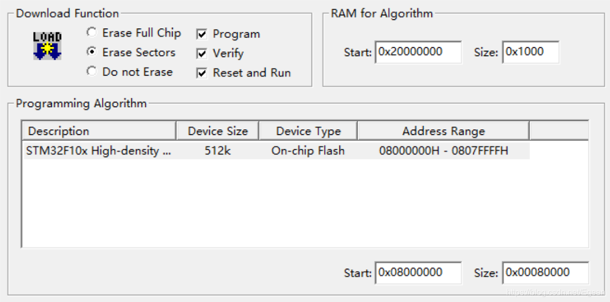
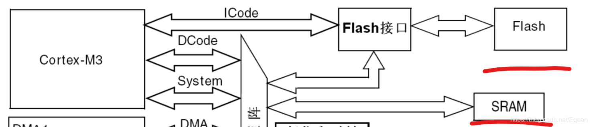

## 概述
uboot的初始化代码就是建立在芯片启动流程基础上的，因此在开始代码讲解之前，先看三星s5pv210的启动流程。三星系列芯片针对的都是手机、平板电脑等运行操作系统的设备，使用的是ARM-Cortex A系列架构。不同于STM32等单片机使用ARM-Cortex M系列架构，A系列针对是应用级处理器，M针对的是微控制器，下面引用一段博客的介绍^[https://www.cnblogs.com/locean/p/5710377.html]：
>ARMv7开始以Cortex来命名，并分成Cortex-A、Cortex-R、Cortex-M三个系列。三大系列分工明确：“A”系列面向尖端的基于虚拟内存的操作系统和用户应用；“R”系列针对实时系统；“M”系列对微控制器。

我们知道，对于一般的单片机而言，程序都是下载到flash当中，当单片机上电后会从flash中取出指令并执行，但是对于一般的应用级处理器而言，这个过程要复杂地多，下面就以STM32为对比，来讲解s5pv210的启动流程。

## 从STM32开始
为了使文章良好地过度，我们就从大家都熟悉的STM32开始。一般我们开发STM32程序都是在Windows下在MDK中使用C语言进行开发，然后编译代码生成二进制文件，最后通过编程器或串口烧写到STM32的flash中，在使用过MDK的朋友可能对下图比较熟悉：

这是MDK中JLINK的配置页面，其中可以看到，STM32F10x On-chip Flash的地址范围是`0x80000000 ~ 0x807FFFFF`，并且可以注意到其内部RAM的起始地址是`0x20000000`。
可以看到STM32内置了Flash和RAM两种存储器的，它们实际是挂在ARM Cortex-M3内核下的，如下图所示：

内核通过不同的地址就可以访问这两种存储器，因此STM32的执行程序的过程可以概述为：处理器访问Flash，取出指令然后执行，接着移动`PC指针`，取出下一条指令执行......
那么这个过程有没有什么问题呢？我们找到`startup_xxx.s`文件看一看。根据STM32的上电启动过程，首先设置SP指针，然后从`Reset_Handler`这个中断开始执行^[https://www.cnblogs.com/amanlikethis/p/3719529.html]，我们看看这个函数：
```cpp
Reset_Handler   PROC
                EXPORT  Reset_Handler             [WEAK]
                IMPORT  __main
                IMPORT  SystemInit			
                LDR     R0, =SystemInit	
                BLX     R0                  
                LDR     R0, =__main
                BX      R0
                ENDP
```
这个函数很简单，第一步执行`SystemInit`进行时钟初始化，然后跳转到`__main`函数，`__main`函数在C库当中，进行库函数相关的初始化，最终会跳到用户的`main`函数当中。

**在整个过程我们可以看到不管是访问Flash还是SRAM，都是上电后直接访问，而没有对其进行相关的初始化。**

我们知道不管是使用I2C接口、串口或SPI接口，还是访问传感器等硬件外设，一般是要进行初始化的，而这里STM32的Flash和SRAM做为挂在ARM内核外的一个外设没有初始化就可以使用，似乎是有点奇怪（当然在没有Flash的情况下也没办法初始化）。它们能够直接使用必定是有硬件基础来支持的。

## 浅谈FLASH和RAM
Flash和RAM实际是有很多种类型的，不同类型的Flash和RAM都有其特点，像STM32因为不需要太大空间因此使用了其中成本较高的方案，而嵌入式处理器上常常使不同的Flash和RAM组合来降低成本。
首先是Flash，简单介绍以下几种^[https://baike.baidu.com/item/Flash%E5%AD%98%E5%82%A8%E5%99%A8/1254787?fr=aladdin] ^[https://baike.baidu.com/item/iNand/6812487]：
 * NANDFlash：这种Flash的优点是成本较低，容量可以做得很大，超过 512MB 容量的 NAND 产品相当普遍，缺点是需要特定的读写时序，需要对相关的控制器进行初始化，读写是以页和块为单位来进行，意味着程序需要拷贝到RAM中才能运行。
 * NORFlash：NOR的优点是程序可以直接在flash闪存内运行，读取速度快，不需要进行初始化，缺点是成本高，没法做出很大的容量。
 * iNAND：可以简单的看成SD卡或MMC卡芯片化，优点是读写速度快，成本低，使用简单，缺点是仍然是需要初始化，并且读写是以页和块为单位来进行。

RAM就简单介绍DRAM^[https://baike.baidu.com/item/DRAM/149572?fr=aladdin]和SRAM ^[https://baike.baidu.com/item/SRAM/7705927?fr=aladdin]两种：
 * DRAM：动态随机存取存储器，DRAM使用电容存储，所以必须隔一段时间刷新（refresh）一次，如果存储单元没有被刷新，存储的信息就会丢失。因此缺点是需要代码来初始化和维持刷新，优点是成本低，容量大。
 * SRAM：静态随机存取存储器,所谓的“静态”，是指这种存储器只要保持通电，里面储存的数据就可以恒常保持。因此优点是不需要代码初始化，缺点是成本高，往往容量不能做很大。

由此可以看到，STM32由于不需要太大容量，使用的是NORFlash和SRAM，因此可以开机直接访问。而对于s5pv210，外接4GB容量Flash，内存为512MB，肯定不能使用这种方案的。

## s5pv210启动流程
一般嵌入式芯片使用的都是小容量NORFLASH和SRAM+大容量NAND和DRAM的组合。像s5pv210芯片就==内置了64KB的iROM，和96KB的SRAM==，其中iROM内固化了一些初始化代码，这两个存储器都是可以上电直接运行的。
然后再看开发板的外设，九鼎x210开发板在芯片的SD通道0（简称SD0）在外接了4GB的iNand，SD2接到一个SD卡插槽，内存方面使用的512MB的DRAM，接在`0x30000000 ~ 0x50000000`地址上。
整个芯片的启动流程如下图所示：

1. 芯片上电，首先访问iROM，执行其中的初始化代码，这段代码称为==BL0==。BL0会判断我们所选择的==启动介质==（启动介质通过开发板上的一个开关选择），这里选择的是SD卡，因此iROM会依次访问SD0和SD2，如发现SD卡或iNand中有代码，会将拷贝SD卡的前16KB的数据到SRAM中，然后跳转到SRAM中执行。
2. 拷贝到SRAM这段代码称为==BL1==，注意，这是我们自己写的一段代码。由于SRAM只有96KB，因此这段代码大小只有16KB。
3. 在BL1中我们会对==外部的DRAM进行初始化==，初始化完成后我们就拥有了512MB的内存，此时拷贝SD卡中第二段代码到DRAM中，然后跳转到DRAM中执行（这里和上图不一致）。
4. 拷贝到DRAM中的这段代码称为==BL2==，在BL2中我们就可以针对内核进行传参，然后启动内核了。

结合uboot，以上的BL1和BL2都是uboot代码，只是它们被烧写到了SD卡中不同的扇区，然后在不同时间加载到内存中。