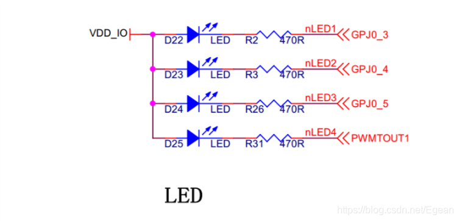
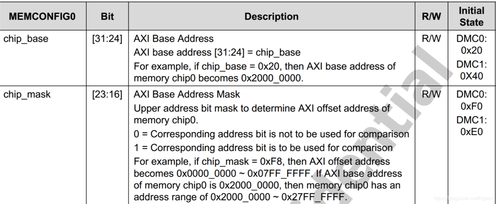

## 概述
上一节讲了uboot启动的第一阶段，其中会调用一个lowlevel_init函数对进行底层硬件初始化，然后完成==重定位==，这一节开始对底层硬件初始化作介绍，主要包括：LED灯，电源锁存，时钟，串口和DRAM。

## LED灯
打开`board/samsung/x210/lowlevel_init.S`文件，查看`lowlevel_init()`函数，首先是检查是否需要重定位：
```cpp
ldr	r0, =0x0000ffff
	bic	r1, pc, r0					// 实际载入地址（SRAM）的高16位存到r1
	ldr	r2, =CONFIG_SYS_TEXT_BASE
	bic	r2, r2, r0					// 链接地址的高16位存到r2
	cmp     r1, r2
	beq     after_cop
```
这一段先暂且跳过，接下来读取CPU ID，确定是芯片是s5pc100还是s5pc110，从而确定GPIO基地址，存到：
```cpp
	ldr	r7, =S5PC100_GPIO_BASE
	ldr	r8, =S5PC100_GPIO_BASE
	/* Read CPU ID */
	ldr	r2, =S5PC110_PRO_ID
	ldr	r0, [r2]
	mov	r1, #0x00010000
	and	r0, r0, r1
	cmp	r0, r5
	beq	100f
	ldr	r8, =S5PC110_GPIO_BASE
```
因为这个lowlevel_init是从三星的`goni`开发板移植的，那块开发板同时支持s5pc100和s5pc110，而我们的芯片是s5pv210，与s5pc110属于同一系列，除了封装不同，其他基本一致，因此这一段执行完后`r7 = S5PC100_GPIO_BASE`
，`r8 = S5PC110_GPIO_BASE`。
下一步进行空闲状态检测和空闲状态唤醒，这也是原文件自带的，我保留了下来：
```cpp
100:
	/* Turn on KEY_LED_ON [GPJ4(1)] XMSMWEN */
	cmp	r7, r8
	beq	skip_check_didle			@ Support C110 only

	ldr	r0, =S5PC110_RST_STAT
	ldr	r1, [r0]
	and	r1, r1, #0x000D0000
	cmp	r1, #(0x1 << 19)			@ DEEPIDLE_WAKEUP
	beq	didle_wakeup
```
这一段不重要，因为我们的`r7`和`r8`不等，因此会检查芯片是否在空闲状态，是的话就从空闲状态唤醒。
接下来的是我们自己写的第一段程序，LED初始化，然后关闭所有LED灯：
```cpp
skip_check_didle:	
	/* 关闭所有LED */
	addne	r0, r8, #0x240				@ S5PC110_GPIO_J0
	ldr	r1, [r0, #0x0]				@ GPIO_CON_OFFSET
	bic	r1, r1, #(0xf << 12)		@ 1 * 4-bit
	bic r1, r1, #(0xf << 16)
	bic r1, r1, #(0xf << 20)
	orr	r1, r1, #(0x1 << 12)		@ J0_3/4/5设置为输出
	orr r1, r1, #(0x1 << 16)
	orr r1, r1, #(0x1 << 20)
	str	r1, [r0, #0x0]				@ GPIO_CON_OFFSET
	
	/* GPJ0_3/4/5熄灭，表示0*/
	ldr	r1, [r0, #0x4]				@ GPIO_DAT_OFFSET
	orr	r1, r1, #(7 << 3)
	str	r1, [r0, #0x4]				@ GPIO_DAT_OFFSET
```
第三行执行后，`r0 = S5PC110_GPIO_J0 + 0x240 = 0xE0200240`，这里`0xE0200240`为芯片`GPJ0`端口寄存器的基地址，而`GPJ0_3`，`GPJ0_4`和`GPJ0_5`连接到了LED灯，具体看开发板原理图和s5pv210数据手册：



因此这里第4行读取了`GPJ0CON`寄存器的值，然后`5 ~10行`修改这个值，将`GPJ0_3/4/5`设置为输出，11行将这个值写回`GPJ0CON`寄存器。`14~15`行设置`GPJ0_3/4/5`为1，关闭所有LED灯。

## 电源供电锁存
接下来进行电源供电锁存。x210开发板使用的是`软开关`，这个开关是一个不会自锁的按钮，当按下时给芯片通电，弹起时芯片断电，想要给芯片持续供电，需要软件给供电锁存，我们先看开发板电源部分的原理图：


这个电路稍微有的复杂，因此解释一下，首先`SW1`是就是按钮开关，按下时1、2管脚和3、4管脚导通；`Q5`是一个PMOS场效应管，特点是G级高电平时关断，低电平时导通；`Q6`是一个NPN型的三极管，当B级高电平时导通；`D8`是个二极管，正向压降1V；`U4`是个DC-DC芯片，这里是将9V转为5V，当EN为高电平时工作，低电平时关闭。
当`SW1`没有按下时，电路呈高阻态，`Q5`的G级被上拉到`VDD_IN`也就是9V，Q5关断，`U4`的EN端被下拉到`GND`，`U4`不工作。
当`SW1`按下时，`D8`负极接地，正极变为1V，`Q5`的G级为低电平，所以导通，因此`U4`的EN端为`(VDD_IN - 1) / 2 = 4V`，变为高电平，`U4`工作，芯片上电。
注意，此时如果松开`SW1`，芯片又会掉电，所以我们在芯片上电后，需要使用代码将此时的供电给锁定下来，为此需要将`EINT0`设置为高电平。
`EINT0`是高电平，三极管`Q6`导通，`Q5`的G级接地，此时松开`SW1`供电仍然能够维持。
`EINT0`连接到芯片的`GPH0_0`：

因此这里需要将`GPH0_0`设置为高电平，代码如下所示：
```cpp
	/* 开发板供电锁存 */
	ldr r0, =(S5PC110_CLOCK_BASE + 0xE81C)
	ldr	r1, [r0]
	orr	r1, r1, #0x300	
	orr	r1, r1, #0x1	
	str	r1, [r0]
```

## 时钟和串口
之后一大段代码都是goni开发板原文件中的，我对其进行了保留，主要是初始化EVT1异步寄存器、IO retension release（求翻译）、关看门狗、设置SRAM、设置中断源，这部分代码是芯片内部资源，不是重点。接下来是芯片的时钟初始化和串口初始化：
```cpp
// 229行
bl system_clock_init
// 238行
bl	uart_asm_init
```
这两个函数都在`lowlevel_init.S`文件当中，是从x210原版uboot中复制过来的，主要是将时钟主频设置为1GHz，然后将UART2初始化为115200，完成后打印一个'O'。
时钟部分基本没有修改，串口初始化部分保留了goni的一部分：
```cpp
/*
 * uart_asm_init: Initialize UART's pins
 */
uart_asm_init:
	/* set GPIO to enable UART0-UART4 */
	mov	r0, r8
	ldr	r1, =0x22222222
	str	r1, [r0, #0x0]			@ S5PC100_GPIO_A0_OFFSET
	ldr	r1, =0x00002222
	str	r1, [r0, #0x20]			@ S5PC100_GPIO_A1_OFFSET

	/* Check S5PC100 */
	cmp	r7, r8
	bne	110f

	/* UART_SEL GPK0[5] at S5PC100 */
	add	r0, r8, #0x2A0			@ S5PC100_GPIO_K0_OFFSET
	ldr	r1, [r0, #0x0]			@ S5PC1XX_GPIO_CON_OFFSET
	bic	r1, r1, #(0xf << 20)		@ 20 = 5 * 4-bit
	orr	r1, r1, #(0x1 << 20)		@ Output
	str	r1, [r0, #0x0]			@ S5PC1XX_GPIO_CON_OFFSET

	ldr	r1, [r0, #0x8]			@ S5PC1XX_GPIO_PULL_OFFSET
	bic	r1, r1, #(0x3 << 10)		@ 10 = 5 * 2-bit
	orr	r1, r1, #(0x2 << 10)		@ Pull-up enabled
	str	r1, [r0, #0x8]			@ S5PC1XX_GPIO_PULL_OFFSET

	ldr	r1, [r0, #0x4]			@ S5PC1XX_GPIO_DAT_OFFSET
	orr	r1, r1, #(1 << 5)		@ 5 = 5 * 1-bit
	str	r1, [r0, #0x4]			@ S5PC1XX_GPIO_DAT_OFFSET

	b	200f
110:
	/* 配置UART2，波特率115200，完成后输出'O' */	
	ldr	r0, =ELFIN_UART_CONSOLE_BASE		@0xE2900800
	mov	r1, #0x0
	str	r1, [r0, #UFCON_OFFSET]
	str	r1, [r0, #UMCON_OFFSET]

	mov	r1, #0x3
	str	r1, [r0, #ULCON_OFFSET]

	ldr	r1, =0x3c5				@0b0011_1100_0101
	str	r1, [r0, #UCON_OFFSET]

	ldr	r1, =UART_UBRDIV_VAL
	str	r1, [r0, #UBRDIV_OFFSET]

	ldr	r1, =UART_UDIVSLOT_VAL
	str	r1, [r0, #UDIVSLOT_OFFSET]

	ldr	r1, =0x4f4f4f4f
	str	r1, [r0, #UTXH_OFFSET]		@'O'
200:
	mov	pc, lr
```
这里首先将GPA_0和GPA_1都复用为串口，然后跳转到110，将波特率设置为115200，最后打印一个字符'O'，最后返回。

## DRAM初始化
之前说过，s5pv210启动时，首先执行iROM里面固化的代码，然后这段代码会将SD卡的前16KB拷贝到内部的SRAM中运行，也就是说之前的所有代码都是在内部的SRAM中运行的。==uboot最终的目的是启动内核==，而SRAM大小只有96KB，对于内核来说是肯定不够的，因此必须将外部的DRAM初始化，然后将uboot==重定位==到DRAM中。
DRAM初始化在279行：
```cpp
	/* dram初始化 */
	bl	mem_ctrl_asm_init
```
`mem_ctrl_asm_init()`函数在`board/samsung/x210/dram_init.S`文件中，该文件也是从x210原版uboot中拷贝过来的。由于这个时候还没有设置栈，因此这段代码是用汇编实现的。
s5pv210的内存映射如下图所示：

其中DRAM0和DRAM1就是ARM内核用来访问内存的地址，分别对应芯片的不同端口：

这里Memory Port1就对应DRAM0，Memory Port2对应DRAM1，再来看看x210开发板使用的DRAM：

x210使用了4片如上所示的DRAM，一片大小为128MB，总共512MB。其中两片接在Memory Port1上，两片接到Memory Port2上，也就是说通过访问DRAM0就可以访问到前256MB内存，访问DRAM1就可以访问到后256MB内存。

这里的初始化实际就是设置该DRAM的访问时序，具体如何设置需要参考数据手册，这里不用深入。初始化还完成的一件重要的事就是==决定内存的映射地址==。

从以上的分析可以发现一个问题，就是DRAM0的地址范围是`0x20000000 - 0x3FFFFFFF`，总共512MB，而我们只接了256MB的内存到DRAM0上，那么这256MB映射到了DRAM0的哪一段上呢？

这可以在DRAM初始化时通过设置`MEMCONFIG0`寄存器来指定，这个部分代码在`board/samsung/x210/dram_init.S`的第126行：

```cpp
	ldr	r1, =DMC0_MEMCONFIG_0			@MemConfig0 256MB config, 8 banks,Mapping Method[12:15]0:linear, 1:linterleaved, 2:Mixed
	str	r1, [r0, #DMC_MEMCONFIG0]
	
	ldr	r1, =DMC0_MEMCONFIG_1			@MemConfig1
	str	r1, [r0, #DMC_MEMCONFIG1]
```
其中`DMC0_MEMCONFIG_0`的值是`0x30F01313`，而`MEMCONFIG0`寄存器描述如下：

这里chip_base是0x30，chip_mask是0xF0，那么根据数据手册描述，这个内存映射到`0x30000000 - 0x3FFFFFFF`，总共256MB内存。DRAM1的内存映射也是类似的，`DMC0_MEMCONFIG_1`的值是：`0x40F01313`，也就是映射到`0x40000000 - 0x4FFFFFFF`。

DRAM初始化完成后，我们就可以正常地访问`0x30000000 - 0x4FFFFFFF`总共512MB的内存了。最后我们再进行内存读写的测试，看是否内存能够正常使用，见`lowlevel_init.S`的281行：

```cpp
	/* 设置栈在DRAM上，地址为：0x33E00000-12 */
	//ldr	sp, =0xD0036000 	/* setup temp stack pointer */
	ldr	sp, =0x33E00000
	sub	sp, sp, #12
	mov	fp, #0			/* no previous frame, so fp=0 */

	// 1，测试栈
	ldr	r0, =ELFIN_UART_CONSOLE_BASE
	ldr	r1, =0x4A4A4A4A
	push {r1}
	ldr r1, =0x4B4B4B4B
	pop {r1}
	str	r1, [r0, #UTXH_OFFSET]
```

首先将栈设置到`0x33E00000 - 12`的地址上，这个地址在DRAM中，然后将`0x4A4A4A4A`压栈，这个数字将写到DRAM中，然后再出栈，也就是读取DRAM，最后使用串口打印这个数字，如果正常串口将会打印出'J'。