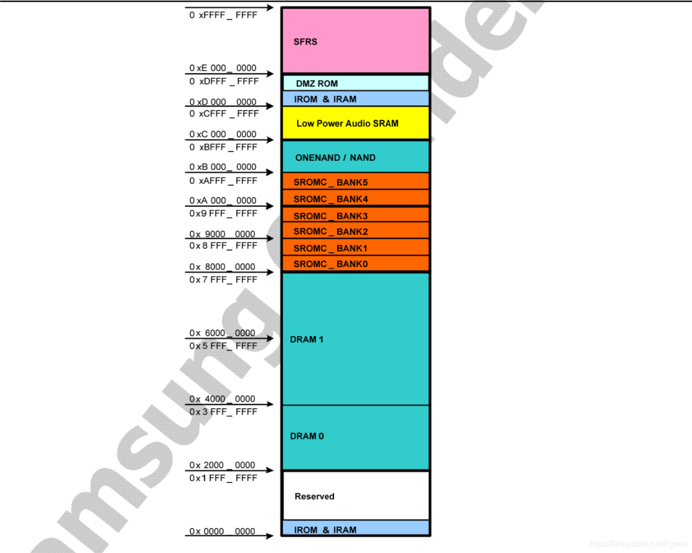
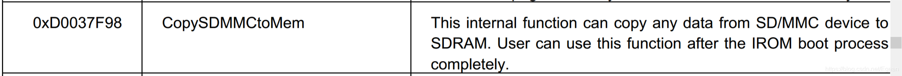

## 概述
上一节初始化好了串口和LED，我们可以用它们进行调试；也设置好了时钟和DRAM，为uboot的重定位做好准备。之前所做的所有工作都是在BL1中，也就是uboot的前16KB，而大部分uboot的代码还在SD卡中没有载入内存，没有载入内存的原因是之前我们使用的是内部SRAM，容量不足以放下整个uboot，而现在已经初始化好了外部DRAM，拥有了512MB内存，是完完全全够放下整个uboot，所以这里的重定位就是将SD卡中BL2的部分载入到DRAM中，然后跳转到DRAM中去运行。
需要注意的是，uboot-2017在启动的后期也会进行一次重定位，目的是将uboot搬运到DRAM末尾部分，方便在内核的加载，这个重定位是uboot事先设置好的，不用我们自己实现。也就是说我们uboot的启动总共需要进行两次重定位，这里讲的是第一次重定位。

## 代码段和数据段
重定位的概念比较难以理解，为了讲清楚我尽量详细一些。首先需要清楚什么是代码段和数据段。
首先回顾一下CPU是如何执行指令的，来看如下一段汇编：
```cpp
	ldr	r0, =0x30000000
	ldr	r1,	=0xe10
	str	r1,	[r0]
```
这段代码就是将`0xe10`这个数字写入到`0x30000000`这个地址，而根据前面分析，`0x30000000`是我们的DRAM，因此段代码就是将`0xe10`写入DRAM中。假如说这段代码就是在我们的BL1当中，我们来详细分析一下CPU执行这段指令的过程。
首先BL1是载入到s5pv210的SRAM中的，而SRAM和DRAM一样是接到ARM内核上的，ARM内核通过访问一个固定的地址就可以访问到SRAM，这个地址在哪里呢？重新贴一下上一节的图：



可以看到，SRAM（也就是IRAM）的起始地址是`0xD0000000`（实际上是0xD0020000），也就是说以上这段代码实际上是被载入到了`0xD0000000 - 0xDFFFFFFF`的某个位置当中，假设是`0xD0021000`吧，CPU通过PC指针的值访问`0xD0021000`就可以载入`ldr	r0, =0x30000000`这段代码，然后执行，随后r0寄存器的值被设置为`0x30000000`，PC指针指向下一个地址`0xD0021004`（32位指令宽，先不考虑流水线），载入指令`ldr	r1,	=0xe10`，随后r1被设置为`0xe10`，PC再指向下个地址`0xD0021008`，载入指令`str	r1,	[r0]`，CPU访问r0指向的地址，也就是`0x30000000`，最后将r1的值存入其中。
这里可以明显地看到，代码（也就是我们输入的指令）和数据（这里是0xe10）是分开存储在两个存储器中的，代码在SRAM中，地址是`0xD0021000`，数据在DRAM中，地址是`0x30000000`。我们就称存储代码的那段内存为==代码段==，而存储数据的那段内存为==数据段==。

>**注意**
>代码段和数据段只是为了便于区分而人为定的一个叫法，它们对应的都是内存，没有硬件上的区别，只是用途不同，因此代码段和数据段并不一定要分开在两个存储器中，只有能保证它们不相互覆盖，在同一个存储器（如DRAM）中也是完全可行的。


## 链接地址和载入地址
接下来介绍==链接地址==和==载入地址==，首先需要明白的是链接地址和载入地址都是针对代码段而言的。
首先是链接地址，我们先来看uboot的反汇编文件，在uboot根目录执行以下命令反汇编uboot：
```cpp
arm-linux-objdump -S u-boot > u-boot.dmp
```
打开`u-boot.dmp`，我从中随便截取一段：
```cpp
33e00060:	e51fd028 	ldr	sp, [pc, #-40]	; 33e00040 <IRQ_STACK_START_IN>
33e00064:	e58de000 	str	lr, [sp]
33e00068:	e14fe000 	mrs	lr, SPSR
33e0006c:	e58de004 	str	lr, [sp, #4]
33e00070:	e3a0d013 	mov	sp, #19
33e00074:	e169f00d 	msr	SPSR_fc, sp
33e00078:	e1a0e00f 	mov	lr, pc
33e0007c:	e1b0f00e 	movs	pc, lr
```
以第一行为例，其中`33e00060`是代码段地址，`e51fd028`是机器码，`ldr	sp, [pc, #-40]`是对应的指令。这里的代码段地址`0x33e00060`就是==链接地址==。
我们可以看到，`0x33e00060`还在16KB的范围内，应该属于BL1的部分，而经过上面的分析，BL1的地址应该在`0xD0000000 - 0xDFFFFFFF`的范围内，和链接地址不符，为什么会出现这种情况呢？

这是因为上面分析的地址是代码的实际==载入地址==。

讲到这里，必须分析一下我们代码编译的过程。我们目前写的代码都是汇编代码，汇编代码会被编译器翻译为ARM的机器码，在这个翻译的过程中，编译器需要知道代码的将来会被载入的地址，这个地址是需要程序员手动指定的（若没有指定则默认为0），因为编译器在程序运行之前，是无法知道程序会被载入到那个地址运行的，这个手动指定的地址就是==链接地址==。
uboot中的链接地址在`include/configs/x210.h`文件中的32行指定：
```cpp
#define CONFIG_SYS_TEXT_BASE		0x33E00000
```
指定了链接地址过后，编译器就认为第一条代码的地址是`0x33E00000`，并以此来计算其他代码的地址。
而我们BL1实际上是载入到SRAM中运行的，地址也不是`0x33E00000`，也就是说链接地址和载入地址是不一致的，这就会导致一个问题，那就是如果执行==位置有关码==将会造成错误。

## 位置有关码和位置无关码（PIC）
编译器编译汇编代码的同时，会需要用到代码的地址，这些地址通过函数名和标号体现，举个简单的例子：
```cpp
	ldr r0, =main

main:
	...
```
该指令会将`main`函数的地址加载到r0寄存器中，而编译器在编译这段代码时不知道main函数的实际载入地址，因此r0中存储的就是`main`函数的链接地址，也就是说如果将来程序没有按链接地址载入，那么r0中存储的地址就是一个错误的地址，因此这是一个位置有关码。
关于具体哪些指令是位置有关码，那些是位置无关码，以及它们的详细分析可以参考博客：https://blog.csdn.net/lizuobin2/article/details/52049892

## 载入BL2到DRAM
程序执行到当前为止都是在SRAM中运行，运行的程序为uboot的前16KB，也就是BL1，而我们最终的目的是在DRAM中运行整个uboot。现在DRAM已经初始化完毕可以使用，现在需要做的是将SD卡的BL2拷贝到DRAM中，然后跳转到DRAM中执行。完成这个拷贝工作的是lowlevel_init.S的296行的`movi_bl2_copy`函数，该函数定义在`board/samsung/x210/movi.c`文件中：
```cpp
typedef u32(*copy_sd_mmc_to_mem)
(u32 channel, u32 start_block, u16 block_size, u32 *trg, u32 init);

void movi_bl2_copy(void)
{
	ulong ch;
#if defined(SET_EVT1)
	ch = *(volatile u32 *)(0xD0037488);
	copy_sd_mmc_to_mem copy_bl2 =
	    (copy_sd_mmc_to_mem) (*(u32 *) (0xD0037F98));

	#if defined(CONFIG_SECURE_BOOT)
	ulong rv;
	#endif
#else
	ch = *(volatile u32 *)(0xD003A508);
	copy_sd_mmc_to_mem copy_bl2 =
	    (copy_sd_mmc_to_mem) (*(u32 *) (0xD003E008));
#endif
	u32 ret;
	if (ch == 0xEB000000) {
		ret = copy_bl2(0, MOVI_BL2_POS, MOVI_BL2_BLKCNT,
			(u32 *)CONFIG_SYS_TEXT_BASE, 0);
#if defined(CONFIG_SECURE_BOOT)
		/* do security check */
		rv = Check_Signature( (SecureBoot_CTX *)SECURE_BOOT_CONTEXT_ADDR,
				      (unsigned char *)CONFIG_SYS_TEXT_BASE, (1024*512-128),
			              (unsigned char *)(CONFIG_SYS_TEXT_BASE+(1024*512-128)), 128 );
		if (rv != 0){
				while(1);
			}
#endif
	}
	else if (ch == 0xEB200000) {
		ret = copy_bl2(2, MOVI_BL2_POS, MOVI_BL2_BLKCNT,
			(u32 *)CONFIG_SYS_TEXT_BASE, 0);
		//ret = copy_bl2(2, 49, 1024, (u32 *)CONFIG_SYS_TEXT_BASE, 0);
#if defined(CONFIG_SECURE_BOOT)
		/* do security check */
		rv = Check_Signature( (SecureBoot_CTX *)SECURE_BOOT_CONTEXT_ADDR,
				      (unsigned char *)CONFIG_SYS_TEXT_BASE, (1024*512-128),
			              (unsigned char *)(CONFIG_SYS_TEXT_BASE+(1024*512-128)), 128 );
		if (rv != 0) {
			while(1);
		}
#endif
	}
	else {
		return;
	}

	if (ret == 0) {
		while (1);
	} else {
		return;
	}
}
```
注意，这里是一段C语言代码，这是因为在上一节最后已经把栈设置在了`0x33E00000-12`的位置，因此能够使用C语言了，这里`SET_EVT1`是定义了的，因此执行：
```cpp
	ch = *(volatile u32 *)(0xD0037488);
	copy_sd_mmc_to_mem copy_bl2 =
	    (copy_sd_mmc_to_mem) (*(u32 *) (0xD0037F98));
```
`0xD0037488`是一个寄存器，如果从MMC启动，里面存有启动的通道号，这里是从SD2启动的，里面的数据是`0xEB200000`，从SD0启动则为`0xEB000000`。

`copy_sd_mmc_to_mem`是我们定义的一个函数指针类型，`copy_bl2`指向`0xD0037F98`地址，该地址是iROM区域，其中固化一段读取SD卡并拷贝到指定内存地址的程序：

我们能够直接调用`copy_bl2`来拷贝SD卡中的数据，接下来正式进行拷贝：
```cpp
	ret = copy_bl2(2, MOVI_BL2_POS, MOVI_BL2_BLKCNT,
			(u32 *)CONFIG_SYS_TEXT_BASE, 0);
```
其中有：
```cpp
/* BL2开始扇区为49号扇区，大小为512KB，也就是1024个扇区 */
#define MOVI_BL2_POS 49
#define MOVI_BL2_BLKCNT ((512 * 1024) / 512)
#define CONFIG_SYS_TEXT_BASE		0x33E00000
```
因此这里就是把SD卡中的49扇区开始的1024个扇区，拷贝到`0x33E00000`地址处，共512KB。
低49扇区就是我们uboot在SD卡中的位置，这是我们将uboot镜像烧写到SD卡中的位置，在`build.sh`文件中：
```bash
UBOOTPOS=49
dd iflag=dsync oflag=dsync if=u-boot.bin of=$SDDEV seek=$UBOOTPOS
```
而之前查看过uboot大小为380KB，因此是把整个uboot拷贝到了DRAM中。

## 重定位
拷贝完成后就可以进行最重要的重定位了，我这里重定位是选择跳转到`_start`函数，见`lowlevel_init.S`的304行：
```cpp
	/* 完成重定位 */
	ldr pc, =_start
```
经过前面分析，这一个位置有关码，会将`_start`标号的地址载入PC指针，从而实现一个==长跳转==，`_start`标号在`arch/arm/lib/vector.S`文件的48行，这个文件是链接脚本的第一个文件，也就是说`_start`标号的地址是`0x33E00000`，CPU从DRAM中载入程序运行，完成重定位。
注意，这里跳转完成后，势必会从`_start`处开始运行，将前面的执行过的程序重新执行一遍，这是没有关系的，分岔点在于进入`lowlevel_init`函数之后，根据之前分析，`lowlevel_init`函数开头会进行一个是否已经重定位的判断：
```cpp
	// 检查是否需要重定位
	ldr	r0, =0x0000ffff
	bic	r1, pc, r0					// 实际载入地址（SRAM）的高16位存到r1
	ldr	r2, =CONFIG_SYS_TEXT_BASE
	bic	r2, r2, r0					// 链接地址的高16位存到r2
	cmp     r1, r2
	beq     after_copy
```
如果已经完成重定位，则执行到此处PC指针的偏移量还在16KB的范围内，也就是说PC的范围是`0x33E00000 - 0x33E03FFF`，那么屏蔽PC指针的低16位，可以得到`0x33E00000`，这和链接地址一致，说明已经完成重定位。
否则PC指针的范围在`0xD0020000 - 0xD0038000`，屏蔽低16位后不等于链接地址，说明没有重定位。

在判断重定位完成后，就会直接跳转到`after_copy`处运行，跳过之前的硬件初始化：
```cpp
after_copy:

	/* 串口打印'K' */
	ldr	r0, =ELFIN_UART_CONSOLE_BASE
	ldr	r1, =0x4b4b4b4b
	str	r1, [r0, #UTXH_OFFSET]

	b	1f

...

1:
	mov	lr, r11
	mov	pc, lr
```
串口打印'K'，然后`lowlevel_init`函数返回。