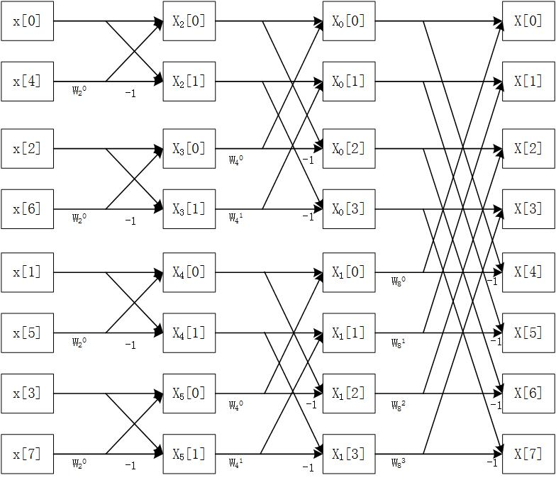

上一篇文章当中已经推导出了整个频域上的表达式，这个表达式叫做蝶形运算，下面就借由蝶形运算实现FFT算法。

那么首先就要先说说蝶形运算。蝶形运算听着挺高大上的，但可以有一种简单方便的图形表示方法，为方便起见我这里再贴一次公式：

----------
$$
X[k]=X_0[k]+W_N^{k}X_1[k]
$$
$$
X[k+\frac N2]=X_0[k]-W_N^{k}X_1[k]
$$

----------
那么这个蝶形运算可以用图形表示为


当然，可以看出一次蝶形运算虽然简化了运算，但仍然需要知道 $X_0[k]$ 和 $X_1[k]$ ，就是说在进行蝶形运算之前我们仍需对 $x_0[n]$ 和 $x_1[n]$ 进行DFT得到$X_0[k]$ 和 $X_1[k]$ 然后才能得到完整的$X[k]$ ，我们知道DFT运算起来是很麻烦的，但是注意到，这里DFT的运算量已经减少了一半，也就是每次只对$\large \frac N2$个点进行DFT，那么可以由此得到启示，能不能像得到 $X[k]$ 一样通过蝶形运算来得到 $X_0[k]$ 和 $X_1[k]$ 呢？这是可以的，对于 $X_0[k]$ 只需将其分为奇偶两组，然后再通过一次蝶形运算即可得到 $X_0[k]$ ，这时单次DFT的运算量为$\large \frac N4$，重复以上过程，直到DFT的运算量为1，此时就会出现一个有趣的事情：


----------


$$
X[0]=\sum\limits_{n=0}^{0} x[n]e^{-i\frac{2\pi *0}{N}n}=x[0]
$$


----------

此时就不需进行DFT了，直接进行蝶形运算就可以了，这就是FFT算法。以上的说明可能比较抽象，下面举一个8点FFT的例子，假设使用$x[0]$~$x[7]$表示要进行FFT的8个点，用$X[0]$~$X[7]$表示对应频域上的点，那么根据以上思路，需先将0~7分为奇偶两组，即：{0,2,4,6}和{1,3,5,7}，然后继续分组：{0,4}和{2,6}、{1,5}和{3,7}，最后一次分组：{0}和{4}、{2}和{6}、{1}和{5}、{3}和{7}。经过三次分组后发现DFT的运算量已经是1了，这时再进行蝶形运算，如下图：


----------



----------
按照这个图我们只需要用程序实现这个图，就可以得到FFT的结果。但是在此之前还有一件事，就是分组问题，可以看到我们首先需要将01234567的顺序换为04261537的顺序，这个顺序有什么规律呢？将其转换为二进制可以看到：000、100、010、110、001、101、011、111。其实就是逆向的二进制加法，最左边为最低位，最右边为最高位，从低位开始加1，然后向高位进位。
所以要完成一个FFT分两步，第一步先将拿到的数组进行逆序，第二步进行蝶形运算。第二步的是最复杂的，但总的可以将其看成两个for循环来实现，以上图为例，8点的FFT需要进行3次蝶形运算，每一次蝶形运算又分为几个单次的蝶形运算，如第1次蝶形运算就分为4个小的单次蝶形运算。

先给出C语言版本（话说啥时候用结构体重构一下。。。）

```c
/* linux下gcc编译 */
#define _USE_MATH_DEFINES
#include <math.h>
#include <stdio.h>
#include <stdint.h>
#include <sys/time.h>
#include <time.h>

#define FFTN 32  //fft的点数
#define PWE 5    //2^PWE=NFFT
#define LEN FFTN*2
#define FRE 2000      //采样频率
#define RS 62.5       //分辨率=FRE/FFTN
//由于一个点是复数，因此用偶数脚标表示实部，奇数脚标表示虚部

float fft_input[LEN] = {0,0,1,0,2,0,3,0,4,0,5,0,6,0,7,0,
                         8,0,9,0,10,0,11,0,12,0,13,0,14,0,15,0,
                         16,0,17,0,18,0,19,0,20,0,21,0,22,0,23,0,
                         24,0,25,0,26,0,27,0,28,0,29,0,30,0,31,0};
                         
                         /*
float fft_input[LEN] = {31,0,30,0,29,0,28,0,27,0,26,0,25,0,24,0,
                         23,0,22,0,21,0,20,0,19,0,18,0,17,0,16,0,
                         15,0,14,0,13,0,12,0,11,0,10,0,9,0,8,0,
                         7,0,6,0,5,0,4,0,3,0,2,0,1,0,0,0};
                         */
float fft_output[LEN];
float MAX[2]; //保存最后得出的结果

int ReverseArrange(void);
int Redix2FFT(void);
void IntegrateData(void);

void main(void)
{
  int i;
  clock_t begin, end;
    
  begin = clock();
  ReverseArrange(); //倒序
  Redix2FFT();  //FFT变换
  end = clock();
  printf("%lfs\n",(double)(end-begin)/CLOCKS_PER_SEC);

}
/*倒序函数，将fft_input进行逆向排序
 *               0   1   2   3   4    5     6     7
   倒序前脚标： 0-1 2-3 4-5 6-7 8-9 10-11 12-13 14-15
                 0   4   2    6    1    5    3    7
   倒序后脚标： 0-1 8-9 4-5 12-13 2-3 10-11 6-7 14-15
*/
//其中：2^PWE=NFFT，PWE表示次幂，即脚标由几位二进制组成
int ReverseArrange(void)
{
  int8_t i,j;
  int8_t tmp = 0x00;  //用来表示脚标
  //先给第一个复数赋值
  fft_output[0] = fft_input[0];
  fft_output[1] = fft_input[1];
  //对剩下的数进行倒序
  for(i=0;i<(FFTN-1)*2;i+=2){
      j = PWE-1;  //得出需要左移的位数
      //逆向二进制加法
      while((tmp & (1<<j)) != 0){
          tmp &= ~(1<<j); //把第j位置零
          j--;
      }
      tmp |= (1<<j);  //这里最后得出的是：0 4 2 6 1 5 3 7
      fft_output[i+2] = fft_input[tmp*2];   //按照新的顺序给输出赋值
      fft_output[i+3] = fft_input[tmp*2+1];
  }
  return 1;
}

/*基2fft运算，需先将fft_input倒序输入到fft_out中*/
int Redix2FFT(void)
{
  int8_t layer; //表示FFT的层数
  int8_t pmul; //= 2^(PWE - layer)，表示当前层中需要进行几次小FFT，FFTN/pmul表示当前小FFT的点数
  int8_t i; //表示正在进行第几次小FFT
  int8_t j; //= 2^(layer - 1)，表示当前层小FFT中蝶形运算的次数
  int8_t k; //每次小FFT中，正在进行第几次蝶形运算
  int8_t currentBase; //表示当前层的小FFT中，第一个元素的脚标
  int8_t current; //=currentBase + k，表示当前需要进行蝶形运算的元素的脚标
  int8_t another; //=current + j，表示当前需要进行蝶形运算的元素的脚标
  int8_t m;
  float Re,Im; //实部、虚部的暂存区
  float TPOA;  //=2 * pi / FFTN，FFT旋转因子WNK的w值
  float TPOATP;//=TPOA * pmul，表示小FFT中WNK的w值
  float reFactor,imFactor;  //=cos(TPOATP * k)，=-sin(TPOATP * k)，表示WNK的实部和虚部

  //下面的注释假设FFTN=8

  TPOA = 2 * M_PI / FFTN; //TPOA = PI/4
  for(layer=1;layer<=PWE;layer++){  //layer = 1,2,3
    j = 0x01<<(layer-1);  //使用math中的pow()会出现bug，使用左移运算减轻计算量
    pmul = 0x01<<(PWE - layer);
    for(i=0;i<pmul;i++){  //pmul=4时，i = 0,1,2,3
      currentBase = i * 4 *j;   //j = 1时，currentBase = 0,4,8,12
      TPOATP = TPOA * pmul;   //pmul=4时，TPOATP = PI
      for(k=0;k<j;k++){   //j=1时，k=0
         current = currentBase + k*2; //current = 0,4,8,12;
         another = current + j*2; //another = 2,6,10,14;
         //准备WNK
         reFactor = cos(TPOATP * k); //1
         imFactor = -sin(TPOATP * k);//0
         //乘上WNK
         Re = fft_output[another];  //备份实部
         fft_output[another] = fft_output[another] * reFactor 
            - fft_output[another+1] * imFactor; //fft_output[2] = 8
         fft_output[another+1] = fft_output[another+1] * reFactor
            + Re * imFactor;  //fft_output[3] = 0
         //蝶形加法
         Re = fft_output[current];  //Re=0
         Im = fft_output[current+1];  //Im=0
         fft_output[current] += fft_output[another];  //fft_output[0] = 8;
         fft_output[current+1] += fft_output[another+1];  //fft_output[1] = 0

         fft_output[another] = Re - fft_output[another];  //fft[2] = -8
         fft_output[another+1] = Im - fft_output[another+1];  //fft[3] = 0
      }
    }
  }
  for(m = 0; m < LEN; m += 2) {
     printf("[%d]: %f+%fi\n", m/2, fft_output[m], fft_output[m+1]);
  }
}
 /* 输出整合，计算出每个频率的幅值，取出幅值最大的点
  */
void IntegrateData(void)
{
  //计算复数的模，注意，所有的模都存到偶数项中
  //fft_output[0] = sqrt(fft_output[0]*fft_output[0]+fft_output[1]*fft_output[1])/FFTN;
  fft_output[LEN-2] = sqrt(fft_output[LEN-2]*fft_output[LEN-2]+fft_output[LEN-1]*fft_output[LEN-1])/FFTN;
  for(uint8_t i=2;i<(LEN-2);i+=2){ //最后一个点和第一个点已单独处理
    fft_output[i] = 2*sqrt(fft_output[i]*fft_output[i]+fft_output[i+1]*fft_output[i+1])/FFTN;
  }
  //找出其中模长最大的值，记录脚标和模长
  MAX[0] = 2;   //脚标
  MAX[1] = fft_output[2]; //模长
  for(uint8_t i=4;i<LEN;i+=2){
    if(MAX[1]<fft_output[i]){   //替换
      MAX[0] = i;
      MAX[1] = fft_output[i];
    }  
  }    
}
```

下面将这个算法在Arduino上实现，注释已经写得很完善了，这里就不多加说明。


----------


```cpp
/*从ADC读取数值后，使用FFT对波形进行分析，得出其中所含频率和对应幅度*/
/*  FFTN    fft时间（ms）  求最值时间(ms) 
 *   8         4  
 *   16        10 
 *   32        25              2
*/
#include <math.h>
#define FFTN 32  //fft的点数
#define PWE 5    //2^PWE=NFFT
#define LEN FFTN*2
#define FRE 2000      //采样频率
#define RS 62.5       //分辨率=FRE/FFTN
//由于一个点是复数，因此用偶数脚标表示实部，奇数脚标表示虚部
float fft_input[LEN] = {0,0,1,0,2,0,3,0,4,0,5,0,6,0,7,0,
                         8,0,9,0,10,0,11,0,12,0,13,0,14,0,15,0,
                         16,0,17,0,18,0,19,0,20,0,21,0,22,0,23,0,
                         24,0,25,0,26,0,27,0,28,0,29,0,30,0,31,0};
                         
float fft_output[LEN];
float MAX[2]; //保存最后得出的结果
unsigned long curTime,lastTime;
void setup() {
  Serial.begin(115200);
}

void loop() {
  ReverseArrange(); //倒序
  lastTime = millis();
  Redix2FFT();  //FFT变换
  curTime = millis();
  Serial.print("fft=");
  Serial.println(curTime-lastTime);
  /* 以上是fft */
  //lastTime = millis();
  //IntegrateData();
  //curTime = millis();
  //Serial.print("int=");
  //Serial.println(curTime-lastTime);
}
/*倒序函数，将fft_input进行逆向排序
 *               0   1   2   3   4    5     6     7
   倒序前脚标： 0-1 2-3 4-5 6-7 8-9 10-11 12-13 14-15
                 0   4   2    6    1    5    3    7
   倒序后脚标： 0-1 8-9 4-5 12-13 2-3 10-11 6-7 14-15
*/
//其中：2^PWE=NFFT，PWE表示次幂，即脚标由几位二进制组成
int ReverseArrange(){
  int8_t i,j;
  int8_t tmp = 0x00;  //用来表示脚标
  //先给第一个复数赋值
  fft_output[0] = fft_input[0];
  fft_output[1] = fft_input[1];
  //对剩下的数进行倒序
  for(i=0;i<(FFTN-1)*2;i+=2){
      j = PWE-1;  //得出需要左移的位数
      //逆向二进制加法
      while((tmp & (1<<j)) != 0){
          tmp &= ~(1<<j); //把第j位置零
          j--;
      }
      tmp |= (1<<j);  //这里最后得出的是：0 4 2 6 1 5 3 7
      fft_output[i+2] = fft_input[tmp*2];   //按照新的顺序给输出赋值
      fft_output[i+3] = fft_input[tmp*2+1];
  }
  return 1;
}

/*基2fft运算，需先将fft_input倒序输入到fft_out中*/
int Redix2FFT(){
  int8_t layer; //表示FFT的层数
  int8_t pmul; //= 2^(PWE - layer)，表示当前层中需要进行几次小FFT，FFTN/pmul表示当前小FFT的点数
  int8_t i; //表示正在进行第几次小FFT
  int8_t j; //= 2^(layer - 1)，表示当前层小FFT中蝶形运算的次数
  int8_t k; //每次小FFT中，正在进行第几次蝶形运算
  int8_t currentBase; //表示当前层的小FFT中，第一个元素的脚标
  int8_t current; //=currentBase + k，表示当前需要进行蝶形运算的元素的脚标
  int8_t another; //=current + j，表示当前需要进行蝶形运算的元素的脚标
  float Re,Im; //实部、虚部的暂存区
  float TPOA;  //=2 * pi / FFTN，FFT旋转因子WNK的w值
  float TPOATP;//=TPOA * pmul，表示小FFT中WNK的w值
  float reFactor,imFactor;  //=cos(TPOATP * k)，=-sin(TPOATP * k)，表示WNK的实部和虚部
  
  //下面的注释假设FFTN=8
  
  TPOA = 2 * PI / FFTN; //TPOA = PI/4
  for(layer=1;layer<=PWE;layer++){  //layer = 1,2,3
    j = 0x01<<(layer-1);  //使用math中的pow()会出现bug，使用左移运算减轻计算量
    pmul = 0x01<<(PWE - layer);
    for(i=0;i<pmul;i++){  //pmul=4时，i = 0,1,2,3
      currentBase = i * 4 *j;   //j = 1时，currentBase = 0,4,8,12
      TPOATP = TPOA * pmul;   //pmul=4时，TPOATP = PI
      for(k=0;k<j;k++){   //j=1时，k=0
         current = currentBase + k*2; //current = 0,4,8,12;
         another = current + j*2; //another = 2,6,10,14;
         //准备WNK
         reFactor = cos(TPOATP * k); //1
         imFactor = -sin(TPOATP * k);//0
         //乘上WNK
         Re = fft_output[another];  //备份实部
         fft_output[another] = fft_output[another] * reFactor 
            - fft_output[another+1] * imFactor; //fft_output[2] = 8
         fft_output[another+1] = fft_output[another+1] * reFactor
            + Re * imFactor;  //fft_output[3] = 0
         //蝶形加法
         Re = fft_output[current];  //Re=0
         Im = fft_output[current+1];  //Im=0
         fft_output[current] += fft_output[another];  //fft_output[0] = 8;
         fft_output[current+1] += fft_output[another+1];  //fft_output[1] = 0

         fft_output[another] = Re - fft_output[another];  //fft[2] = -8
         fft_output[another+1] = Im - fft_output[another+1];  //fft[3] = 0
      }
    }
  }
  for(int8_t m=0;m<FFTN*2;m++){
    Serial.print(fft_output[m]);  
    Serial.print("\t"); 
  }
  Serial.println("");
}
 /*输出整合，计算出每个频率的幅值，取出幅值最大的点
 */
void IntegrateData(){
  //计算复数的模，注意，所有的模都存到偶数项中
  //fft_output[0] = sqrt(fft_output[0]*fft_output[0]+fft_output[1]*fft_output[1])/FFTN;
  fft_output[LEN-2] = sqrt(fft_output[LEN-2]*fft_output[LEN-2]+fft_output[LEN-1]*fft_output[LEN-1])/FFTN;
  for(uint8_t i=2;i<(LEN-2);i+=2){ //最后一个点和第一个点已单独处理
    fft_output[i] = 2*sqrt(fft_output[i]*fft_output[i]+fft_output[i+1]*fft_output[i+1])/FFTN;
  }
  //找出其中模长最大的值，记录脚标和模长
  MAX[0] = 2;   //脚标
  MAX[1] = fft_output[2]; //模长
  for(uint8_t i=4;i<LEN;i+=2){
    if(MAX[1]<fft_output[i]){   //替换
      MAX[0] = i;
      MAX[1] = fft_output[i];
    }  
  }    
}
```