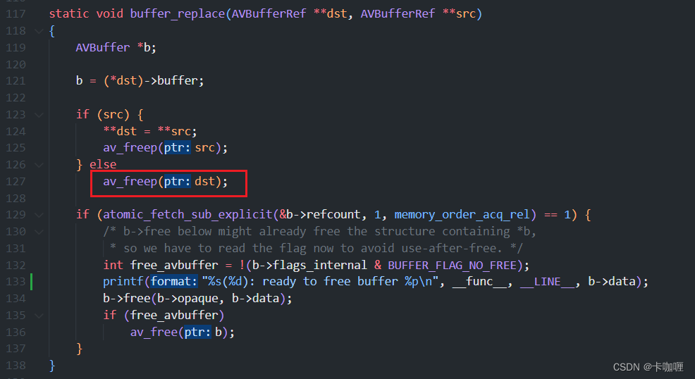

@[TOC](目录)
# 1 编译
参考文件doc/examples/encode_video.c，使用x264作为编码器，需要先安装x264，编译方法：
```shell
# 先编译FFmpeg
./configure --prefix=/usr/local/ffmpeg --enable-shared --enable-yasm --enable-libx264 --enable-gpl --enable-pthreads --extra-cflags=-I/usr/local/x264/include --extra-ldflags=-L/usr/local/x264/lib
make
make install
# 然后编译example
make examples
```
编译生成的文件在doc/examples目录下，使用以下命令执行，编码yuv软件内部自动生成，只用设定输出文件名即可
```shell
./encode_video test.h264 libx264
```
# 2 调用关系
参考文件libavcodec/encode.c，分析送帧函数avcodec_send_frame，该函数会送一帧然后尝试启动编码器编码，伪代码如下，仅摘抄了主要流程
```c
avcodec_send_frame(frame)
 |-- 如果frame为NULL
 |    |-- avci->draining = 1                 // 排水，即刷新编码器
 |-- 否则
 |    |-- encode_send_frame_internal(frame)
 |         |-- AVFrame *dst = avci->buffer_frame
 |         |-- av_frame_ref(dst, src)        // src = frame，获取src的引用
 |-- ret = encode_receive_packet_internal(&avci->buffer_pkt)
 |    |-- 如果avci->draining_done为1，返回EOF
 |    |-- ret = encode_simple_receive_packet(avpkt)
 |    |    |-- while (!avpkt->data)
 |    |         |-- ret = encode_simple_internal
 |    |         |    |-- AVFrame *frame = avci->in_frame;
 |    |         |    |   /* 初始化in_frame->buf[0]为NULL */
 |    |         |    |-- 如果frame->buf[0]为NULL，并且avci->draining为0
 |    |         |    |    |-- av_frame_unref(frame);
 |    |         |    |    |-- ret = ff_encode_get_frame(avctx, frame);
 |    |         |    |    |    |-- 如果avci->draining等于1，返回EOF
 |    |         |    |    |    |-- 如果avci->buffer_frame->buf[0]为NULL，返回AGAIN
 |    |         |    |    |    |   // 转移buffer_frame引用，然后重置buffer_frame，
 |    |         |    |    |    |   // 即buffer_frame->buf[0]置为了NULL */
 |    |         |    |    |    |-- av_frame_move_ref(frame, avci->buffer_frame)
 |    |         |    |    |-- 如果ret失败且不等于EOF，返回ret
 |    |         |    |-- got_packet = 0
 |    |         |    |-- ret = ff_encode_encode_cb(avpkt，frame, &got_packet)
 |    |         |    |    |-- ret = codec->cb.encode(avpkt, frame, got_packet)
 |    |         |    |    |-- 如果ret成功，并且got_packet大于0
 |    |         |    |    |    |-- 如果avpkt->data不为NULL
 |    |         |    |    |    |    |   // 检查是否使用AVBufferRef进行管理
 |    |         |    |    |    |    |   // 如果没有则进行相关处理
 |    |         |    |    |    |    |-- encode_make_refcounted(avpkt)
 |    |         |    |    |    |-- 否则
 |    |         |    |    |         |-- av_packet_unref(avpkt);
 |    |         |    |-- 如果frame不为NULL
 |    |         |    |    |  // 这里因为第7行已经增加了引用计数，因此yuv buf不会被释放
 |    |         |    |    |  // 但是ref会被释放，也就是frame->buf[0]会被释放
 |    |         |    |    |-- av_frame_unref(frame)
 |    |         |    |-- 如果avci->draining为1，并且got_packet为0
 |    |         |    |    |-- avci->draining_done = 1
 |    |         |    |-- 返回ret
 |    |         |-- ret小于0返回ret
 |    |-- 返回ret
 |-- 如果ret失败，并且不为EOF和AGAIN，返回ret
 |-- 返回0
```
启动编码之后，编码的结果会存在buffer_pkt中，然后调用avcodec_receive_packet获取编码的码流，该函数也会启动编码器，伪代码如下
```c
avcodec_receive_packet(avpkt)
 |-- 如果buffer_pkt->data不为空
 |    |-- av_packet_move_ref(avpkt, buffer_pkt)
 |-- 否则
 |    |-- ret = encode_receive_packet_internal(avpkt)
 |    |-- 如果ret失败，返回ret
 |-- 返回0
```
## 2.1 第一帧没有获取到码流，第二帧获取到一帧码流
第一次送帧的流程：
1. 调用encode_send_frame_internal，将帧信息存到avci->buffer_frame中，此操作增加buffer_frame的引用计数
2. 调用encode_receive_packet_internal送帧编码，由于avpkt没有分配内存，因此avpkt->data为NULL，进入while循环，循环中调用encode_simple_internal进行编码，如果获取到码流会将avpkt->data赋值，从而退出循环，另外一种情况是ret为失败，退出循环
3. 调用encode_simple_internal，获取到in_frame，判断frame->buf[0]是否为NULL，in_frame是在编码器初始化申请的，内部没有分配内存，因此为NULL，然后调用ff_encode_get_frame获取帧信息
4. 在函数ff_encode_get_frame中，buffer_frame就是第一步获取的帧信息，此处调用了一个move_ref将其转移到in_frame中，转移之后buffer_frame会被清空
5. 此时frame已经获取到了帧信息，然后调用ff_encode_encode_cb回调底层编码器接口encode，此时由于帧信息刚送进去，还没有完成一帧编码，因此返回encode返回0，但是got_packet为0，表示没有获取到码流，然后unref这个pkt，保证其中没有引用
6. 返回到34行，判断frame不为NULL，然后调用unref减掉in_frame的引用计数，并且释放掉ref，表示已经被消耗，最后返回ret，回到while循环中
7. 由于第5步没有获取到码流，因此avpkt->data还是为NULL，循环不退出，再一次调用encode_simple_internal，获取in_frame，由于其中的ref已经被释放了，因此frame->buf[0]为NULL，再次进入判断
8. 其中再调用ff_encode_get_frame，因为上一次已经将buffer_frame转移到in_frame，已经消耗掉了，因此buffer_frame->buf[0]为NULL，返回AGAIN，回到while循环中
9. while判断ret小于0，然后返回AGAIN，最后在avcodec_send_frame一层，判断返回值为AGAIN，最终返回0成功
第一次收流的流程：
10. 由于送帧没有编码出码流，因此buffer_pkt->data为NULL，会再次调用encode_receive_packet_internal函数来启动编码，in_frame同样为NULL，这一次由于没有送帧，buffer_frame->buf[0]还是为NULL
11. encode_simple_receive_packet返回AGAIN，avcodec_receive_packet最终返回AGAIN
由于收流返回AGAIN，因此开始送第二帧：
12. 拿到新的一帧，首先在encode_send_frame_internal函数中，将buffer_frame赋值，然后调用encode_receive_packet_internal开始编码
13. 此后的流程和第一次送帧一致，但由于送这一帧时收到上一帧编码的码流，got_packet为1，因此会进入27行的分支
14. 判断avpkt->data有数据，执行encode_make_refcounted函数，假设返回的pkt在encode内部是使用了AVBufferRef管理的，这里直接返回成功
15. 如果frame不为NULL，释放减frame的引用计数，释放掉frame的ref，然后返回0，退出到while循环
16. while循环判断avpkt->data不为NULL，退出循环，返回0成功，最终encode_receive_packet_internal返回成功，码流已经被存放到buffer_pkt当中
第二次和第三次收流流程：
17. 由于送帧时已经收到码流，因此buffer_pkt->data不为NULL，调用av_packet_move_ref将buffer_pkt转移到avpkt中， 然后buffer_pkt置空，直接返回成功
18. 由于第二次收流成功，会进行第三次收流，此时过程和第一次类似，由于没有送帧，第三次返回AGAIN
##  2.2 送帧为NULL，刷新编码器获取剩余的全部码流
1. 首先draining置为1，然后调用encode_receive_packet_internal进行编码，由于draining为1，不会进入15行的分支来获取yuv buffer，直接调用ff_encode_encode_cb进行编码
2. ff_encode_encode_cb中调用encode进行编码，传入frame为NULL，直接获取avpkt，如果不是最后一帧，此处ret应该为0，got_packe为1，返回while循环，avpkt->data不为NULL，退出循环，最终avcodec_receive_packet返回成功
3. 由于第一次收流成功，会再进行第二次收流，如果不是最后一帧，此时和第二次流程一致，收到第二帧码流，然后继续进行第三次收流
4. 如果此时是最后一帧了，那么encode接口会返回0，got_packet也为0，avci->draining_done被置为1，最终avcodec_receive_packet返回成功
5. 由于第三次收流成功，此时再进行第四次收流，此时在第9行被拦截，直接返回EOF
6. 收到avcodec_receive_packet返回EOF，编码完成退出程序
# 3 总结
1. 调用encode之前，会调用av_frame_ref接口将帧信息的引用拷贝到buffer_frame中，并且增加引用计数，此时buffer_frame引用计数为2，编码之前会调用av_frame_move_ref将buffer_frame转移到in_frame中，之后buffer_frame的ref为NULL，in_frame的引用计数是2，编码之后会调用av_frame_unref减引用in_frame计数，减之后引用计数为1
2. avcodec_receive_packet传入的pkt没有分配buffer，分配buffer在encode接口中完成，分配之后引用计数为1，在avcodec_receive_packet获取到pkt之后，会对pkt进行写文件等操作，完成之后会调用av_packet_unref减pkt的引用计数，此时引用计数减为0，释放内存
3. 当encode传入的frame为NULL时，需要刷新编码器，若编码比较慢，没有码流准备好，encode返回0并且got_packet为0，此时由于avci->draining为1，avci->draining_done会被置为1，然后在while循环中下一次执行encode_simple_internal，检查avci->draining_done为1，会直接返回EOF，此时encode中还有未编码完成的帧未输出。因此如果frame为NULL，encode应该是==阻塞状态==，直到新的一包码流准备好才返回

# 4 感受
减引用计数的函数，如果减到0则释放其中的buffer，大佬甚至不愿单独写个free函数，直接复用replace，传参也是二重指针，提高阅读难度

像这种复用在ffmpeg中很多，比如encode_simple_internal接口中检查之前有没有送帧实际依靠的是ff_encode_get_frame接口的返回值，该返回值将会影响整个encode_simple_internal接口的返回值，为了可读性这种检查建议显式的写在encode_simple_internal函数中而不是隐含在ff_encode_get_frame返回值中

再比如ff_encode_encode_cb函数中会调用encode_make_refcounted函数来对encode返回的pkt是否使用了ref进行检查，如果使用了ref即avpkt->buf不为NULL，直接返回成功，这个返回值直接影响了是否有122行的数据拷贝，可能影响零拷贝的设计，这种重要的特性建议也是直接写到ff_encode_encode_cb中，而不是依赖encode_make_refcounted函数的检查，encode_make_refcounted只实现单一的申请新的ref然后数据拷贝功能即可

另外很多buffer ref相关的接口有隐含的副作用，比如av_frame_move_ref函数将src转移到dts后会重置src的值

av_frame_unref除了减ref的引用计数之外，还会把ref整个释放掉

这种副作用通过函数名无法得知，只有通过打开函数看实现或者查API reference才知道。
似乎作者的理念似乎趋向于All in one的设计，即一个函数完成尽可能多的功能，不愿意设计单一功能的接口，也不愿意多写一行重复代码，这样其实提高了理解的难度。