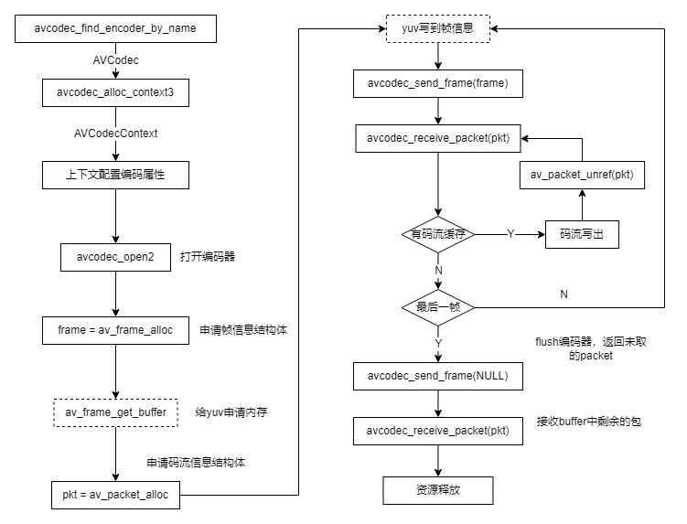
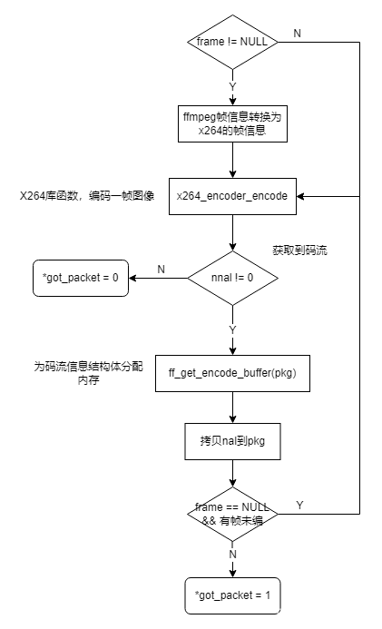

@[TOC](目录)
# 1 编码流程
FFmpeg是一个开源的多媒体框架，底层可对接实现多种编解码器，下面参考文件`doc/examples/encode_video.c`分析编码一帧的流程
## 1.1 整体流程
统一的编码流程如下图所示

FFmpeg使用的是引用计数的思想，对于一块buffer，刚申请时引用计数为1，每有一个模块进行使用，引用计数加1，使用完毕后引用计数减1，当减为0时释放buffer。
此流程中需要关注buffer的分配，对于编码器来说，输入buffer是yuv，也就是上图中的frame，输出buffer是码流包，也就是上图中的pkt，下面对这两个buffer进行分析
1. **frame**：这个结构体是由`av_frame_alloc`分配的，但这里并没有分配yuv的内存，yuv内存是`av_frame_get_buffer`分配的，可见这里输入buffer完全是来自外部的，不需要编码器来管理，编码器只需要根据所给的yuv地址来进行编码就行了
2. **pkt**：这个结构体是由`av_packet_alloc`分配的，也没有分配码流包的内存，可见这里pkt仅仅是一个引用，pkt直接传到了`avcodec_receive_packet`接口进行编码，完成之后将pkt中码流的内容写到文件，最后调用`av_packet_unref`接口减引用计数，因此这里pkt是编码器内部分配的，分配完成之后会减pkt的引用计数加1，然后输出到外部，外部使用完毕之后再减引用计数来释放buffer

编码一帧的相关代码如下：
```c
static void encode(AVCodecContext *enc_ctx, AVFrame *frame, AVPacket *pkt,
                   FILE *outfile)
{
    int ret;

    /* send the frame to the encoder */
    if (frame)
        printf("Send frame %3"PRId64"\n", frame->pts);

    ret = avcodec_send_frame(enc_ctx, frame);
    if (ret < 0) {
        fprintf(stderr, "Error sending a frame for encoding\n");
        exit(1);
    }

    while (ret >= 0) {
        ret = avcodec_receive_packet(enc_ctx, pkt);
        if (ret == AVERROR(EAGAIN) || ret == AVERROR_EOF)
            return;
        else if (ret < 0) {
            fprintf(stderr, "Error during encoding\n");
            exit(1);
        }

        printf("Write packet %3"PRId64" (size=%5d)\n", pkt->pts, pkt->size);
        fwrite(pkt->data, 1, pkt->size, outfile);
        av_packet_unref(pkt);
    }
}
```
其中`avcodec_receive_packet`返回EAGAIN表示送下一帧，返回EOF表示编码器内部已经没有码流。
## 1.2 内部流程
此处分析编码一帧的内部流程，首先看FFmpeg内部编码器的上下文，其中有三个重要结构体
```c
typedef struct AVCodecInternal {
	...
    /**
     * The input frame is stored here for encoders implementing the simple
     * encode API.
     *
     * Not allocated in other cases.
     */
    AVFrame *in_frame;

    /**
     * Temporary buffers for newly received or not yet output packets/frames.
     */
    AVPacket *buffer_pkt;
    AVFrame *buffer_frame;
    ...
} AVCodecInternal;
```
下面结合送帧和收流的接口进行介绍
- **avcodec_send_frame**: 送帧接口，将yuv的帧信息赋值到`buffer_frame`，然后触发一帧编码，将编码出的码流赋值到`buffer_pkt`
- **avcodec_receive_packet**: 收流接口，检查上下文中是否有已经编码好的码流`buffer_pkt`，如果有则将其返回，如果没有再触发一帧编码，将编码好的码流返回

可见send和receive接口均可触发一帧编码，此处触发一帧编码分为两个流程，receive流程和simple流程，代码片段如下：
```c
static int encode_receive_packet_internal(AVCodecContext *avctx, AVPacket *avpkt)
{
	...
	if (ffcodec(avctx->codec)->cb_type == FF_CODEC_CB_TYPE_RECEIVE_PACKET) {
        ret = ffcodec(avctx->codec)->cb.receive_packet(avctx, avpkt);
        if (ret < 0)
            av_packet_unref(avpkt);
        else
            // Encoders must always return ref-counted buffers.
            // Side-data only packets have no data and can be not ref-counted.
            av_assert0(!avpkt->data || avpkt->buf);
    } else
        ret = encode_simple_receive_packet(avctx, avpkt);
    ...
}
```
如果是receive流程，则直接调用`receive_packet`接口的回调，该接口中注册定制编码器的接口，完成一帧编码。如果是simple流程，则调用的是`encode_simple_receive_packet`，这是FFmpeg封装的一个简易流程，其中调用的是`encode`接口，代码片段如下，详细分析可参考文章：
```c
static int encode_simple_internal(AVCodecContext *avctx, AVPacket *avpkt)
{
    AVFrame          *frame = avci->in_frame;
    const FFCodec *const codec = ffcodec(avctx->codec);
    int got_packet;

	...
	/* 拷贝buffer_frame到in_frame */
	...

    if (CONFIG_FRAME_THREAD_ENCODER && avci->frame_thread_encoder) {
        /* This will unref frame. */
        ret = ff_thread_video_encode_frame(avctx, avpkt, frame, &got_packet);
    } else {
        ret = ff_encode_encode_cb(avctx, avpkt, frame, &got_packet);
#if FF_API_THREAD_SAFE_CALLBACKS
        if (frame) {
            av_frame_unref(frame);
        }
#endif
    }
    ...

    return ret;
}
```
 - simple流程中会把`buffer_frame`的引用拷贝到`in_frame`，然后将`in_frame`送帧编码，意味着其内部只能缓存一帧，不支持多帧缓存。并且simple流程中，调用send之后，如果调用receive成功获取到一包码流，下一次调用receive将会返回EAGAIN，且不会调用encode接口，因此对于不支持多帧缓存的编码器而言，如果send一帧后，需要receive两包码流，那么获取到一包码流之后receive接口会返回EAGAIN，循环退出进行下一次send，此时上一帧未编码的yuv会被覆盖
 - receive流程中没有该限制，直接调用了`receive_packet`接口，因此如果需要在ffmpeg适配层做多帧缓存，可以使用`receive`的流程。另外receive流程没有上述限制，在成功收到一帧码流之后，仍然会调用receive，比较灵活，可以做一些定制化的操作
# 2 适配接口
适配接口参考`ffmpeg/libavcodec/nvenc_h264.c`，这是英伟达的硬件编码器接口，自定义一个编码器只需实现以下结构体
```c
const FFCodec ff_h264_nvenc_encoder = {
    .p.name         = "h264_nvenc",
    .p.long_name    = NULL_IF_CONFIG_SMALL("NVIDIA NVENC H.264 encoder"),
    .p.type         = AVMEDIA_TYPE_VIDEO,
    .p.id           = AV_CODEC_ID_H264,
    .init           = ff_nvenc_encode_init,
    FF_CODEC_RECEIVE_PACKET_CB(ff_nvenc_receive_packet),
    .close          = ff_nvenc_encode_close,
    .flush          = ff_nvenc_encode_flush,
    .priv_data_size = sizeof(NvencContext),
    .p.priv_class   = &h264_nvenc_class,
    .defaults       = defaults,
    .p.capabilities = AV_CODEC_CAP_DELAY | AV_CODEC_CAP_HARDWARE |
                      AV_CODEC_CAP_ENCODER_FLUSH | AV_CODEC_CAP_DR1,
    .caps_internal  = FF_CODEC_CAP_INIT_CLEANUP,
    .p.pix_fmts     = ff_nvenc_pix_fmts,
    .p.wrapper_name = "nvenc",
    .hw_configs     = ff_nvenc_hw_configs,
};
```
这里面最重要三个接口是init、close和receive，还有一个比较重要的数据结构是option，此处写明了编码器支持的具体配置
```c
static const AVOption options[] = {
#ifdef NVENC_HAVE_NEW_PRESETS
    { "preset",       "Set the encoding preset",            OFFSET(preset),       AV_OPT_TYPE_INT,   { .i64 = PRESET_P4 },     PRESET_DEFAULT, PRESET_P7,          VE, "preset" },
#else
    { "preset",       "Set the encoding preset",            OFFSET(preset),       AV_OPT_TYPE_INT,   { .i64 = PRESET_MEDIUM }, PRESET_DEFAULT, PRESET_LOSSLESS_HP, VE, "preset" },
#endif
    { "default",      "",                                   0,                    AV_OPT_TYPE_CONST, { .i64 = PRESET_DEFAULT },             0, 0, VE, "preset" },
    { "slow",         "hq 2 passes",                        0,                    AV_OPT_TYPE_CONST, { .i64 = PRESET_SLOW },                0, 0, VE, "preset" },
    { "medium",       "hq 1 pass",                          0,                    AV_OPT_TYPE_CONST, { .i64 = PRESET_MEDIUM },              0, 0, VE, "preset" },
...
};

static const AVClass h264_nvenc_class = {
    .class_name = "h264_nvenc",
    .item_name = av_default_item_name,
    .option = options,
    .version = LIBAVUTIL_VERSION_INT,
};
```
## 2.1 init、close
init是初始化编码器的接口，在`avcodec_open2`中调用，定义接口如下，此接口一般是根据用户的option配置，来对编码器进行相应的初始化
```c
int (*init)(struct AVCodecContext *)
```
close是关闭编码器的接口，在`avcodec_free_context`中调用，定义接口如下，该接口完成编码器内部的一些资源释放操作
```c
int (*close)(struct AVCodecContext *)
```
## 2.2 option
每个编码器有一个自定义的上下文，其作用是在编码器初始化之前对上下文进行配置，编码器初始化的时候就可以按照用户的配置来初始化，以nvenc为例该上下文的定义为
```c
ypedef struct NvencContext
{
    ...
    // 队列相关的定义
    ...

    // 编码相关的配置信息
    int preset;
    int profile;
    int level;
    int tier;
    int rc;
    int cbr;
	...
} NvencContext;
```
该上下文在avcodec内部使用，对外不可见，因此需要option的方式开放对外配置的接口，使用一个`AVOption`来描述一个编码器的配置
```c
typedef struct AVOption {
    const char *name;

    /**
     * short English help text
     * @todo What about other languages?
     */
    const char *help;

    /**
     * The offset relative to the context structure where the option
     * value is stored. It should be 0 for named constants.
     */
    int offset;
    enum AVOptionType type;

    /**
     * the default value for scalar options
     */
    union {
        int64_t i64;
        double dbl;
        const char *str;
        /* TODO those are unused now */
        AVRational q;
    } default_val;
    double min;                 ///< minimum valid value for the option
    double max;                 ///< maximum valid value for the option

    int flags;
    const char *unit;
} AVOption;
```
其中关键的是`offset`和`type`成员，`offset`描述了这个option在上下文中的偏移量，`type`描述了成员占据的长度，有这两个信息就可以在不对外暴露内部上下文的情况下，修改其中的值，用户配置option的示例如下
```c
av_opt_set(c->priv_data, "preset", "slow", 0);
```
## 2.3 receive
nvenc在avcodec层实现了多帧缓存，因此他实现的是receive接口，代码片段如下，需要注意这里输入输出都存在拷贝
```c
int ff_nvenc_receive_packet(AVCodecContext *avctx, AVPacket *pkt)
{
    NvencSurface *tmp_out_surf;
    int res, res2;
    NvencContext *ctx = avctx->priv_data;
    AVFrame *frame = ctx->frame;		// 这个是init中申请的

    if (!frame->buf[0]) {
    	// 将buffer_frame引用拷贝到frame中
        res = ff_encode_get_frame(avctx, frame);	
        if (res < 0 && res != AVERROR_EOF)
            return res;
    }

	// 编码一帧，推测是阻塞的，nv相关的函数没有找到介绍，其中存在拷贝
    res = nvenc_send_frame(avctx, frame);		
    if (res < 0) {
        if (res != AVERROR(EAGAIN))
            return res;
    } else
        av_frame_unref(frame);

    if (output_ready(avctx, avctx->internal->draining)) {
    	// 从ready队列中取编码好的surface
        av_fifo_read(ctx->output_surface_ready_queue, &tmp_out_surf, 1);

        res = nvenc_push_context(avctx);
        if (res < 0)
            return res;
		// 拷贝到pkt中
        res = process_output_surface(avctx, pkt, tmp_out_surf);

        res2 = nvenc_pop_context(avctx);
        if (res2 < 0)
            return res2;

        if (res)
            return res;
		// surface再放回unused队列
        av_fifo_write(ctx->unused_surface_queue, &tmp_out_surf, 1);
    } else if (avctx->internal->draining) {
        return AVERROR_EOF;
    } else {
        return AVERROR(EAGAIN);
    }

    return 0;
}
```

## 2.4 encode
nvenc没有实现encode接口，这里参考`libavcodec/libx264.c`的实现，libx264的流程比较繁琐，总结为流程图如下，x264_encoder_encode为非阻塞接口，内部存在yuv的拷贝，调用后不一定会获取到一帧编码好的码流，但获取到之后，同样需要拷贝到输出pkt中

## 2.5 零拷贝的设计
通过以上分析，发现两种编码器的实现都存在拷贝，下面分析零拷贝实现的可能性
首先是输入零拷贝，输入yuv是外部申请的，编码器只是使用，对于一个阻塞的编码器（即送帧后需要阻塞等待该帧编码完成），这个设计是相对简单的，只需要将frame的地址告诉编码器即可，从编码开始到结束只有一个yuv buffer，编码完成后意味这一帧也消耗完了；如果是非阻塞的编码器涉及多个buffer缓存在编码器中，该设计过于复杂此处不讨论
然后是输出零拷贝，输出的码流buffer是编码器自己申请的，要实现零拷贝，上层使用完毕之后就需要将该buffer还给编码器，参考FFmpeg的example是有这个动作的，即调用unref减引用计数
```c
void av_packet_unref(AVPacket *pkt)
```
`AVPacket`中实际的码流buffer在`buf`成员中
```c
typedef struct AVPacket {
    /**
     * A reference to the reference-counted buffer where the packet data is
     * stored.
     * May be NULL, then the packet data is not reference-counted.
     */
    AVBufferRef *buf;
    ...
} AVPacket;
```
该接口将`buf`的引用计数减到零之后，会进行释放操作，对于`AVBufferRef`而言，释放操作是可以定制的，只需要将free赋值即可
```c
struct AVBuffer {
    ...
    void (*free)(void *opaque, uint8_t *data);
	...
};
```
FFmpeg有相关接口可以生成一个定制的`AVBufferRef`
```c
AVBufferRef *av_buffer_create(uint8_t *data, size_t size,
                              void (*free)(void *opaque, uint8_t *data),
                              void *opaque, int flags)
```
这里`data`是已经分配好的buffer的地址，`size`是已经分配的buffer的大小，`free`是对应的释放函数
因此，输出buffer零拷贝可以这样实现，通过相关编码器接口获取到一包码流之后，通过`av_buffer_create`来生成`AVBufferRef`，传入的是这包码流的地址和大小，注册free函数为还码流buffer给编码器的函数，将生成的`AVBufferRef`赋值到`AVPacket`中返回给上层，上层使用完毕后，调用`av_packet_unref`即可向编码器还码流。


