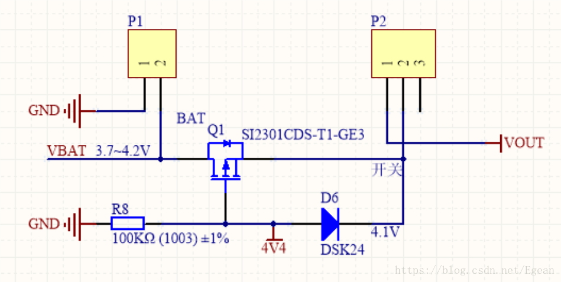
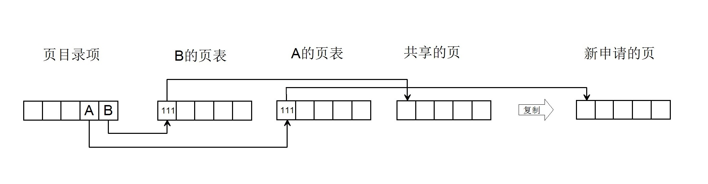

## 用户进程与内存管理
#### 1. 示例
```cpp
// str1.c
#include <stdio.h>
int foo(int n)
{
    char text[2048];
    if(n==0)
        return 0;
    else{
        int i=0;
        for(i; i<2048; i++)
            text[i] = '\0';
        printf("text_%d=0x%x, pid=%d\n", n, text, getpid());
        sleep(5);
        foo(n-1);
    }
}
int main(int argc, char **argv)
{
    foo(6);
    return 0;
}
```

#### 2. 创建str1进程
 - 在执行str1程序之前，先创建str1进程，该进程由shell进程调用sys_fork()创建，
 - 过程中设置了新的task_struct管理结构(其中设置了tss和ldt)，并复制了shell进程的页表给其共享。

```cpp
--- kernel --- fork.c --- copy_process --- p = get_free_page()
 |                     |                |- task[nr] = p
 |                     |                |- *p = *current//复制父进程的任务结构
 |                     |                |- p->state = TASK_UNINTERRUPTIBLE
 |                     |                |- p->pid = last_pid
 |                     |                |- p->father = current->pid
 |                     |                |- p->counter = p->priority
 |                     |                |- p->signal = 0
 |                     |                |- p->alarm = 0
 |                     |                |- 对p->tss进行设置
 |                     |                |- p->tss.esp0 = PAGE_SIZE + (long) p
 |                     |                |  //内核栈
 |                     |                |- p->tss.ldt = _LDT(nr)
 |                     |                |  //进程切换后tss会自动载入寄存器
 |                     |                |  //根据这一项就可以找到LDT的位置
 |                     |                |- copy_mem(nr,p)
 |                     |                |- f->f_count++
 |                     |                |  current->pwd->i_count++
 |                     |                |  current->root->i_count++
 |                     |                |  current->executable->i_count++
 |                     |                |- set_tss_desc(gdt+(nr<<1)+FIRST_TSS_ENTRY,&(p->tss));
 |                     |                |  set_ldt_desc(gdt+(nr<<1)+FIRST_LDT_ENTRY,&(p->ldt));
 |                     |                |  //将tss和ldt挂接到gdn上
 |                     |                |- p->state = TASK_RUNNING
 |                     |- copy_mem() --- code_limit=get_limit(0x0f)
 |                                    |- data_limit=get_limit(0x17)
 |                                    |  //取得父进程段限长
 |                                    |- old_code_base = get_base(current->ldt[1])
 |                                    |- old_data_base = get_base(current->ldt[2])
 |                                    |  //取得父进程段基址
 |                                    |- new_data_base = new_code_base = nr * 0x4000000
 |                                    |  //根据nr设置子进程段基址
 |                                    |- p->start_code = new_code_base
 |                                    |- set_base(p->ldt[1],new_code_base)
 |                                    |- set_base(p->ldt[2],new_data_base)
 |                                    |  //设置段基址到LDT
 |                                    |- copy_page_tables(old_data_base,
 |                                          new_data_base,data_limit)
 |
 |- mm --- memory.c --- copy_page_tables() --- to_page_table = get_free_page()
                                            |  //这个页面用于子进程页表
                                            |- *to_dir = ((unsigned long) to_page_table) | 7
                                            |  //设置页目录项，用户级，读写，存在
                                            |- 复制页表到子进程，并将所有页设置为只读
                                            |  while(...){
                                            |      this_page = *from_page_table
                                            |      this_page &= ~2
                                            |      *to_page_table = this_page
                                            |      对应mem_map计数+1
                                            |  }
```

#### 3. str1进程加载的准备工作
 - 准备工作由shell进程调用do_execv()函数完成，主要完成读取可执行文件，释放之前共享的页表，重新设置段限长，最终设置eip和esp跳转到用户程序执行

```cpp
--- fs --- exec.c --- do_execve() --- p=PAGE_SIZE*MAX_ARG_PAGES-4
                   |               |- inode=namei(filename)
                   |               |- bh = bread(inode->i_dev,inode->i_zone[0])
                   |               |- ex = *((struct exec *) bh->b_data)
                   |               |  //获取可执行文件头
                   |               |- 通过ex检测代码、数据、堆长度是否超过48MB
                   |               |- p=copy_strings(envc,envp,page,p,0)
                   |               |  p=copy_strings(argc,argv,page,p,0)
                   |               |  //给page[p/4096]申请新的页面，并将参数放到其中
                   |               |  //返回填入参数在128KB参数空间中的偏移量
                   |               |- iput(current->executable)
                   |               |  current->executable = inode
                   |               |  //重新设置新的可执行文件i节点
                   |               |- current->close_on_exec = 0
                   |               |  //打开文件屏蔽位图清零
                   |               |- free_page_tables(get_base(current->ldt[1]),get_limit(0x0f))
                   |               |  free_page_tables(get_base(current->ldt[2]),get_limit(0x17))
                   |               |  //释放str1的页表，页目录项和页表项清零，归还页表所占用的页
                   |               |- p += change_ldt(ex.a_text,page)-MAX_ARG_PAGES*PAGE_SIZE
                   |               |  //change_ldt重新设置段限长，然后找到page[32]中的放有参数的页面
                   |               |  //将其放到进程空间的末端，然后建立映射。同时这个表达式将p从参数
                   |               |  //空间的偏移量(128K-x-4)转到进程空间的偏移量(64M-x-4)
                   |               |- current->end_code = ex.a_text
                   |               |  current->end_data = ex.a_data+ex.a_text
                   |               |  current->brk = ex.a_bss+ex.a_text+ex.a_data
                   |               |  //设置task_struct
                   |               |- eip[0] = ex.a_entry
                   |               |- eip[3] = p
                   |                  //设置eip和esp
                   |- change_ldt() --- code_limit = text_size+PAGE_SIZE -1
                                    |  code_limit &= 0xFFFFF000
                                    |  //代码段限长为：代码长度+4KB-1
                                    |- data_limit = 0x4000000
                                    |  //数据段限长为：64MB
                                    |- code_base = get_base(current->ldt[1])
                                    |  data_base = code_base
                                    |  //代码段和数据段基址不变，为0x4000000的整数倍
                                    |- set_base(current->ldt[1],code_base)
	                                |  set_limit(current->ldt[1],code_limit)
	                                |  set_base(current->ldt[2],data_base)
	                                |  set_limit(current->ldt[2],data_limit)
                                    |- data_base += data_limit
                                    |  for (i=MAX_ARG_PAGES-1 ; i>=0 ; i--) {
                                    |      data_base -= PAGE_SIZE;
                                    |      if (page[i])
                                    |      put_page(page[i],data_base);
                                    |  }
                                    |  //找到放置参数的页面，映射到进程空间末尾
                                    |- 返回段限长64MB
```

 - 在do_execve()中释放了之前的页表，页目录项也随之清零，而LDT中代码段基址没有变，所以do_execve()返回后，CPU还是从LDT中找到代码段基址然后找到对应的页目录项，此时页目录项为0，从而引发了**缺页中断**
 - 在copy_strings()中申请的了新的页面放到了page[p/4096]中，然后将参数放入新页面，change_ldt()中又找到page[p/4096]，也就是找到这个新页面，然后将其映射到进程空间末尾。假设数据段基址为0x4000000，参数的地址被放到了page[31]中，然后就会将0x4000000+0x4000000-4K=0x7FFF000这个线性地址与page[31]映射起来。也就是说第31个页目录项，页表偏移1023的页表项里存放的是page[31]
 - 这里eip和esp的值为段内偏移量，**猜测**是与段基址结合生成线性地址，如：代码段基址是0x4000000，假设eip=1024=0x400, 则程序的入口地址为0x4000400，对应第16个页目录项，页表偏移0，页内偏移1024。数据段基址等于代码段基址，也是0x4000000，esp=p=64M-x-4，假设x=2K，esp=0x3FFF7FC，栈指针的线性地址为0x7FFF7FC，对应第31个页目录项，页表偏移1023，页内偏移2044。第31个页目录项，页表偏移1023的页表项已经完成映射，对应page[31]+2044的物理地址，所以此时esp**不会发生**缺页中断
 - 段限长是用来限制诸如eip和esp这类偏移指针的，这里段限长被设置为0x4000000，那么如果eip或esp大于了0x4000000就会引发异常。
 - 虽然这里eip和esp的线性地址相差很大，但是它们对应的物理地址可能就是连续的，因为从线性地址到物理地址的转换需要知道页目录项、页表项的内容，仅凭线性地址是无法知道物理地址的位置的

#### 4. str1的运行和加载
 - 释放了共享的页面后，页目录项为0，进入缺页中断

```cpp
--- mm --- page.s --- page_fault() --- do_no_page()
        |
        |- memory.c --- do_no_page(address) --- address &= 0xfffff000//清除页内偏移，方便进行块操作
                     |                       |  tmp = address - current->start_code
                     |                       |  //获得在线性地址中的偏移量
                     |                       |  if(!current->executable || tmp >= current->end_data)
                     |                       |      get_empty_page(address)
                     |                       |      return;
                     |                       |- 看是否能够和其他进程共享
                     |                       |- page = get_free_page()
                     |                       |- block = 1 + tmp/BLOCK_SIZE
                     |                       |  //计算块开始的位置
                     |                       |- bread_page(page,current->executable->i_dev)
                     |                       |  //读取一页的信息到page中
                     |                       |- put_page(page,address)
                     |                          //将新的页映射到线性地址
                     |- get_empty_page(address) --- tmp=get_free_page()
                                                 |- put_page(tmp,address)
```

 - do_no_page中新申请了一个页，然后将文件节点中一页的数据读入内存中，并完成与线性地址的映射。注意这里的address是发生缺页中断的**线性地址**。如0x4000400，中断返回后，由于页表已经映射完毕，就可以进入0x4000400对应的物理内存执行应用程序。
 - 如果str1程序大于一个页面，在执行过程中，如果需要新的代码，就会不断触发缺页中断，以此来加载需要执行的程序。
 - 继续之前的例子，esp=0x7FFF7FC，是指向page[31]+2044的，此时执行foo()函数，里面申请了text[2048]，占用了2048字节的栈空间，因此esp向下退2048个字节，此时esp=0x7FFEFFC，对应页目录偏移31，页表偏移1022，页内偏移4092，简记为31_1022_4092，此时31_1022还是空的，因此触发**缺页中断**。
 - 缺页中断的地址为0x7FFEFFC，tmp=0x3FFE000，tmp>current->end_data，因此直接get_empty_page()将0x3FFE000映射到一个新的页面，然后返回

#### 5. str1进程的退出
 - str1进程调用exit()函数进行退出，最终会进入sys_exit()中去执行

```cpp
--- kernel --- exit.c --- sys_exit() --- do_exit()
                       |- do_exit() --- free_page_tables(get_base(current->ldt[1]),get_limit(0x0f))
                                     |- free_page_tables(get_base(current->ldt[2]),get_limit(0x17))
                                     |- 解除与父进程的共享文件
                                     |- current->state = TASK_ZOMBIE
                                     |- tell_father(current->father)
                                     |  //向父进程发送信号SIGCHLD
                                     |- schedule()
```
 
 - str1的父进程是shell进程，这里先将str1设置为僵死态，然后向shell进程发送信号，最后调度到shell进程。shell进程收到信号后，释放掉str1的任务结构，并解除task[64]的关系，退出完成

#### 6. 页写保护
 - 假设现在有一个用户进程A，它通过fork函数调用创建了一个新进程B，在新进程创建过程中，进程A的页表全部复制给了进程B的页表中，并设置了进程B的页目录项。此时这两个进程共享页面，共享页面引用计数累加为2，并且共享页面被设置为**只读**属性，无论进程A还是B都不能对共享页面进行写操作。

 - 假设此时进程A压栈，就会产生一个**页写保护**中断，跳转到un_wp_page()函数执行

```cpp
--- mm --- memory.c --- un_wp_page() --- 若触发中断的页面引用计数为1
                                      |  直接设置为可写
                                      |- new_page=get_free_page()
                                      |- mem_map[MAP_NR(old_page)]--
                                      |- *table_entry = new_page | 7
                                      |- copy_page(old_page,new_page)
```
- 该函数重新申请了一个页，然后将旧页面的引用计数减一，将新的页地址写入进程A的页表中，并设置为可读可写，然后复制旧页面内容到新页面中
- 中断返回后A进行压栈操作，然后切换到B执行，B也执行了一个压栈操作，此时旧页面仍然是只读状态，因此也会进入页写保护中断，此时旧页面的引用计数为1，因此直接设置为可写，然后退出。
