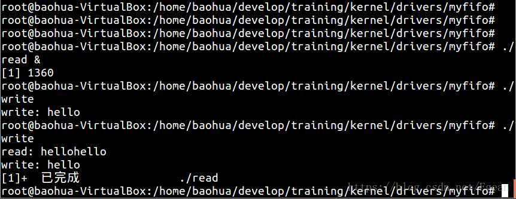
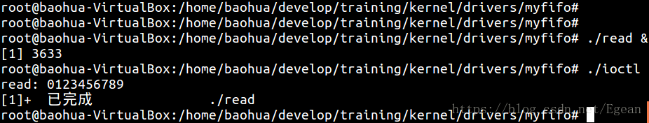
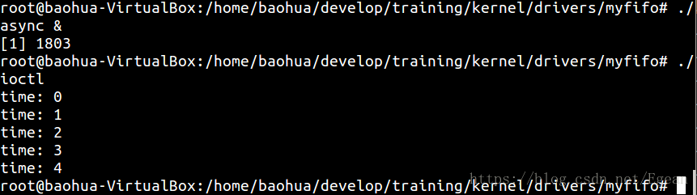

## 介绍
这里是linux驱动最基础部分，我会实现一个不使用任何驱动框架、不包含任何硬件操作的程序来实现一个字符设备驱动（参考宋宝华老师的程序），其中会包含互斥锁、等待队列、定时和异步通知的使用，最后分析它们在内核中到底是如何运作的。

## 代码和验证
这是一个用内存模拟的字符设备驱动，在初始化时会分配一页的内存给`fifo_dev.mem_entry`，在写入函数中，在之前内容的末尾添加内容，在读取函数中从这段内存头部读取内容，然后将读取的内容删除并将剩下的内容移动到内存头部。也就是一个模仿FIFO的操作。

```cpp
#include <linux/module.h>
#include <linux/types.h>
#include <linux/sched.h>
#include <linux/init.h>
#include <linux/cdev.h>
#include <linux/slab.h>
#include <linux/poll.h>
#include <linux/uaccess.h>

#define PAGE_LEN 4096		// 页的大小为4096字节
#define FIFO_MAJOR 233		// 自动分配设备号定义为0
#define FIFO_CLEAR 0x22330
#define TIM_INIT 0x22331
#define TIM_OPEN 0x22332
#define TIM_CLOSE 0x22333

struct fifo_dev {
	struct cdev cdev;
	uint8_t *mem_entry;
	int offset;
	struct mutex mutex;			// 该锁用于读写的并发控制
	wait_queue_head_t w_wait;
	wait_queue_head_t r_wait;
	struct timer_list timer;
	struct fasync_struct *async_queue;	// 异步通知队列
};
static struct fifo_dev *fifo_devp;
static int fifo_major = FIFO_MAJOR;

// fctnl(fd, F_SETFL, xxx)会映射到本函数, 同时此函数相当于初始化了
// dev->async_queue异步通知队列
static int fifo_fasync(int fd, struct file *filp, int mode)
{
	struct fifo_dev *dev = filp->private_data;
	return fasync_helper(fd, filp, mode, &dev->async_queue);
}

// 每秒向fifo中添加10个字符, 然后唤醒读进程. 并发送异步通知
// 此操作会清除掉fifo中0~9的内容, 这里不能阻塞
static void fifo_do_timer(unsigned long arg)
{
	struct fifo_dev *dev = (struct fifo_dev *)arg;
	char *buf = "0123456789";
	memcpy(dev->mem_entry, buf, 10);
	dev->offset = dev->offset > 10 ? dev->offset : 10;
	wake_up_interruptible(&dev->r_wait);
	if(dev->async_queue) {
		kill_fasync(&dev->async_queue, SIGIO, POLL_IN);
		printk(KERN_INFO "%s kill SIGIO\n", __func__);
	}
	printk(KERN_INFO "jiffies: %ld\n", jiffies);

	mod_timer(&dev->timer, jiffies + HZ);
}

static long fifo_ioctl(struct file *filp, unsigned int cmd, 
				unsigned long arg)
{
	struct fifo_dev *dev = filp->private_data;

	switch(cmd) {
	case FIFO_CLEAR:
		memset(dev->mem_entry, 0, PAGE_LEN);
		dev->offset = 0;
		printk(KERN_INFO "fifo clear\n");
		break;
	case TIM_INIT:
		init_timer(&dev->timer);
		dev->timer.function = &fifo_do_timer;
		dev->timer.data = (unsigned long)dev;
		break;
	case TIM_OPEN:
		dev->timer.expires = jiffies + HZ;
		add_timer(&dev->timer);
		break;
	case TIM_CLOSE:
		del_timer(&dev->timer);
		break;
	default:
		return -EINVAL;
	}

	return 0;
}

// 只能从头开始读, ppos参数无效
static ssize_t fifo_read(struct file *filp, char __user *buf,
				size_t count, loff_t *ppos)
{
	struct fifo_dev *dev = filp->private_data;
	int ret = 0;
	DECLARE_WAITQUEUE(wait, current);

	// 读之前上锁, 不允许其他进程读和写
	mutex_lock(&dev->mutex);
	add_wait_queue(&dev->r_wait, &wait);
	// 若内容不够, 调度到其他进程等待满足要求长度时再读取
	while(count > dev->offset) {
		if(filp->f_flags & O_NONBLOCK) {
			ret = -EAGAIN;
			goto out;
		}
		mutex_unlock(&dev->mutex);
		__set_current_state(TASK_INTERRUPTIBLE);
		schedule();
		//interruptible_sleep_on(&dev->r_wait);
		if(signal_pending(current)) {
			ret = -ERESTARTSYS;
			goto sig_out;
		}
		mutex_lock(&dev->mutex);
		printk(KERN_INFO "read process wake up: %d, %d\n", 
				dev->offset, count);
	}
	//count = count > dev->offset ? dev->offset : count;
	// entry = 0, count = 3, offset = 6 --> offset = 3
	// 0 1 2 3 4 5 6 7 8 9
	// 先拷贝出0~2, 再将3~5拷贝到0~2处
	if(copy_to_user(buf, dev->mem_entry, count)) {
		ret = -EFAULT;
		goto out;
	} else {
		// 删除已读数据
		memcpy(dev->mem_entry, dev->mem_entry + count, 
				dev->offset - count);
		dev->offset -= count;
		ret = count;
		printk(KERN_INFO "read %d bytes(s),current_len:%d\n", count,
		       dev->offset);
		wake_up_interruptible(&dev->w_wait);
	}

out:
	mutex_unlock(&dev->mutex);
sig_out:
	remove_wait_queue(&dev->r_wait, &wait);
	set_current_state(TASK_RUNNING);
	return ret;
}

// 只能从末尾开始写, ppos参数无效
static ssize_t fifo_write(struct file *filp, const char __user *buf,
				size_t count, loff_t *ppos)
{
	struct fifo_dev *dev = filp->private_data;
	int left;
	int ret = count;
	DECLARE_WAITQUEUE(wait, current);

	// 写之前上锁, 不允许其他进程读和写
	mutex_lock(&dev->mutex);
	// 添加到等待队列
	add_wait_queue(&dev->w_wait, &wait);
	// 内存不够时, 等待其他进程释放出足够内存
	left = PAGE_LEN - dev->offset;
	while(count > left) {
		// 非阻塞读直接返回
		if(filp->f_flags & O_NONBLOCK) {
			ret = -EAGAIN;
			goto out;
		}
		// 先解锁再调度, 否则其他进程不能获取资源
		mutex_unlock(&dev->mutex);
		__set_current_state(TASK_INTERRUPTIBLE);
		schedule();
		//interruptible_sleep_on(&dev->w_wait);
		// 由信号唤醒本进程, 则直接退出
		// 不加这个判断信号无法打断程序
		if(signal_pending(current)) {
			ret = -ERESTARTSYS;
			goto sig_out;
		}
		// 重新调度回本进程, 先上锁然后再一次检测内存是否足够
		mutex_lock(&dev->mutex);
		left = PAGE_LEN - dev->offset;
		printk(KERN_INFO "write process wake up: %d, %d\n", 
				left, count);
	}

	//count = count > left ? left : count;
	// entry = 0, count = 6 --> offset = 6
	// 0 1 2 3 4 5 6 7 8 9
	// 实际上拷贝了0~5的内容
	if(copy_from_user(dev->mem_entry + dev->offset, buf, count)) {
		ret = -EFAULT;
		goto out;
	} else {
		dev->offset += count;
		ret = count;
		printk(KERN_INFO "write %d bytes(s),current_len:%d\n", count,
		       dev->offset);
		// 写完之后唤醒等待的读进程
		wake_up_interruptible(&dev->r_wait);
	}

out:
	mutex_unlock(&dev->mutex);
sig_out:
	remove_wait_queue(&dev->w_wait, &wait);
	set_current_state(TASK_RUNNING);
	return ret;
}

static int fifo_open(struct inode *inode, struct file *filp)
{
	filp->private_data = fifo_devp;
	return 0;
}

static int fifo_release(struct inode *inode, struct file *filp)
{
	fifo_fasync(-1, filp, 0);
	return 0;
}

static const struct file_operations fifo_fops = {
	.owner = THIS_MODULE,
	.read = fifo_read,
	.write = fifo_write,
	.open = fifo_open,
	.release = fifo_release,
	.unlocked_ioctl = fifo_ioctl,
	.fasync = fifo_fasync
};

static int fifo_setup_cdev(struct fifo_dev *dev, int minor)
{
	int err;
	dev_t devno = MKDEV(fifo_major, minor);
	// 绑定cdev和fops
	cdev_init(&dev->cdev, &fifo_fops);
	dev->cdev.owner = THIS_MODULE;
	// 绑定cdev和设备号
	err = cdev_add(&dev->cdev, devno, 1);
	if(err) {
		printk(KERN_NOTICE "Error %d adding globalfifo%d", err, minor);
		return 0;
	}

	return 1;
}

static int __init fifo_init(void)
{
	int ret;
	dev_t devno;

	if(fifo_major) {
		// 获取设备号, 次设备号为0
		devno = MKDEV(fifo_major, 0);
		// 占用指定设备号, 数量为1, 名字为"myfifo"
		ret = register_chrdev_region(devno, 1, "myfifo");
	} else {
		// 系统自动分配设备号, 分配设备号存在devno中, 起始次设备号为0
		// 数量为2, 名字为"myfifo"
		ret = alloc_chrdev_region(&devno, 0, 1, "myfifo");
		// 获得主设备号
		fifo_major = MAJOR(devno);
	}
	if(ret < 0) {
		printk(KERN_NOTICE "fail to register char device\n");
		return ret;
	}

	// kzalloc是使用kmalloc分配内存, 然后将分配的内存置为0
	fifo_devp = kzalloc(sizeof(struct fifo_dev), GFP_KERNEL);
	if(!fifo_devp) {
		ret = -ENOMEM;
		goto fail_malloc;
	}
	fifo_devp->mem_entry = kzalloc(PAGE_LEN, GFP_KERNEL);
	
	// 添加cdev到系统
	if(!fifo_setup_cdev(fifo_devp, 0)){
		printk(KERN_NOTICE "fail to setup cdev\n");
		goto fail_setup;
	}
	
	// 初始化互斥锁
	mutex_init(&fifo_devp->mutex);
	// 初始化等待队列
	init_waitqueue_head(&fifo_devp->r_wait);
	init_waitqueue_head(&fifo_devp->w_wait);
	return 0;

fail_setup:
	kfree(fifo_devp->mem_entry);
	kfree(fifo_devp);
fail_malloc:
	unregister_chrdev_region(devno, 1);
	return ret;
}
module_init(fifo_init);

static void __exit fifo_exit(void)
{
	cdev_del(&fifo_devp->cdev);
	kfree(fifo_devp->mem_entry);
	kfree(fifo_devp);
	unregister_chrdev_region(MKDEV(fifo_major, 0), 1);
}
module_exit(fifo_exit);

MODULE_AUTHOR("colourfate <hzy1q84@foxmail.com>");
MODULE_LICENSE("GPL v2");
```

安装该模块后执行：`mknod /dev/myfifo c 233 0` 创建字符设备文件，主设备号为233， 次设备号为0。

## 字符设备驱动
#### 1. 字符驱动设备的注册
在`fifo_setup_cdev()` 函数中包含了字符设备驱动的注册过程。其中主要包含了两个函数：`cdev_init()` 和 `cdev_add()`，下面用代码树状图（只包含关键函数调用）来分析这两个函数。

```cpp
 --- linux --- fs --- char_dev.c --- cdev_init(                            --- INIT_LIST_HEAD(&cdev->list)
            |                     |    struct cdev *cdev,                   |- kobject_init(&cdev->kobj, &ktype_cdev_default)
            |                     |    const struct file_operations *fops)  |- cdev->ops = fops
            |                     |                                            // 绑定fops到cdev
            |                     |- cdev_add(         --- kobj_map(cdev_map, dev, count, NULL, exact_match, exact_lock, p)
            |                     |    struct cdev *p, 
            |                     |    dev_t dev,
            |                     |    unsigned count)
            |
            |- drivers --- base --- map.c --- kobj_map(                  --- 申请一个probe结构
                                                struct kobj_map *domain,  |- 将设备号和cdev封装到probe结构中
                                                dev_t dev,                |- 将probe放进cdev_map数组中
                                                unsigned long range,
	                                            struct module *module,
                                                kobj_probe_t *probe,
	                                            int (*lock)(dev_t, void *),
                                                void *data)
```
树状图中包含了文件节点以及所调用的函数。这里只用记住两件事，第一件事：`cdev->ops = fops`，第二件事：cdev被封装进了probe结构体中，然后probe又被放进了`cdev_map` 数组中。`cdev_map`封装了系统所有的cdev结构和其设备号，在初始化时长度被设定为255，也就是说最多255个字符设备。

#### 2. 打开字符驱动设备

我们知道，当打开一个字符设备的时候会执行`file_operation` 中的 `open()` 函数，这里分析该调用是如何实现的。在打开一个字符设备时，会执行`chrdev_open()`函数，该函数如下所示

```cpp
 --- linux --- fs --- char_dev.c --- chrdev_open(           --- p = inode->i_cdev
                                       struct inode *inode,  |- if(!p)
                                       struct file *filp)    |-     kobj=kobj_lookup(cdev_map, inode->i_rdev, &idx)
                                                             |-     new = container_of(kobj, struct cdev, kobj)
                                                             |      //inode->i_rdev是设备号, 根据设备号从cdev_map中
													         |      //找出对应的kobj, 然后使用container_of宏得到cdev
													         |-     inode->i_cdev = p = new
													         |      //把cdev放到inode中
													         |-     fops = fops_get(p->ops)
													         |-     replace_fops(filp, fops)
													         |      //从cdev中提取fops, 然后替换file中的fops

```

 - 注意`inode->i_rdev`表示设备号, 当执行`mknod /dev/<name> c <dev> 0` (其中`<name>`是设备名称, `<dev>`是设备号) 时, 该值就被赋值给了`inode`。
 - 当`inode`没有绑定cdev时， 从`cdev_map`中查找是否有相同设备号的`cdev`，如果有就将该`cdev`和`inode`相绑定，然后替换了`file`中的`fops`，之后就可以驱动中写好的open, read, write等函数了。

## 等待队列
#### 1. 等待队列在内核中的实现
驱动中使用了两个等待队列`r_wait` 和 `w_wait` 分别用于读和写。当写的时候，先将本进程添加到等待队列`w_wait`，然后检查剩余内存是否足够，若不够则将本进程设置为可中断等待状态，然后调度到其他进程；之后如果进行一次读操作，读取完成后会调用`wake_up_interruptible()` 函数唤醒`w_wait` 上的所有进程；读操作完成后最终会调度到刚才写的写进程中，程序继续执行，写完成后将本进程从`w_wait`等待队列中移除。
这整个过程依赖以下几个个函数：
```cpp
// 1. 初始化等待队列头
init_waitqueue_head(q)
// 2. 用进程tsk初始化一个等待队列元素name
DECLARE_WAITQUEUE(name, tsk)
// 3. 添加等待队列元素wait到等待队列q中
void add_wait_queue(wait_queue_head_t *q, wait_queue_t *wait)
// 4. 设置当前进程为TASK_INTERRUPTIBLE， 然后调度到其他进程
__set_current_state(TASK_INTERRUPTIBLE)
schedule()
// 5. 唤醒一个等待队列
wake_up_interruptible(x)
```
这些函数的调用路线如下：
```cpp
 --- include --- linux --- wait.h --- init_waitqueue_head(q) --- __init_waitqueue_head((q), #q, &__key)
  |                                |- DECLARE_WAITQUEUE --- wait_queue_t name = __WAITQUEUE_INITIALIZER(name, tsk) {
  |                                |                     |      .private = tsk,
  |                                |                     |      .func = default_wake_function,
  |                                |                     |      .task_list = { NULL, NULL }
  |                                |                     |  }
  |                                |- __add_wait_queue() --- list_add(&new->task_list, &head->task_list)
  |                                |                         //将等待元素添加到等待队列头指向的链表中
  |                                |- wake_up_interruptible(x) --- __wake_up(x, TASK_INTERRUPTIBLE, 1, NULL)
  |
  |- kernel --- sched --- wait.c --- __init_waitqueue_head() --- spin_lock_init(&q->lock)
                       |          |                           |- INIT_LIST_HEAD(&q->task_list)
                       |          |- add_wait_queue() --- __add_wait_queue(q, wait)
                       |          |- ___wake_up() --- _wake_up_common(q, mode, nr_exclusive, 0, key)
                       |          |- __wake_up_common() --- list_for_each_entry_safe(curr, next, &q->task_list, task_list){ 
					   |                                 |      curr->func(curr, mode, wake_flags, key) 
                       |                                 |  }//遍历链表, 分别执行唤醒函数
					   |
                       |- core.c --- default_wake_function() --- try_to_wake_up(curr->private, mode, wake_flags)
                                  |- try_to_wake_up() --- if (!(p->state & state))
                                  |                    |      goto out;
                                  |                    |- ttwu_queue()
                                  |- ttwu_queue() --- ttwu_do_activate()
                                  |- ttwu_do_activate() --- ttwu_activate()
                                  |                      |- ttwu_do_wakeup()
                                  |- ttwu_do_wakeup() --- p->state = TASK_RUNNING//最终将当前任务设置为就绪态

```
 - 初始化时，使用`init_waitqueue_head(&fifo_devp->w_wait)`将`w_wait`中的链表头初始化。
 -  添加等待队列时，调用`DECLARE_WAITQUEUE(wait, current)`时，将当前进程任务结构体放入的`wait`中，并将`.func = default_wake_function`，然后使用`add_wait_queue(&dev->w_wait, &wait)`将声明的`wait`插入`w_wait`链表的尾部
 - 休眠时直接调用`__set_current_state(TASK_INTERRUPTIBLE)`和`schedule()`。
 - 唤醒时调用`wake_up_interruptible(&dev->w_wait)`，该函数会在`__wake_up_common()`函数中遍历`w_wait`中的链表，然后分别执行等待元素的`.func`函数指针，也就是`default_wake_function()`函数，该函数最终会将`wait`中任务结构体的状态设置为就绪态`TASK_RUNNING`，之前进入等待的进程就可以在下一次被调度了，从而完成唤醒。

#### 2. 验证等待队列
我们写两个简单的程序来验证等待队列。首先是`read.c`程序，该程序打开`/dev/myfifo`，然后从中读取10个字节，然后打印出来。
```cpp
#include <stdio.h>
#include <sys/types.h>
#include <sys/stat.h>
#include <fcntl.h>

int main(void)
{
	int fd;
	char buf[10];
	
	fd = open("/dev/myfifo", O_RDWR);
	if(fd < 0) {
		perror("open");
		return -1;
	}
	// 此时文件为空, 应该阻塞住
	read(fd, buf, 10);
	printf("read: %s\n", buf);
	return 0;
}
```
然后是`write.c`程序，该程序将"hello"写入`\dev\myfifo`文件中。
```cpp
#include <stdio.h>
#include <sys/types.h>
#include <sys/stat.h>
#include <fcntl.h>

int main(void)
{
	int fd;
	char *buf = "hello";

	fd = open("/dev/myfifo", O_RDWR);
	if(fd < 0) {
		perror("open");
		return -1;
	}

	write(fd, buf, 5);
	printf("write: %s\n", buf);
	return 0;
}
```
先执行`./read &`将read放入后台运行，由于此时驱动中内存没有内容，因此会该进程会休眠，不会有任何输出内容。再执行`.\write`，会向内存中写入5个字节，此时虽然唤醒了读进程，但是由于`count < left`，读进程又会再次休眠；此时再次执行`./write`，读进程就会读出此时内存中的内容"hellohello"，然后退出。


## 定时器
定时器的使用很简单，主要包含以下几个函数：
```cpp
// 初始化定时器
struct timer_list timer;
init_timer(&timer);
// 绑定定时器处理函数和传参
timer.function = &xxx_do_timer;
dev->timer.data = (unsigned long)xxx;
// 设定定时时间，添加定时器
dev->timer.expires = jiffies + HZ;
add_timer(&timer);
// 修改定时时间
mod_timer(&timer, jiffies + HZ);
// 删除定时器
del_timer(&timer);
```
这里不分析它的具体实现，但需要注意的是定时器处理函数`xxx_do_timer()`被调用时是**软中断上下文**，是没有进程结构体的，不会进入调度器进行调度，因此如果在`xxx_do_timer()`执行期间被调度到其他进程，那么将不会返回这里继续执行。
驱动中使用`ioctl()`来控制定时器，定时器开启后，会不断地将内存中0~9的内容改写，并唤醒读进程，我们写一个`ioctl.c`来进行测试
```cpp
#include <stdio.h>
#include <sys/types.h>
#include <sys/stat.h>
#include <fcntl.h>
#define FIFO_CLEAR 0x22330
#define TIM_INIT 0x22331
#define TIM_OPEN 0x22332
#define TIM_CLOSE 0x22333

int main(void)
{
	int fd;
	fd = open("/dev/myfifo", O_RDWR);
	if(fd < 0) {
		perror("open");
		return -1;
	}

	ioctl(fd, FIFO_CLEAR, NULL);
	ioctl(fd, TIM_INIT, NULL);
	ioctl(fd, TIM_OPEN, NULL);
	sleep(5);
	ioctl(fd, TIM_CLOSE, NULL);
	return 0;
}
```
首先清空内存，然后初始化并打开定时器，休眠5秒后关闭定时器。我们先执行`./read &`后台进行读取，然后执行`./ioctl`可看到读进程被唤醒，并打印出了`1234567890`。


## 异步通知
#### 1. 异步通知在内核中的实现
异步通知有点类似于硬件中断的概念，它主要是将程序从阻塞中解放出来。进程先将一个函数和特定的信号绑定，当没有数据时，进程不用阻塞等待，可以继续执行，直到数据到来，此时进程会收到一个特定信号，与之绑定的函数得以执行。驱动中的异步通知是放在定时器中的，主要包含以下两个函数：
```cpp
// fctnl(fd, F_SETFL, xxx)会映射到本函数
int fasync_helper(int fd, struct file * filp, int on, struct fasync_struct **fapp)
// 向与之绑定的用户进程发送信号
void kill_fasync(struct fasync_struct **fp, int sig, int band)
```
异步通知在内核中的实现与等待队列有相似之处，异步通知的调用路线如下：
```cpp
 --- fs --- fctnl.c --- fasync_helper() --- if (!on)//on即mode参数
                     |                   |      fasync_remove_entry(filp, fapp);
                     |                   |  fasync_add_entry(fd, filp, fapp)
                     |- fasync_add_entry() --- new = fasync_alloc()
					 |                      |- fasync_insert_entry(fd, filp, fapp, new))
                     |- fasync_insert_entry() --- 查找异步通知队列中是否已经指定的异步通知结构
                     |                         |  若存在, 直接退出
                     |                         |- new->fa_file = filp
                     |                         |- new->fa_fd = fd
                     |                         |- new->fa_next = *fapp
                     |                         |  //给新的异步通知结构赋值, 并插入链表
                     |                         |- filp->f_flags |= FASYNC
                     |- kill_fasync() --- kill_fasync_rcu()
					 |- kill_fasync_rcu() --- 遍历异步通知队列
                                           |-     fown = &fa->fa_file->f_owner
										   |      //找到异步通知的owner
										   |-     send_sigio(fown, fa->fa_fd, band)
                                                  //向owner发送信号
```
 - 在`fasync_helper()`函数中， 参数`on`用来控制是向异步通知队列中添加元素还是移除元素，如果是1，则执行`fasync_add_entry()`，该函数中声明了一个新的元素`new`，然后调用`fasync_insert_entry()`函数将它插入到异步通知队列`fapp`中，关键的插入过程是`new->fa_next = *fapp`。
 - 在`kill_fasync()`函数中，主要是遍历刚才的异步通知队列，获取其中的`owner`，然后调用`send_sigio()`向`owner`发送信号，这个`owner`就是与该设备文件绑定的进程，这一步在驱动中并没有实现，它是由操作系统来实现的，因此这一步不用太担心。

#### 2. 验证异步通知
同样，我们写一个`async.c`程序来验证异步通知。
```cpp
#include <stdio.h>
#include <stdlib.h>
#include <unistd.h>
#include <fcntl.h>
#include <signal.h>
#include <sys/stat.h>
static int cnt = 0;

static void signalio_handler(int signum)
{
	printf("time: %d\n", cnt++);
}

void main(void)
{
	int fd, oflags;
	fd = open("/dev/myfifo", O_RDWR, S_IRUSR | S_IWUSR);
	if (fd != -1) {
		// 1. 将本进程接收到的SIGIO信号和处理函数绑定
		signal(SIGIO, signalio_handler);
		// 2. 将设备文件和本进程相绑定
		fcntl(fd, F_SETOWN, getpid());
		// 3. 打开设备文件异步通知机制
		oflags = fcntl(fd, F_GETFL);
		fcntl(fd, F_SETFL, oflags | FASYNC);
		while (1) {
			sleep(100);
		}
	} else {
		printf("device open failure\n");
	}
}
```
打开异步通知分三步，其中我们驱动中只实现了第三步，其他都由操作系统实现了。先执行`./async &` 打开设备文件的异步通知，然后本进程进入休眠状态，此时如果有`SIGIO`信号产生，就会调用`signalio_handler()`打印调用次数。然后再执行`./ioctl`打开定时器，定时器会定时调用`kill_fasync()`函数发布信号，此时第一个进程就会接收到信号。


## 总结
使用一个简单的驱动程序实现内核提供的一些基本功能，为加深印象分析了字符设备、等待队列和异步通知的具体实现，写了几个简单的程序进行测试。