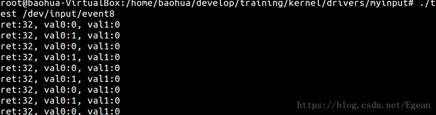

## 介绍

本章以"BTN_0"事件为例, 使用input子系统向内核注册一个"BTN_0"的输入事件，然后通过定时器定时触发来模拟按键按下的操作；在应用层中通过注册输入事件来接收驱动发出的事件。整个过程不涉及硬件，只是介绍Input子系统的框架。
Input子系统基于cdev提供接口，属于字符设备，所有使用input子系统构建的设备都使用**主设备号13**，同时输入子系统也支持**自动创建设备文件**，这些文件采用阻塞的IO读写方式，被创建在**"/dev/input/"**下。

----

## 驱动代码

该驱动使用了platform驱动框架，包括platform_driver部分和platform_device部分，首先是驱动部分。

```cpp
#include <linux/module.h>
#include <linux/types.h>
#include <linux/sched.h>
#include <linux/init.h>
#include <linux/cdev.h>
#include <linux/slab.h>
#include <linux/poll.h>
#include <linux/platform_device.h>
#include <linux/uaccess.h>
#include <linux/input.h>

struct myinput_dev {
   struct timer_list timer;
   struct input_dev *input;
   atomic_t count;
};

static void do_key_input(unsigned long arg)
{
    struct myinput_dev *mydev = (struct myinput_dev *)arg;
    int val;

    val = atomic_inc_return(&mydev->count);
    if (val % 2 == 0)
        val = 0;
    else
        val = 1;
    // 上报BTN_0事件
    input_report_key(mydev->input, BTN_0, val);
    input_sync(mydev->input);

    mod_timer(&mydev->timer, jiffies + HZ);
}

static int key_input_probe(struct platform_device *pdev)
{
    struct myinput_dev *mydev;

    mydev = kzalloc(sizeof(*mydev), GFP_KERNEL);
    if (!mydev)
        return -ENOMEM;

    // 初始化定时器
    init_timer(&mydev->timer);
    mydev->timer.function = do_key_input;
    mydev->timer.expires = jiffies + HZ;
    mydev->timer.data = (unsigned long)mydev;
    add_timer(&mydev->timer);

    // 注册输入子系统, input_dev中evbit[1], keybit[24]
    // 这里注册了键盘事件中的BTN_0事件
    mydev->input = input_allocate_device();
    mydev->input->name = "key_input";
    mydev->input->evbit[0] = BIT_MASK(EV_KEY);
    mydev->input->keybit[BIT_WORD(BTN_0)] = BIT_MASK(BTN_0);
    input_register_device(mydev->input);

    atomic_set(&mydev->count, 0);

    platform_set_drvdata(pdev, mydev);
    
    return 0;
}

static int key_input_remove(struct platform_device *pdev)
{
    struct myinput_dev *mydev = platform_get_drvdata(pdev);
    input_free_device(mydev->input);
    del_timer(&mydev->timer);
    kfree(mydev);

    return 0;
}

static struct platform_driver key_input_driver = {
    .probe = key_input_probe,
    .remove = key_input_remove,
    .driver = {
        .name = "key_input",
        .owner = THIS_MODULE
    }
};
module_platform_driver(key_input_driver)

MODULE_AUTHOR("colourfate <hzy1q84@foxmail.com>");
MODULE_LICENSE("GPL v2");
```
该程序很简单，在probe函数中注册了定时器和Input系统，定时时间到则调用`do_key_input()`函数，该函数中使用Input子系统定时向系统上报0或1。这里有两点需要注意，一是Input子系统的注册：
```cpp
mydev->input->evbit[0] = BIT_MASK(EV_KEY);
mydev->input->keybit[BIT_WORD(BTN_0)] = BIT_MASK(BTN_0);
```
`input_dev`的结构是这样的：
```cpp
struct input_dev {
    ...
	unsigned long propbit[BITS_TO_LONGS(INPUT_PROP_CNT)];
    // EV_CNT为支持的事件数, 等于32, BITS_TO_LONGS是计算32位需要几个long
    // 来存储, 这里是32位系统, long占4字节, 因此只需要一个long即可
	unsigned long evbit[BITS_TO_LONGS(EV_CNT)];
	unsigned long keybit[BITS_TO_LONGS(KEY_CNT)];
	unsigned long relbit[BITS_TO_LONGS(REL_CNT)];
	unsigned long absbit[BITS_TO_LONGS(ABS_CNT)];
	unsigned long mscbit[BITS_TO_LONGS(MSC_CNT)];
	unsigned long ledbit[BITS_TO_LONGS(LED_CNT)];
	unsigned long sndbit[BITS_TO_LONGS(SND_CNT)];
	unsigned long ffbit[BITS_TO_LONGS(FF_CNT)];
	unsigned long swbit[BITS_TO_LONGS(SW_CNT)];
    ...
```
这里`input_dev.evbit[]`是用来表示支持的事件类型，EV_CNT=32，表示最大支持32种事件，只需一个long即可存储, 因此`BITS_TO_LONGS(EV_CNT)=1`
虽然EV_CNT=32, 但是系统中只支持12种事件, 12种事件中只有8种事件在结构体中有对应的位图
keybit, relbit, ..., swbit是8种事件对应的位图。如`KEY_CNT=0x300`, 支持768个按键，要注册其中一个按键就将相应的位置1。如`BTN_0=100`是，100/32=3......4, 所以将keybit[3]的第4位置1即可。

在构建`input_dev`的代码中：
第一行表示向内核注册按键事件，这里的`evbit[0]`可以不必理会，这是考虑到不同平台上long数据类型的长度不一样而设计的，在x86架构下`evbit`数组的长度就是1，也就是说只有0。
第二行表示注册按键事件中的`BTN_0`事件，`BIT_WORD(BTN_0)=3`，而`BIT_MASK(BTN_0)`刚好是第4位是1，和上面的分析一致。

第二点需要主要的是Input子系统的上报函数
```cpp
input_report_key(mydev->input, BTN_0, val);
input_sync(mydev->input);
```
可以一次进行多个`input_report_key()`函数，但是上报的事件必须是向系统注册过的。上报之后需要执行`input_sync()`函数进行同步才能真正的上报成功。

实际上这里定时器中适合于使用tasklet调度出去后再进行Input子系统的操作，否则一直是处于中断上下文中，如果其中的函数又有调度，那么该中断就永远不会返回了，从而造成错误。但是经过分析`input_report_key()`和`input_sync()`函数中是调用了自旋锁锁住再进行操作的，所以不会有调度，这看起来似乎没问题。

接下来是platform_device的代码：
```cpp
#include <linux/module.h>
#include <linux/platform_device.h>

static struct platform_device *key_input_pdev;

static int __init key_input_dev_init(void)
{
	int ret;

    key_input_pdev = platform_device_alloc("key_input", -1);
	if (!key_input_pdev)
		return -ENOMEM;

	ret = platform_device_add(key_input_pdev);
	if (ret) {
		platform_device_put(key_input_pdev);
		return ret;
	}

	return 0;

}
module_init(key_input_dev_init);

static void __exit key_input_dev_exit(void)
{
	platform_device_unregister(key_input_pdev);
}
module_exit(key_input_dev_exit);

MODULE_AUTHOR("colourfate <hzy1q84@foxmail.com>");
MODULE_LICENSE("GPL v2");
```
该驱动中只有一个platform_device的注册，由于和platform_driver的名字是一致的，这会导致了驱动中的probe函数被执行。

## 测试驱动

Input子系统很简单，因此不分析内核实现了，直接写一个程序来测试这个驱动

```cpp
#include <stdio.h>
#include <sys/types.h>
#include <sys/stat.h>
#include <fcntl.h>
#include <unistd.h>
#include <linux/input.h>

int main(int argc, char const *argv[])
{
    int fd = 0;
    struct input_event event[2] = {0};      // 驱动上传了1个事件，第2个用来装空元素 
    int ret = 0;
	
	if (argc != 2) {
		printf("./iread <file>\n");
		return -1;
	}
    
	fd = open(argv[1],O_RDONLY);
	if (fd < 0) {
		perror("open");
		return -1;
	}

    while(1){
        ret = read(fd, &event, sizeof(event));
		if(ret < 0) {
			perror("read");
			return -1;
		}
        printf("ret:%d, val0:%d, val1:%d\n", ret,
        event[0].value, event[1].value);
        sleep(1);
    }
    return 0;
}

```
将之前编译的驱动模块插入系统，会发现在/dev/input/目录下自动创建了event8文件, 该文件就是所注册的"BTN_0"事件，不同计算机可能事件号不一样，但是会比插入模块之前多出一个事件。

编译以上读取函数为`iread`，然后执行`./iread /dev/input/event8`就会看到交替出现的0和1，每隔1秒出现一次。
