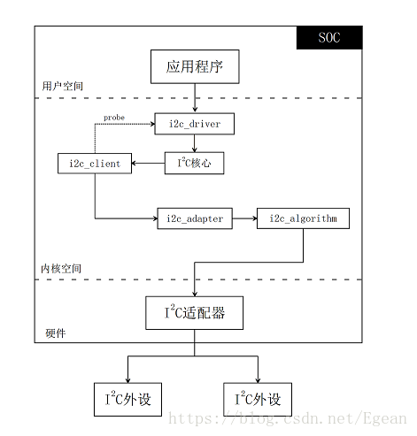
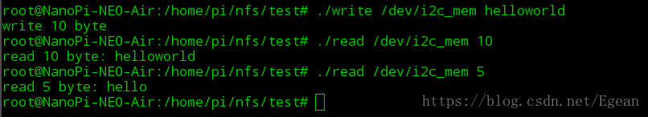

### 介绍
这里实现一种不涉及硬件的I2C总线和设备驱动，然后分析I2C驱动在系统中的注册过程。这里实现的驱动类似于之前的FIFO字符设备驱动，与之不同的是这里使用了I2C驱动框架，设备文件写入和读取将通过i2c_client传递到指定的i2c_adaper，然后在i2c_adapter中操作一段内存。这个驱动非常简单，甚至没有使用FIFO这种硬件结构，只能进行读和写，毕竟内存的操作不是重点，重点是熟悉Linux系统的I2C驱动框架。

首先需要注意的是I2C驱动分为**总线驱动**和**设备驱动**，不能混为一谈。I2C总线驱动主要针对i2c_adapter和i2c_algorithm进行设置，一个i2c_adapter对应一个SOC中的I2C适配器。比如全志H3芯片有三个I2C接口，那么就对应三个I2C适配器，在I2C总线驱动中，主要完成对I2C适配器的配置工作，如写哪个寄存器配置I2C时钟，写哪个寄存器准备发送，接收到数据后从哪个寄存器读取等。可以看出这都是和平台相关的代码，主要由移植操作系统工程师实现。

I2C设备驱动是针对外设的驱动，这是在默认系统的I2C适配器已经能够正常工作情况下，指定调用哪个I2C适配器发送相应的数据给外设芯片。比如i2c-0上接了一个加速度传感器，那么我就可以调用i2c-0的适配器来向该外设发送相应的数据来操作它的寄存器，完成传感器的初始化、读取等操作。

------

### 相关结构体
 - i2c_adapter对应一个I2C适配器，其中的`i2c_algorithm`决定了该适配器是如何工作的。
```cpp
struct i2c_adapter {
	struct module *owner;
	const struct i2c_algorithm *algo; /* the algorithm to access the bus */
	void *algo_data;
    ...
	struct device dev;		/* the adapter device */

	int nr;
	char name[48];
	...
    struct list_head userspace_clients;
    ...
};
```
 - i2c_algorithm指定了i2c_adapter具体的传输方法，一个i2c_adapter绑定一个i2c_algorithm。
```cpp
struct i2c_algorithm{
     int (*master_xfer)(struct i2c_adapter *adap, struct i2c_msg *msgs,int num);
     int (*smbus_xfer) (struct i2c_adapter *adap, u16 addr,  unsigned short flags, char read_write,  u8 command, int size, union i2c_smbus_data *data);
     u32 (*functionality) (struct i2c_adapter *);
}
```
 - i2c_client对应一个I2C的外设，属于I2C设备驱动部分，其中包括了外设的名称、从机地址、挂接的适配器等信息。
```cpp
struct i2c_client {
	unsigned short flags;		/* div., see below		*/
	unsigned short addr;		/* chip address - NOTE: 7bit	*/
					/* addresses are stored in the	*/
					/* _LOWER_ 7 bits		*/
	char name[I2C_NAME_SIZE];
	struct i2c_adapter *adapter;	/* the adapter we sit on	*/
	struct device dev;		/* the device structure		*/
	int irq;			/* irq issued by device		*/
	struct list_head detected;
    ...
};
```
 - i2c_driver主要包含一个probe函数，当i2c_client和i2c_driver匹配时，probe函数就会执行，这一点和platform驱动是相似的。
```cpp
struct i2c_driver {
	unsigned int class;

	/* Notifies the driver that a new bus has appeared. You should avoid
	 * using this, it will be removed in a near future.
	 */
	int (*attach_adapter)(struct i2c_adapter *) __deprecated;

	/* Standard driver model interfaces */
	int (*probe)(struct i2c_client *, const struct i2c_device_id *);
	int (*remove)(struct i2c_client *);
	int (*probe_new)(struct i2c_client *);
	void (*shutdown)(struct i2c_client *);
	void (*alert)(struct i2c_client *, enum i2c_alert_protocol protocol,
		      unsigned int data);
	int (*command)(struct i2c_client *client, unsigned int cmd, void *arg);
	struct device_driver driver;
	const struct i2c_device_id *id_table;
	
	/* Device detection callback for automatic device creation */
	int (*detect)(struct i2c_client *, struct i2c_board_info *);
	const unsigned short *address_list;
	struct list_head clients;
};

```

----------

### I2C总线驱动

#### 1. 驱动代码
由于这里使用了platform总线框架，因此这里只贴出platform_driver部分，platform_device部分只包含一个简单的注册并且在第2节有相关代码参考，所以不再贴出来了。
```cpp
#include <linux/module.h>
#include <linux/types.h>
#include <linux/init.h>
#include <linux/cdev.h>
#include <linux/slab.h>
#include <linux/platform_device.h>
#include <linux/uaccess.h>
#include <linux/i2c.h>

#define PAGE_LEN 4096

struct myi2c_dev {
    char *mem;
    struct i2c_adapter adapter;
    struct i2c_client *client;
};

// 返回-EAGAIN重试发送
static int i2c_test_xfer(struct i2c_adapter *adap, struct i2c_msg *msgs,
                int num)
{
    struct myi2c_dev *dev = i2c_get_adapdata(adap);
    int i;

    for (i=0; i<num; i++) {
        if (msgs[i].len > PAGE_LEN)
            msgs[i].len = PAGE_LEN;
        if (msgs[i].flags & I2C_M_RD) {
            // 读数据
            printk(KERN_INFO "read data from %p to %p\n", dev->mem, 
                    msgs[i].buf);
            if (copy_to_user(msgs[i].buf, dev->mem, msgs[i].len)) {
                printk(KERN_INFO "i2c_adapter: fail to read\n");
                return -EFAULT;
            }
        } else {
            // 写数据
            printk(KERN_INFO "write data from %p to %p\n", msgs[i].buf, 
                    dev->mem);
            if (copy_from_user(dev->mem, msgs[i].buf, msgs[i].len)) {
                printk(KERN_INFO "i2c_adapter: fail to write\n");
                return -EFAULT;
            }
        }
    }

    return 0;
}

static u32 i2c_test_func(struct i2c_adapter *adap)
{
    return I2C_FUNC_I2C;  
}

static const struct i2c_algorithm i2c_test_algo = {
    .master_xfer = i2c_test_xfer,
    .functionality = i2c_test_func  // 决定适配器支持什么类型的i2c器件
};

static struct i2c_board_info i2c_mem_dev = {
    //I2C_BOARD_INFO("24c08", 0x50),
    //.platform_data = &at24c08
    .type = "i2c_mem",
    .addr = 0x23
};

static int i2c_test_probe(struct platform_device *pdev)
{
    struct myi2c_dev *dev;
    int ret;

    dev = kzalloc(sizeof(*dev), GFP_KERNEL);
    if (!dev)
        return -ENOMEM;
    dev->mem = kzalloc(PAGE_LEN, GFP_KERNEL);
    if (!dev->mem)
        return -ENOMEM;

    // 设置适配器私有数据
    i2c_set_adapdata(&dev->adapter, dev);
    // 添加i2c适配器, 使用指定的总线号
    dev->adapter.owner = THIS_MODULE;
    //dev->adapter.class = I2C_CLASS_DEPRECATED;
    strcpy(dev->adapter.name, "i2c test adapter");
    dev->adapter.algo = &i2c_test_algo;
    dev->adapter.dev.parent = &pdev->dev;
    dev->adapter.nr = pdev->id;
    ret = i2c_add_numbered_adapter(&dev->adapter);

    // 手动添加i2c_client，本来应该在板级文件或设备树中添加
    dev->client = i2c_new_device(&dev->adapter, &i2c_mem_dev);
    if (!dev->client) {
        printk(KERN_INFO "fail to register i2c_client\n");
        return -ENOMEM;
    }

    platform_set_drvdata(pdev, dev);
    printk(KERN_INFO "test probe!\n");
    
    return 0;
}

static int i2c_test_remove(struct platform_device *pdev)
{
    struct myi2c_dev *dev = platform_get_drvdata(pdev);
    i2c_unregister_device(dev->client);
    i2c_del_adapter(&dev->adapter);
    kfree(dev->mem);
    kfree(dev);
    printk(KERN_INFO "i2c test remove!\n");
    return 0;
}


static struct platform_driver i2c_test_driver = {
    .probe = i2c_test_probe,
    .remove = i2c_test_remove,
    .driver = {
        .name = "i2c_test_module",
        .owner = THIS_MODULE
    }
};
module_platform_driver(i2c_test_driver);

MODULE_AUTHOR("colourfate <hzy1q84@foxmail.com>");
MODULE_LICENSE("GPL v2");
```

#### 2. 内核实现分析

<font color=#A52A2A size=4 >i2c_adapter的添加：</font>

这里使用了platform驱动框架，我们直接看probe函数。这里首先使用`i2c_set_adapdata()`函数设置i2c_adapter的私有数据，可以看到`i2c_adapter`实际上是`device`的子类，而这个私有数据也是设置在`device`中的：
```cpp
static inline void i2c_set_adapdata(struct i2c_adapter *dev, void *data)
{
	dev_set_drvdata(&dev->dev, data);
}
```
接下来对i2c_adapter进行配置，其中配置了`dev->adapter.algo = &i2c_test_algo`，这很重要，因为它决定了i2c适配器是如何工作的，同时还配置了`dev->adapter.nr = pdev->id`，这是i2c适配器的编号，通过编号可以找到唯一指定的适配器。
接下来使用`i2c_add_numbered_adapter()`函数将适配器添加到系统。该函数指定了`i2c_adapter()`的总线号，同时可以使用`i2c_add_adapter()`函数让系统自动分配总线号。
```cpp
--- drivers --- i2c --- i2c_core.c --- i2c_add_numbered_adapter(   --- if (adap->nr == -1)
             |                      |    struct i2c_adapter *adap)  |      i2c_add_adapter(adap);
             |                      |                               |- __i2c_add_numbered_adapter(adap);
             |                      |- __i2c_add_numbered_adapter( --- id = idr_alloc(&i2c_adapter_idr,adap,adap->nr,adap->nr+1,GFP_KERNEL)
             |                      |    struct i2c_adapter *adap)  |- i2c_register_adapter(adap)
             |                      |- i2c_register_adapter(       --- INIT_LIST_HEAD(&adap->userspace_clients)
             |                      |    struct i2c_adapter *adap)  |- dev_set_name(&adap->dev, "i2c-%d", adap->nr)
             |                      |                               |- adap->dev.bus = &i2c_bus_type
	         |                      |                               |- adap->dev.type = &i2c_adapter_type
	         |                      |                               |- device_register(&adap->dev)
             |                      |                               |- bus_for_each_drv(&i2c_bus_type, NULL, adap, __process_new_adapter);
             |                      |- __process_new_adapter(     --- i2c_do_add_adapter(to_i2c_driver(d), data)
             |                      |    struct device_driver *d,
             |                      |    void *data)
             |                      |- i2c_do_add_adapter(         --- i2c_detect(adap, driver)
             |                      |    struct i2c_driver *driver, |- 这里是废弃的driver->attach_adapter方法
			 |                      |    struct i2c_adapter *adap)
             |                      |- i2c_detect(                   --- address_list = driver->address_list
             |                      |    struct i2c_adapter *adapter, |- if (!driver->detect || !address_list) 
             |                      |    struct i2c_driver *driver)   |       return 0;
             |                      |                                 |- temp_client = kzalloc(sizeof(struct i2c_client), GFP_KERNEL)
             |                      |                                 |- temp_client->adapter = adapter
             |                      |                                 |- for (i = 0; address_list[i] != I2C_CLIENT_END; i += 1) {
             |                      |                                 |      temp_client->addr = address_list[i];
             |                      |                                 |      err = i2c_detect_address(temp_client, driver);
             |                      |                                 |      err不是错误码，则break;
             |                      |                                 |  }
             |                      |                                 |- kfree(temp_client)
             |                      |- i2c_detect_address(              --- struct i2c_board_info info
             |                      |    struct i2c_client *temp_client, |- adapter = temp_client->adapter
			 |                      |    struct i2c_driver *driver)      |- addr = temp_client->addr
             |                      |                                    |- info.addr = addr
             |                      |                                    |- driver->detect(temp_client, &info)
             |                      |                                    |- if (info.type[0] == '\0')
             |                      |                                    |      报错;
             |                      |                                    |  else {
             |                      |                                    |      struct i2c_client *client;
             |                      |                                    |      client = i2c_new_device(adapter, &info);
             |                      |                                    |      list_add_tail(&client->detected, &driver->clients);
             |                      |                                    |  }
             |  
             |- base --- bus.c --- bus_for_each_drv(            --- while ((drv = next_driver(&i)) && !error)
                                     struct bus_type *bus,       |-     error = fn(drv, data);
                                     struct device_driver *start,
		                             void *data,
                                     int (*fn)(struct device_driver *, void *))

```
`i2c_add_numbered_adapter`展开后涉及很多函数，首先可以追到`i2c_register_adapter()`函数，该函数首先使用`dev_set_name()`设定了总线名称为`i2c-%d`，其中%d为总线号，然后设定了总线名称和从总线类型，并用`device_register()`函数注册设备，该函数在platform驱动中已经详细分析，这里不展开，最后遍历总线上的所有驱动，并执行`__process_new_adapter()`函数。

从`__process_new_adapter()`函数直接调用了`i2c_do_add_adapter()`函数，其中`to_i2c_driver`宏是由`device_driver`父类得到`i2c_driver`子类。

`i2c_do_add_adapter()`函数实际上就是一个`i2c_detect()`函数，下面废弃的函数我们不分析。

`i2c_detect()`中，如果没有定义`driver->address_list`和`driver->detect `，则直接跳出，`i2c_driver`是下面讲到的外设驱动部分，这里没有定义这两个变量，所以到这里添加适配器就完成，由于我们没有在驱动中定义`address_list`和`detect`，所以不会有`i2c_client`添加进来，所以这里是手动添加的`i2c_client`。我们也可以继续分析。

接下来申请一个`temp_client`，然后将适配器与之绑定，然后遍历`address_list`，并将`address_list[i]`绑定到`temp_client`上，然后执行`i2c_detect_address`

进入`i2c_detect_address()`函数，该函数实际上是声明了一个`struct i2c_board_info`变量，然后使用`driver->detect`填充该变量，然后使用`i2c_new_device()`新申请了一个`i2c_client`，将`adapter`与之绑定，并使用`info`的信息初始化它，这个函数下来会分析。最后使用`list_add_tail()`添加到链表完成client的添加工作。


<font color=#A52A2A size=4 >i2c_client的添加：</font>

这里实际就用了一个`i2c_new_device()`函数完成client的添加

```cpp
--- drivers --- i2c --- i2c_core.c --- i2c_new_device(                      --- client = kzalloc(sizeof *client, GFP_KERNEL)
                                         struct i2c_adapter *adap,           |- client->adapter = adap
                                         struct i2c_board_info const *info)  |- client->dev.platform_data = info->platform_data
                                                                             |- client->flags = info->flags
                                                                             |- client->addr = info->addr
                                                                             |- client->irq = info->irq
                                                                             |- strlcpy(client->name, info->type, sizeof(client->name))
                                                                             |- client->dev.bus = &i2c_bus_type
                                                                             |- client->dev.type = &i2c_client_type
                                                                             |- device_register(&client->dev)
```
我不准备具体分析接下来的代码了，因为代码树列出了函数调用中的关键部分，再结合linux内核源码应该能很容易看懂（毕竟内核源码非常规范），之前的分析只是照着源码复述了一遍，意义不大。当然如果有容易搞错的关键部分我还是会说明。引用linus名言：
> Read the fucking source code!

---------

### I2C设备驱动
#### 1. 驱动代码
```cpp
#include <linux/module.h>
#include <linux/i2c.h>
#include <linux/miscdevice.h>
#include <linux/types.h>
#include <linux/init.h>
#include <linux/cdev.h>
#include <linux/slab.h>
#include <linux/uaccess.h>


struct i2c_memery_dev {
    struct miscdevice miscdev;
    struct i2c_client *client;
};

ssize_t i2c_mem_read(struct file *filp, char __user *buf, 
                size_t count, loff_t *ppos)
{
    // misc注册时自动将miscdevice的指针放到private_data中，这就是
    // 为什么在i2c_memery_dev中要使用miscdevice的实体，而不是指针
    struct i2c_memery_dev *dev = container_of(filp->private_data,
                    struct i2c_memery_dev, miscdev);
    struct i2c_msg msg;
    int ret;
    // 构建i2c_msg
    msg.addr = dev->client->addr;
    msg.flags = I2C_M_RD;
    msg.buf = buf;
    msg.len = count;
    // 调用适配器发送, 返回值为client->adapter->algo->master_xfer函数的
    // 返回值
    ret = i2c_transfer(dev->client->adapter, &msg, 1);
    if (ret < 0) {
        printk(KERN_INFO "fail to transfer\n");
        return 0;
    }
    printk(KERN_INFO "count=%d\n", count);
   
    return count;
}

ssize_t i2c_mem_write (struct file *filp, const char __user *buf,
            size_t count, loff_t *ppos)
{
    struct i2c_memery_dev *dev = container_of(filp->private_data,
                    struct i2c_memery_dev, miscdev);
    struct i2c_msg msg;
    int ret;
    // 构建i2c_msg
    msg.addr = dev->client->addr;
    msg.flags = 0;
    msg.buf = buf;
    msg.len = count;
    // 调用适配器发送
    ret = i2c_transfer(dev->client->adapter, &msg, 1);
    if (ret < 0) { 
        printk(KERN_INFO "fail to transfer\n");
        return 0;
    }
    printk(KERN_INFO "count=%d\n", count);
   
    return count;
}

static int i2c_mem_release(struct inode *inode, struct file *filp)
{
    printk(KERN_INFO "i2c_mem release\n");
    return 0;
}

static int i2c_mem_open(struct inode *inode, struct file *filp)
{
    printk(KERN_INFO "i2c_mem open\n");
    return 0;
}

static const struct file_operations i2c_mem_fops = {
    .write = i2c_mem_write,
    .read = i2c_mem_read,
    .open = i2c_mem_open,
    .release = i2c_mem_release
};

static int i2c_mem_probe(struct i2c_client *client, 
                const struct i2c_device_id *id)
{
    struct i2c_memery_dev *dev;
    int ret;

    dev = kzalloc(sizeof(*dev), GFP_KERNEL);
    if (!dev) {
        printk(KERN_INFO "i2c_mem_probe:fail to kzalloc\n");
        return -ENOMEM;
    }
    
    // 设置杂散类设备驱动
    dev->miscdev.minor = MISC_DYNAMIC_MINOR;
    dev->miscdev.name = "i2c_mem";
    dev->miscdev.fops = &i2c_mem_fops;
    // 设置私有数据
    dev->client = client;
    dev_set_drvdata(&client->dev, dev);
    
    ret = misc_register(&dev->miscdev);
    if (ret < 0) {
        return ret;
    }

    return 0;
}

static int i2c_mem_remove(struct i2c_client *client)
{
    struct i2c_memery_dev *dev = dev_get_drvdata(&client->dev);
    misc_deregister(&dev->miscdev);
    return 0;
}

static const struct i2c_device_id i2c_mem_ids[] = {
    {"i2c_mem", 0}
};

static struct i2c_driver i2c_mem_driver = {
    .driver = {
        .name = "i2c_mem",
        .owner = THIS_MODULE,
    },
    .probe = i2c_mem_probe,
    .remove = i2c_mem_remove,
    .id_table = i2c_mem_ids,
};

static int __init i2c_mem_test_init(void)
{
    return i2c_add_driver(&i2c_mem_driver);
}
module_init(i2c_mem_test_init);

static void __exit i2c_mem_test_exit(void)
{
    i2c_del_driver(&i2c_mem_driver);
}
module_exit(i2c_mem_test_exit);

MODULE_AUTHOR("colourfate <hzy1q84@foxmail.com>");
MODULE_LICENSE("GPL v2");
```

#### 2. 内核实现分析
设备驱动主要是向系统注册`i2c_driver`这个结构，然后在总线驱动中，我们注册了一个`i2c_client`，此时注册驱动就会遍历总线所有设备，然后对所有设备和驱动调用`bus->match`这个函数来判断设备和驱动是否匹配，这个地方和platform驱动非常相似（毕竟它们都是总线驱动），只是这个地方的`bus->match`是`i2c_bus_type`的匹配函数。
匹配过后就可以执行probe函数进行初始化，这里设备驱动使用了**杂散类设备驱动**框架，只实现了其中的read和write函数

<font color=#A52A2A size=4 >i2c_driver的注册：</font>

注册主要调用的是`i2c_add_driver()`宏，这个宏调用了`i2c_register_driver()`函数。
```cpp
#define i2c_add_driver(driver) \
	i2c_register_driver(THIS_MODULE, driver)
```
接下来分析`i2c_register_driver`函数
```cpp
--- drivers --- i2c --- i2c_core.c --- i2c_register_driver(         --- driver->driver.bus = &i2c_bus_type
                                    |    struct module *owner,       |- INIT_LIST_HEAD(&driver->clients)
                                    |    struct i2c_driver *driver)  |- driver_register(&driver->driver)
                                    |                                |- i2c_for_each_dev(driver, __process_new_driver)
                                    |- i2c_for_each_dev(                    --- bus_for_each_dev(&i2c_bus_type, NULL, data, fn)
                                    |    void *data,
                                    |    int (*fn)(struct device *, void *))
                                    |- __process_new_driver( --- if (dev->type != &i2c_adapter_type)
                                         struct device *dev,  |      return 0;
                                         void *data)          |- i2c_do_add_adapter(data, to_i2c_adapter(dev));
```
可以看到这里面有两个关键函数都已经分析过了，一个是在platform驱动中分析过的`driver_register()`函数，一个是刚刚分析过的`i2c_do_add_adapter()`函数。这里其实就是向系统注册驱动，并遍历i2c_bus上的所有设备，然后再对所有设备执行`i2c_do_add_adapter`，尝试生成`i2c_client`，由于这里没有定义`detect`函数，而是手动添加的`i2c_client`，所以全部返回0.

在`driver_register()`函数中完成了`i2c_client`和`i2c_driver`的匹配，但是这里调用的是`i2c_bus_type->match`函数，下面看看它们是如何匹配的。先找到其定义，再找到定义总绑定的函数。

```cpp
// driver/i2c/i2c_core.c
struct bus_type i2c_bus_type = {
	.name		= "i2c",
	.match		= i2c_device_match,
	.probe		= i2c_device_probe,
	.remove		= i2c_device_remove,
	.shutdown	= i2c_device_shutdown,
};

static int i2c_device_match(struct device *dev, struct device_driver *drv)
{
	struct i2c_client	*client = i2c_verify_client(dev);
	struct i2c_driver	*driver;

	/* Attempt an OF style match */
	if (i2c_of_match_device(drv->of_match_table, client))
		return 1;

	/* Then ACPI style match */
	if (acpi_driver_match_device(dev, drv))
		return 1;

	driver = to_i2c_driver(drv);

	/* Finally an I2C match */
	if (i2c_match_id(driver->id_table, client))
		return 1;

	return 0;
}
```
这个函数实际上和`platform_bus_type->match`大同小异，先匹配设备树，然后匹配id，就是说如果`i2c_client`和`i2c_driver`的名字设置相同的话就能够完成匹配。

------------

### I2C驱动框架分析
如果认真分析了以上I2C驱动实现的具体代码，我们会发现Linux的I2C驱动框架实际上分三层，分别是：I2C设备驱动、I2C核心、I2C总线驱动。

**I2C设备驱动定义了外设的交互方式，对与不同的I2C外设需要不同的设备驱动**。I2C设备驱动对上和用户应用程序打交道，对下和I2C核心对接。
I2C核心是I2C驱动框架的主体，它定义了一系列API供设备驱动和总线驱动使用，相当于一个标准的函数调用规范。
**I2C总线驱动定义了平台上I2C的工作方式，只要平台不变这部分代码就可以通用**。I2C总线驱动是最底层的驱动，它上面是I2C核心，下面是SOC中的I2C适配器硬件，I2C适配器硬件上面连接了的我们的I2C外设。

总体来看这个框架如图所示：


----------

### 驱动测试
分别编译好三个驱动模块，然后插入到系统，可以看到`/dev/`目录下出现了`i2c_mem`设备文件。写两个读和写app来测试驱动，这里写的app是通用的，以后也会使用这些它们来测试其他驱动。

首先是read.c：

```cpp
#include <stdio.h>
#include <sys/types.h>
#include <sys/stat.h>
#include <fcntl.h>
#include <stdlib.h>
#include <unistd.h>

int main(int argc, char **argv)
{
    int fd, count, ret;
    char buf[128] = {0};

    if (argc != 3) {
        printf("usage: ./read <file> <count>\n");
        return -1;
    }
    
    fd = open(argv[1], O_RDWR);
    if (fd < 0) {
        perror("open");
        return -1;
    }
    
    count = atoi(argv[2]);
    if (count > 128) {
        count = 128;
        printf("warn: count > 128\n");
    } else if (count < 1) {
        count = 1;
        printf("warn: count < 1\n");
    }

    ret = read(fd, buf, count);
    if (ret < 0) {
        perror("read");
        return -1;
    }

    printf("read %d byte: %s\n", ret, buf);
    close(fd);
    
    return 0;
}
```

然后是write.c：
```cpp
#include <stdio.h>
#include <sys/types.h>
#include <sys/stat.h>
#include <fcntl.h>
#include <unistd.h>
#include <string.h>

int main(int argc, char **argv)
{
    int fd, count, ret;

    if (argc != 3) {
        printf("usage: ./write <file> <string>\n");
        return -1;
    }
    
    fd = open(argv[1], O_RDWR);
    if (fd < 0) {
        perror("open");
        return -1;
    }
    
    ret = write(fd, argv[2], strlen(argv[2]));
    if (ret < 0) {
        perror("write");
        return -1;
    }

    printf("write %d byte\n", ret);
    close(fd);
    
    return 0;
}
```

编译好之后执行`./write /dev/i2c_mem helloworld`写入数据，然后使用`./read /dev/i2c_mem 10`读出数据。我这里是直接在开发板上测试的。
