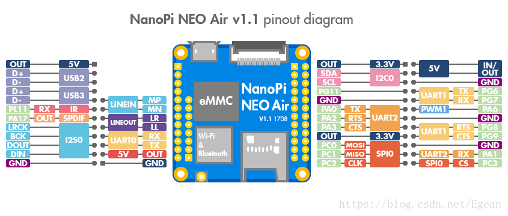
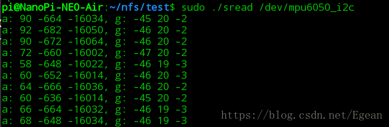

### 介绍
在上节中实现了不依赖于硬件的I2C总线驱动和设备驱动，这一节我们利用I2C框架来真正地驱动硬件，由于手上的I2C器件只有一个MPU6050，所以这里实现了一个MPU6050的I2C设备驱动程序，硬件平台是nanopi-air。注意因为nanopi已经实现了I2C总线驱动（具体实现在drivers/i2c/busses/i2c-mv64xxx.c），因此我们可以直接使用现成i2c_adapter来进行I2C通信。

### 代码实现
注意，因为nanopi-air只引出了i2c-0，所以下面的驱动中使用的是i2c-0的适配器。
```cpp
#include <linux/module.h>
#include <linux/i2c.h>
#include <linux/miscdevice.h>
#include <linux/types.h>
#include <linux/init.h>
#include <linux/cdev.h>
#include <linux/slab.h>
#include <linux/uaccess.h>

#include "mpu6050.h"

#define I2C_0 0     // i2c-0总线号
#define DEV_NAME "mpu6050"

struct mpu6050_i2c_dev {
    struct miscdevice miscdev;
    struct i2c_client *client;
};

int mpu6050_read_bytes(uint8_t *rxbuf, uint8_t len, 
            struct i2c_client *client, uint8_t reg_addr)
{
    struct i2c_msg msgs[2];
    uint8_t txbuf = reg_addr;
    int ret;

    memset(msgs, 0, sizeof(msgs));
    msgs[0].addr = client->addr;
    msgs[0].buf = &txbuf;
    msgs[0].len = 1;

    msgs[1].addr = client->addr;
    msgs[1].flags = I2C_M_RD;
    msgs[1].buf = rxbuf;
    msgs[1].len = len;

    ret = i2c_transfer(client->adapter, msgs, ARRAY_SIZE(msgs));
    if (ret < 0) {
        pr_info("%s: fail to transfer\n", __func__);
        return -EFAULT;
    }

    return 0;
}

int mpu6050_read_byte(uint8_t *data, struct i2c_client *client, 
            uint8_t reg_addr)
{
    return mpu6050_read_bytes(data, 1, client, reg_addr);
}

int mpu6050_write_byte(uint8_t data, struct i2c_client *client, 
            uint8_t reg_addr)
{
    struct i2c_msg msg[1];
    uint8_t txbuf[] = {reg_addr, data};
    int ret;

    memset(msg, 0, sizeof(msg));
    msg[0].addr = client->addr;
    msg[0].buf = txbuf;
    msg[0].len = sizeof(txbuf);
    
    ret = i2c_transfer(client->adapter, msg, ARRAY_SIZE(msg));
    if (ret < 0) {
        pr_info("%s: fail to transfer\n", __func__);
        return -EFAULT;
    }

    return 0;
}

int mpu6050_test_connect(struct i2c_client *client)
{
    uint8_t slave_addr;
    int ret;

    ret = mpu6050_read_byte(&slave_addr, client, MPU6050_RA_WHO_AM_I);
    if (ret < 0)
        return -EFAULT;

    if (slave_addr != client->addr) {
        pr_info("%s: %d isn't client address\n", __func__, slave_addr);
        return -ENODEV;
    }
    pr_info("%s: mpu6050 connected\n", __func__);

    return 0;
}

ssize_t mpu6050_i2c_read(struct file *filp, char __user *buf, 
                size_t count, loff_t *ppos)
{
    // misc注册时自动将miscdevice的指针放到private_data中，这就是
    // 为什么在i2c_memery_dev中要使用miscdevice的实体，而不是指针
    struct mpu6050_i2c_dev *dev = container_of(filp->private_data,
                    struct mpu6050_i2c_dev, miscdev);
    uint8_t tmp[14];
    int ret;

    if (count > 14) {
        pr_info("count > 14");
        count = 14;
    } else if (count < 1) {
        pr_info("count < 1");
        count = 1;
    }
    ret = mpu6050_read_bytes(tmp, 14, dev->client, 
                MPU6050_RA_ACCEL_XOUT_H);
    if (ret < 0) 
        goto out;

    pr_info("%d %d %d, %d %d %d\n", tmp[0]<<8 | tmp[1], 
            tmp[2]<<8 | tmp[3], tmp[4]<<8 | tmp[5], tmp[8]<<8 | tmp[9],
            tmp[10]<<8 | tmp[11], tmp[12]<<8 | tmp[13]);
    if (copy_to_user(buf, tmp, count))
        ret = -EFAULT;
    else 
        ret = count;
out:    
    return ret;
}

ssize_t mpu6050_i2c_write (struct file *filp, const char __user *buf,
            size_t count, loff_t *ppos)
{
    struct mpu6050_i2c_dev *dev = container_of(filp->private_data,
                    struct mpu6050_i2c_dev, miscdev);
    
    return 0;
}

static int mpu6050_i2c_release(struct inode *inode, struct file *filp)
{ 
    pr_info("%s\n", __func__);
    return 0;
}

static int mpu6050_i2c_open(struct inode *inode, struct file *filp)
{
    struct mpu6050_i2c_dev *dev = container_of(filp->private_data,
                    struct mpu6050_i2c_dev, miscdev);
    int ret;

    ret = mpu6050_test_connect(dev->client);
    if (ret < 0)
        return ret;
    pr_info("%s: Use default configuration, Low pass filter level 6,"
            "Gyro range: +-2000 deg/s, Acceleration range: +-2 g\n"
            , __func__);
    mpu6050_write_byte(0x07, dev->client, MPU6050_RA_SMPLRT_DIV);
    mpu6050_write_byte(0x06, dev->client, MPU6050_RA_CONFIG);
    mpu6050_write_byte(0x18, dev->client, MPU6050_RA_GYRO_CONFIG);
    mpu6050_write_byte(0x07, dev->client, MPU6050_RA_ACCEL_CONFIG);
    mpu6050_write_byte(0x00, dev->client, MPU6050_RA_PWR_MGMT_1);

    return 0;
}

static const struct file_operations mpu6050_i2c_fops = {
    .write = mpu6050_i2c_write,
    .read = mpu6050_i2c_read,
    .open = mpu6050_i2c_open,
    .release = mpu6050_i2c_release
};

static int mpu6050_i2c_probe(struct i2c_client *client, 
                const struct i2c_device_id *id)
{
    struct mpu6050_i2c_dev *dev;
    int ret;

    dev = kzalloc(sizeof(*dev), GFP_KERNEL);
    if (!dev) {
        pr_info("%s: fail to malloc memery\n", __func__);
        return -ENOMEM;
    }
    
    // 设置杂散类设备驱动
    dev->miscdev.minor = MISC_DYNAMIC_MINOR;
    dev->miscdev.name = "mpu6050_i2c";
    dev->miscdev.fops = &mpu6050_i2c_fops;
    // 设置私有数据
    dev->client = client;
    dev_set_drvdata(&client->dev, dev);
    
    ret = misc_register(&dev->miscdev);
    if (ret < 0) {
        return ret;
    }

    printk(KERN_INFO "%s\n", __func__);

    return 0;
}

static int mpu6050_i2c_remove(struct i2c_client *client)
{
    struct mpu6050_i2c_dev *dev = dev_get_drvdata(&client->dev);
    misc_deregister(&dev->miscdev);
    return 0;
}

// 这里的client是临时的，并没有注册到系统
// 由于这里的adapter.class = I2C_CLASS_DEPRECATED，因此不支持自动探测
static int mpu6050_i2c_detect(struct i2c_client *client, 
                struct i2c_board_info *info)
{
    struct i2c_adapter *adap = client->adapter;
    int ret;
    
    printk(KERN_INFO "mpu6050 detect\n");

    if (!i2c_check_functionality(adap, I2C_FUNC_SMBUS_BYTE_DATA))
        return -ENODEV;
    
    if (I2C_0 == adap->nr) {
        pr_info("detect addr = %x:\n", client->addr);
        // 探测i2c_driver->address_list中所有可能的地址
        ret = mpu6050_test_connect(client);
        if (!ret) {
            pr_info("fail to find device\n");
            return -ENODEV;
        } else {
            // 这个info->type就是client的名字，给它赋值，系统就会创建
            // 一个新的i2c_client到系统
            strcpy(info->type, DEV_NAME);
            return 0;
        }
    } else {
        printk(KERN_INFO "not i2c-0");
    }

    return -ENODEV;
}

static const struct i2c_device_id mpu6050_i2c_ids[] = {
    {DEV_NAME, MPU6050_ADDRESS_AD0_LOW}
};

const unsigned short mpu6050_addr_list[] = {
    MPU6050_ADDRESS_AD0_LOW,
    MPU6050_ADDRESS_AD0_HIGH,
    I2C_CLIENT_END,
};

static struct i2c_driver mpu6050_i2c_driver = {
    .driver = {
        .name = "mpu6050",
        .owner = THIS_MODULE,
    },
    .probe = mpu6050_i2c_probe,
    .remove = mpu6050_i2c_remove,
    .detect = mpu6050_i2c_detect,
    .id_table = mpu6050_i2c_ids,
    .address_list = mpu6050_addr_list,
};


static struct i2c_board_info mpu6050_i2c_info = {
    .type = DEV_NAME,
    .addr = MPU6050_ADDRESS_AD0_LOW
};


static struct i2c_client *temp_client;
static int __init mpu6050_i2c_init(void)
{
    struct i2c_adapter *adapter;

    adapter = i2c_get_adapter(I2C_0);
    if (!adapter)
        printk(KERN_INFO "fail to get i2c-%d\n", I2C_0);
    
    // 临时注册一个i2c_client
    temp_client = i2c_new_device(adapter, &mpu6050_i2c_info);
    if (!temp_client)
        printk(KERN_INFO "fail to registe %s\n", mpu6050_i2c_info.type);

    pr_info(KERN_INFO "mpu6050 i2c init\n");
    return i2c_add_driver(&mpu6050_i2c_driver);
}
module_init(mpu6050_i2c_init);

static void __exit mpu6050_i2c_exit(void)
{
    i2c_unregister_device(temp_client);
    i2c_del_driver(&mpu6050_i2c_driver);
}
module_exit(mpu6050_i2c_exit);

MODULE_AUTHOR("colourfate <hzy1q84@foxmail.com>");
MODULE_LICENSE("GPL v2");
```
由于上一节中已经详细分析了I2C框架，因此这里这里就不具体分析了。值得注意的是，为了不重新编译内核，这里只是临时添加了一个`i2c_client`，然后在模块移除时删除，这个`i2c_client`绑定的适配器正是i2c-0，这一点从`i2c_get_adapter()`函数处可以看出。
另外本驱动也在`i2c_driver`中绑定了`detect`函数和`address_list`变量，但是这里的I2C适配器不支持自动扫描设备，这一点从适配器的实现可以看出：
```cpp
// drivers/i2c/busses/i2c-mv64xxx.c的928行
drv_data->adapter.class = I2C_CLASS_DEPRECATED;
```
如果适配器的类是`I2C_CLASS_DEPRECATED`的话，是不支持自动探测设备的，上一节没有提到这一点，但是从`i2c_core.c`文件可以看出

```cpp
// drivers/i2c/i2c_core.c的2962行，也就是i2c_detect函数
if (adapter->class == I2C_CLASS_DEPRECATED) {
    dev_dbg(&adapter->dev,
		"This adapter dropped support for I2C classes and won't auto-detect %s devices anymore. "
		"If you need it, check 'Documentation/i2c/instantiating-devices' for alternatives.\n",
		driver->driver.name);
	return 0;
}
```

### 硬件操作分析

简单介绍一下MPU6050这个传感器，MPU6050集成了三轴加速度计和三轴陀螺仪。加速度计是一种力传感器，只要有力施加，加速度计就能测量出来，比如加速和减速的时候就有力施加上去。但是一种特殊情况是z轴，它一直会受一个重力，因此加速度计的z轴始终不是0。陀螺仪测量的是角加速度，在静止时，三个轴的读数趋近于0。
要驱动这个传感器，需要首先需要初始化配置，写寄存器退出睡眠状态，然后从指定寄存器就可以读出数据了
初始化配置在`open`函数当中：
```cpp
mpu6050_write_byte(0x07, dev->client, MPU6050_RA_SMPLRT_DIV);
mpu6050_write_byte(0x06, dev->client, MPU6050_RA_CONFIG);
mpu6050_write_byte(0x18, dev->client, MPU6050_RA_GYRO_CONFIG);
mpu6050_write_byte(0x07, dev->client, MPU6050_RA_ACCEL_CONFIG);
mpu6050_write_byte(0x00, dev->client, MPU6050_RA_PWR_MGMT_1);
```
前两个寄存器配置分频系数、采样率和低通滤波等，第3、4寄存器配置陀螺仪和加速度计的量程，最后一个寄存器退出睡眠模式，具体介绍可参照MPU6050寄存手册。
读取数据在read中实现，`MPU6050_RA_ACCEL_XOUT_H`寄存器本来存储的是加速度计x轴的高8位，但是加速度计、温度传感器和陀螺仪的寄存器是紧挨着的，因此可以一次读出
```cpp
// 14个紧挨着的寄存器
#define MPU6050_RA_ACCEL_XOUT_H     0x3B
#define MPU6050_RA_ACCEL_XOUT_L     0x3C
#define MPU6050_RA_ACCEL_YOUT_H     0x3D
#define MPU6050_RA_ACCEL_YOUT_L     0x3E
#define MPU6050_RA_ACCEL_ZOUT_H     0x3F
#define MPU6050_RA_ACCEL_ZOUT_L     0x40
#define MPU6050_RA_TEMP_OUT_H       0x41
#define MPU6050_RA_TEMP_OUT_L       0x42
#define MPU6050_RA_GYRO_XOUT_H      0x43
#define MPU6050_RA_GYRO_XOUT_L      0x44
#define MPU6050_RA_GYRO_YOUT_H      0x45
#define MPU6050_RA_GYRO_YOUT_L      0x46
#define MPU6050_RA_GYRO_ZOUT_H      0x47
#define MPU6050_RA_GYRO_ZOUT_L      0x48

ret = mpu6050_read_bytes(tmp, 14, dev->client, 
                MPU6050_RA_ACCEL_XOUT_H);
```

### 驱动测试
写一个程序来测试驱动，该程序每隔1秒从设备文件读取数据，总共读取10次
```cpp
#include <stdio.h>
#include <sys/types.h>
#include <sys/stat.h>
#include <fcntl.h>
#include <stdlib.h>
#include <unistd.h>

#define BYTE2SHORT(x, y) ((int16_t)(x<<8|y))

int main(int argc, char **argv)
{
    int fd, count, ret;
    char buf[128] = {0};
    int i;

    if (argc != 2) {
        printf("usage: ./read <file>\n");
        return -1;
    }
    
    fd = open(argv[1], O_RDWR);
    if (fd < 0) {
        perror("open");
        return -1;
    }
    
    for (i = 0; i < 10; i++) {
        ret = read(fd, buf, 14);
        if (ret < 0) {
            perror("read");
            return -1;
        } 
        printf("a: %d %d %d, g: %d %d %d\n", BYTE2SHORT(buf[0], buf[1]),
                  BYTE2SHORT(buf[2], buf[3]),BYTE2SHORT(buf[4], buf[5]),
                  BYTE2SHORT(buf[8], buf[9]),BYTE2SHORT(buf[10], buf[11]),
                  BYTE2SHORT(buf[12], buf[13]));
        //lseek(fd, 0, SEEK_SET);
        sleep(1);
    }
    close(fd);

    return 0;
}

```

将nanopi的i2c-0接口和MPU6050模块连接，模块从nanopi的3.3V端口供电。



编译并插入驱动，可以看见`/dev/`目录下多了 `mpu6050_i2c`的设备文件。编译`sensor_read.c`为`sread`，然后运行`sudo ./sread /dev/mpu6050_i2c`，可以读取加速度计和陀螺仪的数据，因为我的模块是向下装的，所以加速度计的z轴是负数。
