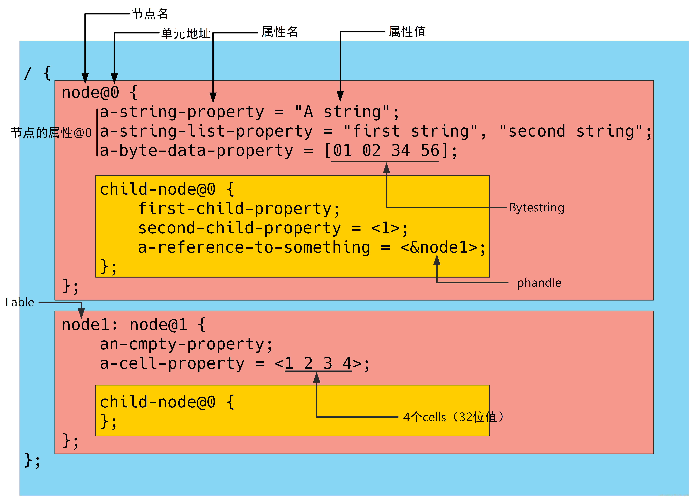
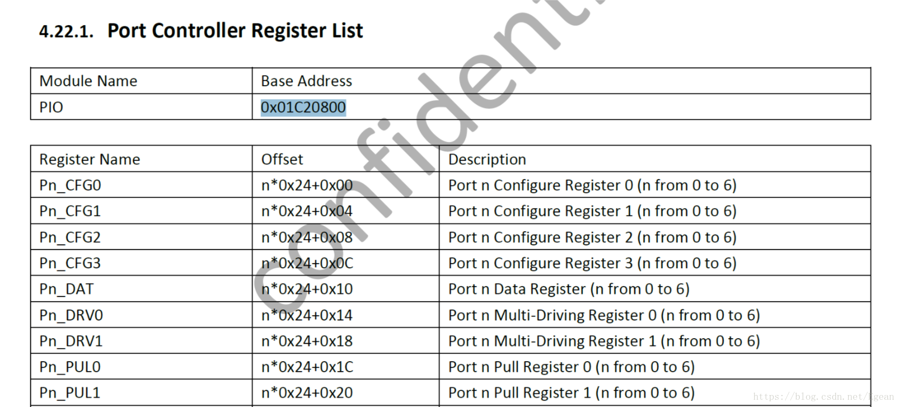
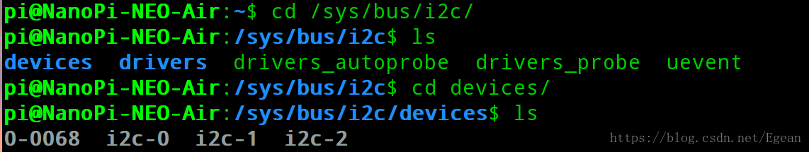
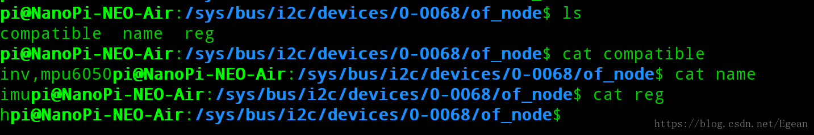

### 介绍
本节简单介绍一下设备树，然后对nanopi的设备树文件进行分析。为了真正地体会设备树的用法，我们在现有设备树的I2C节点中尝试添加一个mpu6050的子节点，然后在nanopi的文件系统中尝试访问该节点，以验证是否添加成功。下一节会修改mpu6050的I2C驱动，使之支持该节点。

------

### 设备树简介
设备树文件是一种板级描述文件，该文件由一系列的节点和子节点组成，用于描述CPU内部资源和板级外设资源。CPU内部资源是指CPU中包含的外设，如I2C控制器、SPI控制器、GPIO控制器等。板级外设是指PCB上包含的硬件资源，如LED灯、按键、I2C外设、SPI外设等。盗一张图说明一个设备树的基本组成（出处：https://blog.csdn.net/smcdef/article/details/77387975）

图中，`\`为根节点，而`\ { ... }`中就是整个文件包含的内容，可以看出根节点中包含了两个子节点:node@0和node@1，其中节点的名称可以一致，只要单元地址不一致即可。
子节点拥有有自己的属性，同时中也可以包含自己的子节点。属性的作用范围在整个节点的范围内，**如果其子节点未申明，那么默认和根节点使用相同的属性。**这里child-node@0就是node@0的子节点，同时子节点又拥有自己的属性。
注意node@1的前面有一个叫做node1的标签，其作用就是给该节点一个标号以供其他地方引用。这里node1就被引用到了child-node@0的属性中：`a-reference-to-something = <&node1>`。其中&node1叫做`phandle`

-------

### 分析nanopi设备树
设备树文件的后缀有`.dts`和`.dtsi`，其中`.dtsi`包含了不同型号电路板中相同的资源，可以被`.dts`文件包含，类似于c语言的头文件。`dtc`是设备树编译器（Device Tree Compiler）的缩写，一般linux内核中自带`dtc`，`.dts`文件被`dtc`编译后会生成`.dtb`文件，该文件就是设备树的二进制文件，可以被内核读取并解析。

为了更清楚地说明问题，这里使用了nanopi-air的设备树为例进行讲解。作者水平有限，只介绍自己理解的部分。nanopi-air的设备树文件在`arch/arm/boot/dts/`目录中，其中相关的文件是：
```
sun8i-h3-nanopi-neo-air.dts
sun8i-h3-nanopi.dtsi
sun8i-h3.dtsi
sunxi-h3-h5.dtsi
```
第一个文件是对nanopi-air特定资源的描述，第二个文件是对nanopi系列特定资源的描述，第三文件是对全志h3芯片的特定描述，第四个文件是对全志h3-h5芯片通用资源的描述。可见一层一层由特定到通用。打开最后一个文件，可以看到如下层次结构：

```
/ {
	interrupt-parent = <&gic>;
	#address-cells = <1>;
	#size-cells = <1>;

	clocks {
		#address-cells = <1>;
		#size-cells = <1>;
		ranges;
        ...
	};

	soc {
		compatible = "simple-bus";
		#address-cells = <1>;
		#size-cells = <1>;
		ranges;

        ...
		pio: pinctrl@01c20800 {
			/* compatible is in per SoC .dtsi file */
			reg = <0x01c20800 0x400>;
			interrupts = <GIC_SPI 11 IRQ_TYPE_LEVEL_HIGH>,
				     <GIC_SPI 17 IRQ_TYPE_LEVEL_HIGH>,
				     <GIC_SPI 23 IRQ_TYPE_LEVEL_HIGH>;
			clocks = <&ccu CLK_BUS_PIO>, <&osc24M>, <&osc32k>;
			clock-names = "apb", "hosc", "losc";
			gpio-controller;
			#gpio-cells = <3>;
			interrupt-controller;
			#interrupt-cells = <3>;
            ...
		};
        ...
		i2c0: i2c@01c2ac00 {
			compatible = "allwinner,sun6i-a31-i2c";
			reg = <0x01c2ac00 0x400>;
			interrupts = <GIC_SPI 6 IRQ_TYPE_LEVEL_HIGH>;
			clocks = <&ccu CLK_BUS_I2C0>;
			resets = <&ccu RST_BUS_I2C0>;
			pinctrl-names = "default";
			pinctrl-0 = <&i2c0_pins>;
			status = "disabled";
			#address-cells = <1>;
			#size-cells = <0>;
		};
        ...
		r_pio: pinctrl@01f02c00 {
			compatible = "allwinner,sun8i-h3-r-pinctrl";
			reg = <0x01f02c00 0x400>;
			interrupts = <GIC_SPI 45 IRQ_TYPE_LEVEL_HIGH>;
			clocks = <&apb0_gates 0>, <&osc24M>, <&osc32k>;
			clock-names = "apb", "hosc", "losc";
			resets = <&apb0_reset 0>;
			gpio-controller;
			#gpio-cells = <3>;
			interrupt-controller;
			#interrupt-cells = <3>;
            ...
		};
        ...
        gic: interrupt-controller@01c81000 {
			compatible = "arm,gic-400";
			reg = <0x01c81000 0x1000>,
			      <0x01c82000 0x2000>,
			      <0x01c84000 0x2000>,
			      <0x01c86000 0x2000>;
			interrupt-controller;
			#interrupt-cells = <3>;
			interrupts = <GIC_PPI 9 (GIC_CPU_MASK_SIMPLE(4) | IRQ_TYPE_LEVEL_HIGH)>;
		};
	};
};
```

首先，可以看到根节点下只有两个子节点：`clock`和`soc`，而这两个节点下又分别有许多子节点。根节点下除了子节点外的内容就是该节点的属性，这里根节点的属性是：
```
interrupt-parent = <&gic>;
#address-cells = <1>;
#size-cells = <1>;
```

第一个`interrupt-parent`是指中断控制器，这里`<&gic>`是指引用`gic`这个标签，我们找到这个标签，在`soc`的子节点下，有个中断控制器节点`interrupt-controller@01c81000`，所以这里表示根节点下使用这个中断控制器。根据之前提到的属性作用范围为整个节点，**就是说子节点如果不特别声明，那么默认使用这个中断控制器。**

剩下两个属性是指子节点的reg（寄存器）属性的address个数和size个数，这一点下面再说明。

我们重点看`soc`下的子节点，首先看`soc`的属性：
```
compatible = "simple-bus";
#address-cells = <1>;
#size-cells = <1>;
ranges;
```

这里出现一个新属性是`compatible`，和字面意思一样，表示该节点的兼容性，该属性在内核识别设备树节点时将会起到重要作用。这里该属性的值为"simple-bus"，这表示该节点是一个**总线**，该总线就是CPU总线，在CPU总线上挂接有各种片上外设，如内存、网络控制器、GPIO控制器、I2C控制器等。这些外设都有一个地址，CPU通过这个地址来访问外设。

**内核在解析设备树时遇到"simple-bus"时，会继续解析这个节点的子节点，并将各个子节点注册为一个`platform_device`放到`platform_bus_type`中。**这一点下一节再通过代码来分析。

再来看`pinctrl@01c20800`这个子节点，这个节点的属性如下：
```
reg = <0x01c20800 0x400>;
interrupts = <GIC_SPI 11 IRQ_TYPE_LEVEL_HIGH>,
		     <GIC_SPI 17 IRQ_TYPE_LEVEL_HIGH>,
		     <GIC_SPI 23 IRQ_TYPE_LEVEL_HIGH>;
clocks = <&ccu CLK_BUS_PIO>, <&osc24M>, <&osc32k>;
clock-names = "apb", "hosc", "losc";
gpio-controller;
#gpio-cells = <3>;
interrupt-controller;
#interrupt-cells = <3>;
```
注意reg属性，这个属性由两部分构成，一部分是address，另一部分是size，因为它的父节点`soc`的`#address-cells = <1>; #size-cells = <1>;`，所以address和size都只有一个，可以判断这里`address=0x01c20800, size=0x400`，意思是这个子节点从的地址0x01c20800开始，到0x01c20c00结束。这一点可以对应全志H3芯片的数据手册找到相应的内容：

从图中可以看到这个节点是一个GPIO控制器，地址正是从0x01c20800开始的，和上面分析一致，另外该GPIO控制器控制的是PA, PC~PG总共6个bank，分别用0, 2~6表示（注意没有PB端口），每个bank拥有32个pin，这一点可以查看数据手册得知。

该节点还拥有gpio-controller属性，表示该节点是一个GPIO控制器，#gpio-cells = <3>表示使用该GPIO控制器时需要3个参数，三个参数分别表示什么内容需要查看binding文档。该文档在
```
Documentation/devicetree/bindings/pinctrl/allwinner,sunxi-pinctrl.txt
```
其中有一段话介绍了三个参数的意义：

> Consumers that would want to refer to one or the other (or both) should provide through the usual *-gpios and interrupts properties a cell with 3 arguments, first the number of the bank, then the pin inside that bank, and finally the flags for the GPIO/interrupts.

第一个数字表示bank号，第二个数字表示pin编号，第三个数字表示flag，稍后我们会用到这三个参数。

再来看i2c节点，该节点名称为`i2c@01c2ac00`，属性如下：

```
compatible = "allwinner,sun6i-a31-i2c";
reg = <0x01c2ac00 0x400>;
interrupts = <GIC_SPI 6 IRQ_TYPE_LEVEL_HIGH>;
clocks = <&ccu CLK_BUS_I2C0>;
resets = <&ccu RST_BUS_I2C0>;
pinctrl-names = "default";
pinctrl-0 = <&i2c0_pins>;
status = "disabled";
#address-cells = <1>;
#size-cells = <0>;
```

这是一个i2c控制器（适配器），注意`compatible`属性，该属性也非常重要，后期内核通过识别该字符串来加载i2c_adapter到i2c总线上。地址范围是`0x01c2ac00`到`0x01c2b000`

这里有个属性是`status="disabled"`表示该控制器是关闭状态。`#address-cells = <1>; #size-cells = <0>;`表示了其子节点reg属性的构成就只有一个address。

-------

### 添加mpu6050子节点
分析了sunxi-h3-h5.dtsi文件，我们写一个最简单的设备树节点。直接打开sun8i-h3-nanopi-neo-air.dts文件，该文件间接包含了sunxi-h3-h5.dtsi文件。在该文件下找到`&i2c`这个`phandle`。

```
&i2c0 {
    status = "okay";
};
```

注意这里&i2c0不是表示子节点，而是一个phandle，该phandle就是sunxi-h3-h5.dtsi文件中的i2c控制器，这里表示引用该i2c控制器，然后将其`status`属性改为"okay"。由于mpu6050是挂在i2c总线上的，因此需要在i2c控制器下增加子节点，如下所示增加子节点：

```
&i2c0 {
    status = "okay";
    imu@68 {
        compatible = "inv,mpu6050";
        reg = <0x68>;
    };
};
```

其中`imu`是该子节点的类型，`@68`表示该节点的地址是68，这里因为是i2c总线，所以表示i2c从机地址。`compatible = "inv,mpu6050"`用于在驱动中匹配该i2c设备，其中"inv"表示生产厂商，"mpu6050"表示器件型号。

重新编译设备树，在内核目录执行`make dtbs ARCH=arm CROSS_COMPILE=arm-linux-`，然后将编译出的`.dtb`文件拷贝到nanopi的SD卡当中，重新启动nanopi，如果设备树解析成功，则在`/sys/bus/i2c/device`目录下会多出一个`0-0068`的目录：

进入该目录中的`of_node`目录，然后读取其中的三个文件可以看到我们定义的属性值。

我们读取reg时得到的是"h"，它的ASCII码正是`0x68`。