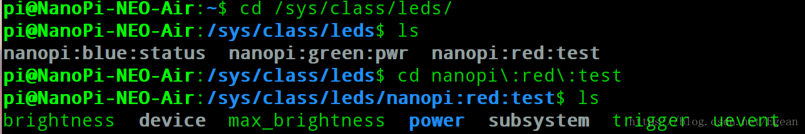
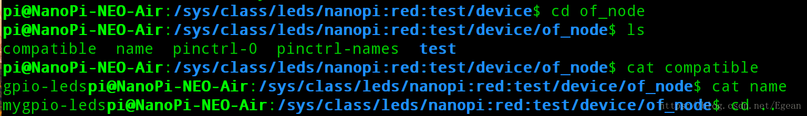
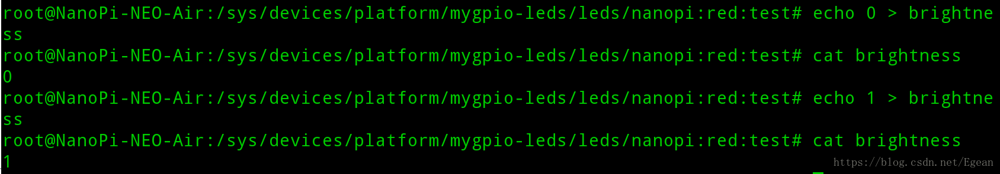

### 介绍
这节通过在nanopi的设备树中添加LED子节点，来实现一个LED驱动。由于linux内核支持LED驱动框架并且有通用的LED驱动，因此这里只需按照驱动要求添加设备树节点就可以了，不用我们自己重写LED驱动。这一节先在设备树中添加一个LED节点，重新编译设备树测试效果，然后对内核中`drivers/leds/leds-gpio.c`进行分析，看该LED驱动是如何实现的。

### 添加设备树节点
我们在sun8i-h3-nanopi-neo-air.dts中添加如下内容：
```cpp
/ {
	...
	mygpio-leds {
        compatible = "gpio-leds";        /* 才能被识别为Led */
        pinctrl-names = "default";
        pinctrl-0 = <&test_pin>;
        test {
            label = "nanopi:red:test";
            gpios = <&pio 6 11 GPIO_ACTIVE_HIGH>; /* PG11 */
            default-state = "on";
        };
    };
}

&pio {
	...
	test_pin: test_pin@0 {
        pins = "PG11";
        function = "gpio_out";
    };
}
```

该节点分为两部分，第一部分是mygpio-leds子节点，第二部分是test_pin@0子节点。第一个节点是根节点下的一个子节点，根据上一节的分析，该节点将被系统解析为一个platform_device。第二个节点是pio的子节点，该节点表明了对应的GPIO引脚编号和该GPIO的模式，这是pinctrl相关的内容，对于pinctrl不同的平台实现不同，这里nanopi的pinctrl是用字符串来表示引脚号和模式（似乎nanopi的pinctrl只支持设置pin的模式，并不能直接指定该引脚的输出值）。

再看mygpio-leds节点，其中的`compatible = "gpio-leds"`，用于与platform_drivers匹配，`pinctrl-0 = <&test_pin>`引用了`test_pin@0`子节点，表明要设置PG11为输出模式，紧接着是一个子节点test，其中`label = "nanopi:red:test"`表示该LED名称，`gpios = <&pio 6 11 GPIO_ACTIVE_HIGH>`引用了pio标号，该标号定义在sun8i-h3-h5.dtsi文件中：

```cpp
pio: pinctrl@01c20800 {
			/* compatible is in per SoC .dtsi file */
			reg = <0x01c20800 0x400>;
			interrupts = <GIC_SPI 11 IRQ_TYPE_LEVEL_HIGH>,
				     <GIC_SPI 17 IRQ_TYPE_LEVEL_HIGH>,
				     <GIC_SPI 23 IRQ_TYPE_LEVEL_HIGH>;
			clocks = <&ccu CLK_BUS_PIO>, <&osc24M>, <&osc32k>;
			clock-names = "apb", "hosc", "losc";
			gpio-controller;
			#gpio-cells = <3>;
			interrupt-controller;
			#interrupt-cells = <3>;
			...
}
```

注意其中的`#gpio-cells = <3>`属性，它表明引用该节点时需要三个参数，这在前面有提到，这三个参数的分别表示该GPIO的bank、编号和初始化后默认输出模式。这里bank=6，按照数据手册上的定义，0表示A，1表示B...6就表示G，编号为11，也就是PG11，初始化为高电平。

### 测试
我们先进行测试，重新编译写好的设备树，然后拷贝到SD卡中，启动nanopi，进入`/sys/class/leds`目录可以看到我们定义的"nanopi:red:test"文件

进入该文件夹的`device/of_node`目录可以看到我们定义的属性

最后退回到`/sys/class/leds/nanopi:red:test`目录，对`brightness`文件进行操作，可控制PG11输出高电平和低电平，如果在PG11上接一个LED可以看到该LED的亮灭


### LED驱动的实现分析
内核中实现LED驱动的文件是`drivers/leds/leds-gpio.c`，这是一个platform驱动，下面对其进行分析，先看platform_driver的定义。
```cpp
static const struct of_device_id of_gpio_leds_match[] = {
	{ .compatible = "gpio-leds", },
	{},
};

static struct platform_driver gpio_led_driver = {
	.probe		= gpio_led_probe,
	.shutdown	= gpio_led_shutdown,
	.driver		= {
		.name	= "leds-gpio",
		.of_match_table = of_gpio_leds_match,
	},
};

module_platform_driver(gpio_led_driver);
```

我们定义的mygpio-leds中，`compatible = "gpio-leds"`，因此可以执行`gpio_led_probe`函数

```cpp
struct gpio_leds_priv {
	int num_leds;
	struct gpio_led_data leds[];		// 不定长数组，使用时才分配长度
};

static inline int sizeof_gpio_leds_priv(int num_leds)
{
	return sizeof(struct gpio_leds_priv) +
		(sizeof(struct gpio_led_data) * num_leds);
}

 drivers --- leds --- leds-gpio.c --- gpio_led_probe(                 --- struct gpio_led_platform_data *pdata
                                   |    struct platform_device *pdev)  |- pdata = dev_get_platdata(&pdev->dev)
                                   |                                   |- if (pdata && pdata->num_leds) {
                                   |                                   |      ...
                                   |                                   |  } else {
                                   |                                   |      priv = gpio_leds_create(pdev)
                                   |                                   |  }
                                   |                                   |- platform_set_drvdata(pdev, priv)
                                   |- gpio_leds_create(               --- int count
                                   |    struct platform_device *pdev)  |- struct gpio_leds_priv *priv
                                   |                                   |- struct fwnode_handle *child
                                   |                                   |- count = device_get_child_node_count(dev)
                                   |                                   |- priv = devm_kzalloc(dev, 
                                   |                                   |      sizeof_gpio_leds_priv(count), GFP_KERNEL)
                                   |                                   |- device_for_each_child_node(dev, child) {
                                   |                                   |      struct gpio_led_data *led_dat;
                                   |                                   |      struct gpio_led led = {};
                                   |                                   |      struct device_node *np;
                                   |                                   |      np = to_of_node(child); 
                                   |                                   |      led_dat = &priv->leds[priv->num_leds];
                                   |                                   |*     fwnode_property_read_string(child, 
                                   |                                   |              "label", &led.name);
                                   |                                   |*     led.gpiod = devm_fwnode_get_gpiod_from_child(
                                   |                                   |              dev, NULL, child, GPIOD_ASIS, led.name);
                                   |                                   |      // 获取gpio_desc
                                   |                                   |*     create_gpio_led(&led, led_dat, dev, NULL);
                                   |                                   |      // 注册到LED驱动框架
                                   |                                   |      priv->num_leds++;
                                   |                                   |- }
                                   |- create_gpio_led(                  --- led_dat->gpiod = template->gpiod;
                                        const struct gpio_led *template, |- if (!led_dat->gpiod) { // 这里不是空
                                        struct gpio_led_data *led_dat,   |      ...
                                        struct device *parent,           |  }
                                        gpio_blink_set_t blink_set)      |- led_dat->cdev.name = template->name
                                                                         |- 对led_dat的一系列赋值
                                                                         |* gpiod_direction_output(led_dat->gpiod, state);
                                                                         |* devm_led_classdev_register(parent, &led_dat->cdev);
```

由于我们解析设备树为platform_device时并没有设置platform_data，因此执行`gpio_leds_create`函数对设备树节点进行解析。首先获取子节点的数目，对gpio_leds_priv进行动态初始化，遍历子节点（这里只有一个子节点），获取每个子节点的label属性，然后通过lable属性获取gpio_desc，然后调用create_gpio_led对LED驱动进行注册，其中对led_dat->cdev进行了设置，然后利用LED驱动框架将其注册到系统

linux的LED框架这里不展开了，该框架与应用层的接口是sysfs，通过读写sysfs的文件，来控制LED的亮灭。