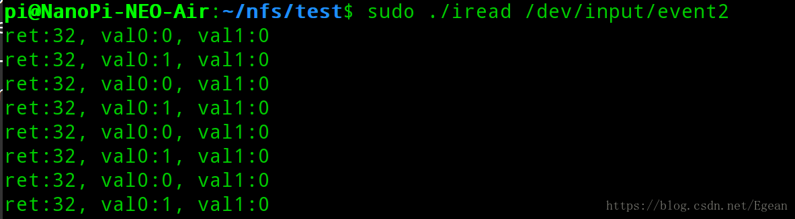

### 介绍
这一节在nanopi上实现按键驱动，和LED驱动一样，通用的按键驱动在linux内核中已经实现好，我们只需要按照要求写好设备树即可，不用我们自己实现按键驱动。这一节中首先修改设备树并测试按键驱动，然后分析`drivers/input/keyboard/gpio_keys.c`文件，看按键驱动是如何实现的。

### 添加设备树节点
在`sun8i-h3-neo-nanopi-air.dtsi`文件中加入以下内容

```cpp
/ {
    mygpio-key {
		compatible = "gpio-keys";
		input-name = "key-test";
		pinctrl-names = "default";
		pinctrl-0 = <&test_pin1>;
		
		k2@0 {
			lable = "key-test";
			linux,code = <BTN_0>;
			gpios = <&pio 6 8 GPIO_ACTIVE_LOW>;
		};
	};
    ...
};

&pio {
    ...
	test_pin1: test_pin@1 {
		pins = "PG8";
		function = "gpio_in";
	};
};
```

和LED的设备树节点相似，按键的设备树节点也由两部分组成，一部分是mygpio-key，另一部分是test_pin@1，其中test_pin@1也是pio的子节点，表明了GPIO的编号和模式，在mygpio-key的pinctrl-0属性中对其进行了引用。

mygpio-key的compatible属性用来与驱动相匹配，input-name是输入设备的名称，因为在linux内核的按键驱动中使用的是input子系统。接下来是k2@0子节点，lable表明了其名称，linux,code是注册的事件类型是BTN_0事件，最后gpios表明了该按键对应的GPIO控制器。

### 测试
由于nanopi中默认是不支持通用的gpio-key驱动的，所以需要对内核进行重新配置和编译。在内核根目录执行
```
make menuconfig
```
然后进入`Device Drivers --- Input device support --- Keyborads`，选中GPIO_Buttons，如下图所示

保存退出后重新编译内核和设备树，然后启动nanopi，进入`/sys/class/input/event2`可以看到如下内容，其中name就是我们定义的key的名字

可见event2就是我们的按键输入事件，使用以下程序读取`/dev/input/event2`
```cpp
#include <stdio.h>
#include <sys/types.h>
#include <sys/stat.h>
#include <fcntl.h>
#include <unistd.h>
#include <linux/input.h>

int main(int argc, char const *argv[])
{
    int fd = 0;
    struct input_event event[2] = {0};
    int ret = 0;

    if (argc != 2) {
        printf("./iread <file>\n");
        return -1;
    }

    fd = open(argv[1],O_RDONLY);
    if (fd < 0) {
        perror("open");
        return -1;
    }

    while(1){
        ret = read(fd, &event, sizeof(event));
        if(ret < 0) {
            perror("read");
            return -1;
        }
        printf("ret:%d, val0:%d, val1:%d\n", ret,
        event[0].value, event[1].value);
        sleep(1);
    }
    return 0;
}
```

将该文件编译为iread，然后执行`sudo ./iread /dev/input/event2`，程序会阻塞，此时如果在PG8引脚接一个按键到3.3V，按下该按键会读取该引脚的状态，如下图所示


## 按键驱动实现的分析
按键驱动的实现在drivers/input/keyborad/gpio_keys.c文件中，这是一个platform驱动，platform_driver的定义如下：

```cpp
static const struct of_device_id gpio_keys_of_match[] = {
	{ .compatible = "gpio-keys", },
	{ },
};

static struct platform_driver gpio_keys_device_driver = {
	.probe		= gpio_keys_probe,
	.remove		= gpio_keys_remove,
	.driver		= {
		.name	= "gpio-keys",
		.pm	= &gpio_keys_pm_ops,
		.of_match_table = gpio_keys_of_match,
	}
};
```

这里的compatible属性和我们定义的设备树节点相同，gpio_keys_probe函数执行。

```cpp
 drivers/input/keyborad/gpio_keys.c --- gpio_keys_probe(                --- struct gpio_keys_platform_data *pdata
                                     |    struct platform_device *pdev)  |- struct gpio_keys_drvdata *ddata
                                     |                                   |- struct input_dev *input
                                     |                                   |- pdata = gpio_keys_get_devtree_pdata(dev)
                                     |                                   |- size = sizeof(struct gpio_keys_drvdata) +
			                         |                                   |         pdata->nbuttons * 
                                     |                                   |         sizeof(struct gpio_button_data);
                                     |                                   |- ddata = devm_kzalloc(dev, size, GFP_KERNEL);
                                     |                                   |- input = devm_input_allocate_device(dev)
                                     |                                   |- input->open = gpio_keys_open
                                     |                                   |- input->close = gpio_keys_close
                                     |                                   |- input->keycodemax = pdata->nbuttons
                                     |                                   |- for (i = 0; i < pdata->nbuttons; i++) {
                                     |                                   |      struct gpio_keys_button *button 
                                     |                                   |              = &pdata->buttons[i];
                                     |                                   |      gpio_keys_setup_key(pdev, input, 
                                     |                                   |              ddata, button, i, child);
                                     |                                   |  }
                                     |                                   |- input_register_device(input)
                                     |- gpio_keys_get_devtree_pdata( --- int nbuttons;
                                     |    struct device *dev)         |- struct gpio_keys_platform_data *pdata
                                     |                                |- struct gpio_keys_button *button
                                     |                                |- nbuttons = device_get_child_node_count(dev)
                                     |                                |- pdata = devm_kzalloc(dev,
			                         |                                |    sizeof(*pdata)+nbuttons*sizeof(*button),
			                         |                                |    GFP_KERNEL);
                                     |                                |- button = (struct gpio_keys_button *)
                                     |                                |    (pdata + 1);
                                     |                                |- pdata->buttons = button
                                     |                                |- pdata->nbuttons = nbuttons
                                     |                                |- device_property_read_string(
                                     |                                |    dev,"label",&pdata->name);
                                     |                                |- device_for_each_child_node(dev, child) {
                                     |                                |      fwnode_property_read_string(child, 
                                     |                                |        "label", &button->desc);
                                     |                                |      fwnode_property_read_u32(child, 
                                     |                                |        "linux,input-type", &button->type));
                                     |                                |  }
                                     |- gpio_keys_setup_key(                    --- struct gpio_button_data *bdata
                                          struct platform_device *pdev,          |- bdata = &ddata->data[idx]
                                          struct input_dev *input,               |- bdata->input = input
                                          struct gpio_keys_drvdata *ddata,       |- bdata->gpiod = 
                                          const struct gpio_keys_button *button, |    devm_fwnode_get_gpiod_from_child(
                                          int idx,                               |    dev, NULL,child,GPIOD_IN,desc)
                                          struct fwnode_handle *child)           |- irq = gpiod_to_irq(bdata->gpiod)
                                                                                 |- bdata->irq = irq
                                                                                 |- isr = gpio_keys_irq_isr
                                                                                 |- bdata->code = &ddata->keymap[idx]
                                                                                 |- *bdata->code = button->code
                                                                                 |- input_set_capability(
                                                                                 |    input, button->type ?: EV_KEY, *bdata->code)
                                                                                 |- devm_request_any_context_irq(
                                                                                 |    dev, bdata->irq, isr, irqflags,
                                                                                 |    desc, bdata);
```


该过程和LED驱动一致，先是解析设备树节点的属性填充私有数据，然后注册中断，对input进行填充，最后注册input子系统