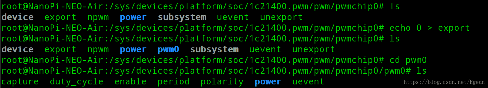

### 介绍
前两节利用设备树实现了nanopi的LED驱动和按键驱动，这一节来实现nonapi的PWM驱动。PWM驱动在内核中也有相应的实现，因此这里只是按照要求添加设备树文件即可。这一节和之前一样，首先修改设备树文件进行测试，然后分析内核相应的软件实现。

### 添加设备树节点
因为在`sunxi-h3-h5.dtsi`和`sun8i-h3-nanopi.dtsi`文件中已经定义了PWM节点

```cpp
// sunxi-h3-h5.dtsi
pwm: pwm@01c21400 {
	compatible = "allwinner,sun8i-h3-pwm";
	reg = <0x01c21400 0x8>;
	clocks = <&osc24M>;
	#pwm-cells = <3>;
	status = "disabled";
};

// sun8i-h3-nanopi.dtsi
&pwm {
	pinctrl-names = "default";
	pinctrl-0 = <&pwm0_pins>;
	status = "disabled";
};
```

可见我们只需将pwm节点的`status`改为打开即可，在`sun8i-h3-neo-nanopi-air.dtsi`文件中添加以下内容

```
&pwm {
	status = "okey";
};
```

这里打开的是pwm0，也就是PA5，是UART0的RX引脚，如果开启这个引脚的pwm功能，串口功能将会停用，也就是说不能用USB转串口线来控制nanopi了，只能通过ssh来登录nanopi进行控制。值得注意的是友善之臂官网上的引脚描述中的还有一个pwm1引脚，也就是PA6，该描述是错误的，**全志H3芯片并没有pwm1**，这一点已经在nanopi的原理图上得到更新，删除了pwm1，因此这里只能使用pwm0。

重新编译设备树重启nanopi后，进入`/sys/class/pwm`目录，发现这个目录是空的。这里我想了很长时间，看了无数遍驱动代码后确认这个目录下应该是有个文件的，但是因为某种原因没有创建出来。后来在官网上看到nanopi有个`npi-config`命令可以配置各个引脚，而输入这个命令，选择`Advanced Options --- PWM`可以看到pwm0是默认关闭的，如下图所示：

这可能是官方为了保证UART0一直能够用而这样设计的，因此尽管我们在设备树中开启的pwm0，但是`npi-config`在开机阶段又将pwm0关闭了，所以我们只需在这里将其打开即可。打开后重启nanopi，再进入`/sys/class/pwm`目录可以看到有个pwmchip0的目录，该目录中有一些文件，如下图所示：

此时还不能操作pwm0，我们需要先向`export`文件中写入0，才能导出pwm0目录，如下图所示：

此时多出了一个pwm0目录，进入该目录可以就可以操作pwm0了，在此之前需要先连接好我们的硬件，我这里使用了一个LED灯，正极接到5V，负极接到pwm0，然后如下图所示操作：

先向`enable`文件写入1，使能pwm0，然后向`period`写入周期20000000ns，向`duty_cycle`写入占空比20000000ns，此时pwm0为低电平，LED全亮，向`duty_cycle`写入占空比10000000ns，LED半亮，向`duty_cycle`写入0，LED熄灭。

### 内核中PWM驱动的实现
内核中全志芯片的PWM驱动在`drivers/pwm/pwm-sun4i.c`文件中，这是一个platform驱动，其platform_driver定义如下：

```cpp
static const struct of_device_id sun4i_pwm_dt_ids[] = {
	{
		.compatible = "allwinner,sun4i-a10-pwm",
		.data = &sun4i_pwm_data_a10,
	}, {
		.compatible = "allwinner,sun5i-a10s-pwm",
		.data = &sun4i_pwm_data_a10s,
	}, {
		.compatible = "allwinner,sun5i-a13-pwm",
		.data = &sun4i_pwm_data_a13,
	}, {
		.compatible = "allwinner,sun7i-a20-pwm",
		.data = &sun4i_pwm_data_a20,
	}, {
		.compatible = "allwinner,sun8i-h3-pwm",
		.data = &sun4i_pwm_data_h3,
	}, {
		/* sentinel */
	},
};

static struct platform_driver sun4i_pwm_driver = {
	.driver = {
		.name = "sun4i-pwm",
		.of_match_table = sun4i_pwm_dt_ids,
	},
	.probe = sun4i_pwm_probe,
	.remove = sun4i_pwm_remove,
};
```
这里的`compatible="allwinner,sun8i-h3-pwm"`和设备树中定义的相同，因此`sun4i_pwm_probe()`函数执行：

```cpp
driver/pwm/pwm-sun4i.c --- sun4i_pwm_probe(                --- struct sun4i_pwm_chip *pwm
                        |    struct platform_device *pdev)  |- struct resource *res
                        |                                   |- pwm = devm_kzalloc(&pdev->dev, 
                        |                                   |        sizeof(*pwm), GFP_KERNEL)
                        |                                   |- res = platform_get_resource(pdev,
                        |                                   |        IORESOURCE_MEM, 0);
                        |                                   |  //从reg属性读取寄存地址
                        |                                   |- pwm->base = devm_ioremap_resource(
                        |                                   |       &pdev->dev, res)
                        |                                   |- pwm->clk = devm_clk_get(&pdev->dev, NULL)
                        |                                   |- pwm->chip.ops = &sun4i_pwm_ops
                        |                                   |- pwmchip_add(&pwm->chip)
                        |                                   |  //向pwm框架注册pwm驱动
                        |                                   |- clk_prepare_enable(pwm->clk)
                        |                                   |- clk_disable_unprepare(pwm->clk)
                        |
                        |- pwmchip_add(             --- pwmchip_add_with_polarity(
                        |    struct pwm_chip *chip)  |    chip, PWM_POLARITY_NORMAL)
                        |
                        |- pwmchip_add_with_polarity(   --- struct pwm_device *pwm
                        |    struct pwm_chip *chip,      |- alloc_pwms(chip->base, chip->npwm)
                        |    enum pwm_polarity polarity) |- chip->pwms = kcalloc(chip->npwm, 
                        |                                |       sizeof(*pwm), GFP_KERNEL)
                        |                                |- for (i = 0; i < chip->npwm; i++) {
                        |                                |      pwm = &chip->pwms[i];
                        |                                |      pwm->chip = chip;
                        |                                |      pwm->pwm = chip->base + i;
                        |                                |      pwm->hwpwm = i;
                        |                                |      pwm->state.polarity = polarity;
                        |                                |  }
                        |                                |- pwmchip_sysfs_export(chip)
```

这里连带把linux的pwm驱动框架都分析了一部分，其中创建sysfs的部分在`drivers/pwm/sysfs.c`文件中，这里没有展开