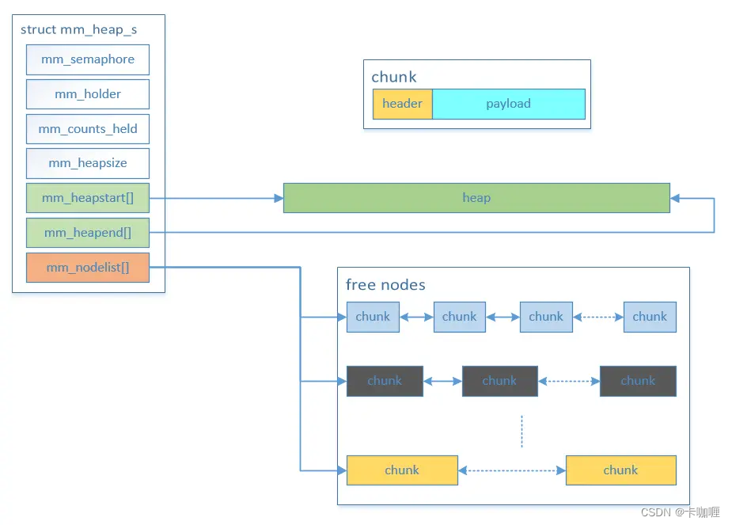

# 1 内存管理模型
此处讨论的是nuttx的堆内存管理，其中内存管理模型如下图所示

# 2 通过realloc缩小内存
参考函数：`nuttx/mm/mm_heap/mm_realloc.c`，其中缩小内存直接进入以下分支返回，**可以看到返回的仍然是`oldmem`，内存地址不会改变**
```c
FAR void *mm_realloc(FAR struct mm_heap_s *heap, FAR void *oldmem,
                     size_t size)
{
  ...
  newsize = MM_ALIGN_UP(size + SIZEOF_MM_ALLOCNODE);
  ...

  /* Check if this is a request to reduce the size of the allocation. */

  oldsize = oldnode->size;
  if (newsize <= oldsize)
    {
      /* Handle the special case where we are not going to change the size
       * of the allocation.
       */

      if (newsize < oldsize)
        {
          mm_shrinkchunk(heap, oldnode, newsize);
          kasan_poison((FAR char *)oldnode + oldnode->size,
                       oldsize - oldnode->size);
        }

      /* Then return the original address */

      mm_unlock(heap);
      MM_ADD_BACKTRACE(heap, oldnode);

      return oldmem;
    }
  ...
}
```
其中有个`mm_shrinkchunk`函数是完成缩小内存块的具体工作的，分为两种情况
1. 缩小的内存块后面一块内存是空闲的，此时会减小当前内存块的大小，然后将多余内存合并到后面一块内存中，然后重新插入空闲链表
2. 缩小的内存块后面一块内存已经分配，此时减小当前内存块的大小之后，将多余内存生成一个独立的内存块插入到空闲链表中
对应的代码如下：
```c
void mm_shrinkchunk(FAR struct mm_heap_s *heap,
                    FAR struct mm_allocnode_s *node, size_t size)
{
  FAR struct mm_freenode_s *next;

  DEBUGASSERT((size & MM_GRAN_MASK) == 0);

  /* Get a reference to the next node */
  // 得到相邻后面一块内存描述符
  next = (FAR struct mm_freenode_s *)((FAR char *)node + node->size);

  /* Check if it is free */
  // 后面一块内存空闲
  if ((next->preceding & MM_ALLOC_BIT) == 0)
    {
      FAR struct mm_allocnode_s *andbeyond;
      FAR struct mm_freenode_s *newnode;

      /* Get the chunk next the next node (which could be the tail chunk) */

      andbeyond = (FAR struct mm_allocnode_s *)
                  ((FAR char *)next + next->size);

      /* Remove the next node.  There must be a predecessor, but there may
       * not be a successor node.
       */
      // 将下一个结点移除
      DEBUGASSERT(next->blink);
      next->blink->flink = next->flink;
      if (next->flink)
        {
          next->flink->blink = next->blink;
        }

      /* Create a new chunk that will hold both the next chunk and the
       * tailing memory from the aligned chunk.
       */
      // 创建一个新的结点
      newnode = (FAR struct mm_freenode_s *)((FAR char *)node + size);

      /* Set up the size of the new node */
      // 合并后的大小
      newnode->size        = next->size + node->size - size;
      newnode->preceding   = size;
      node->size           = size;
      andbeyond->preceding = newnode->size |
                             (andbeyond->preceding & MM_MASK_BIT);

      /* Add the new node to the freenodelist */
      // 新结点插入到空闲队列
      mm_addfreechunk(heap, newnode);
    }

  /* The next chunk is allocated.  Try to free the end portion at the end
   * chunk to be shrunk.
   */
  // 后面内存不空闲
  else if (node->size >= size + SIZEOF_MM_FREENODE)
    {
      FAR struct mm_freenode_s *newnode;

      /* Create a new chunk that will hold both the next chunk and the
       * tailing memory from the aligned chunk.
       */
      // 创建新结点
      newnode = (FAR struct mm_freenode_s *)((FAR char *)node + size);

      /* Set up the size of the new node */
      // 大小为剩余内存大小
      newnode->size        = node->size - size;
      newnode->preceding   = size;
      node->size           = size;
      next->preceding      = newnode->size |
                             (next->preceding & MM_MASK_BIT);

      /* Add the new node to the freenodelist */
      // 插入到空闲队列
      mm_addfreechunk(heap, newnode);
    }
}
```
