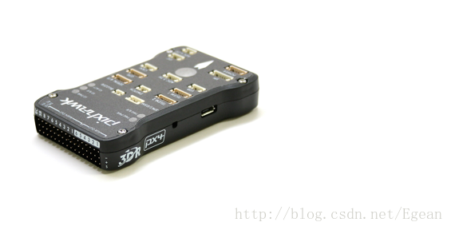
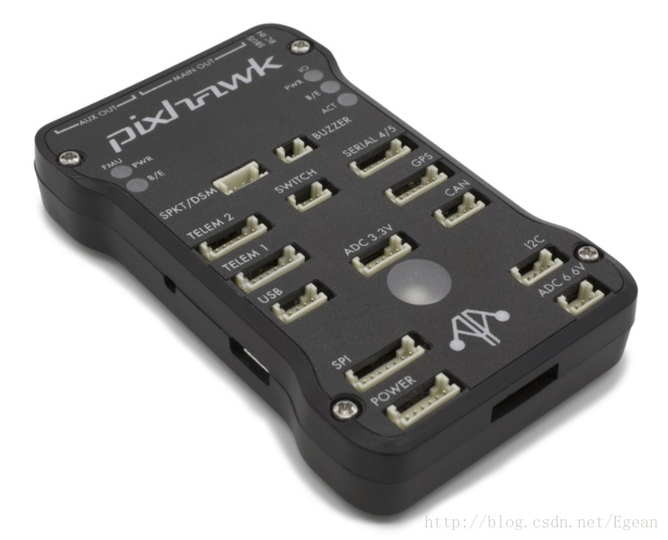

#1. 介绍
之前买了个330的四轴，最近想利用起来，所以买了个pixhawk来玩。pixhawk是开源的，所以想看看能不能在其基础上开发出什么。
要做开发首先要配置环境，由于官方推荐在linux环境下开发，所以这里介绍ubuntu下pixhawk的开发环境配置。
首先，网上能够找到很多ubuntu下配置环境的博客，但是因为年代比较久远了，其中有很多坑的，我都一一踩过了，下面直接给出我测试可行的步骤。


----------


#2. 配置开发环境
官方的配置教程点击[这里](https://dev.px4.io/zh/setup/dev_env_linux.html)，需要梯子，没有梯子也可以参考这篇[博文](http://blog.csdn.net/libing403/article/details/51292598)。
##2.1. 安装工具链
**（1） 权限设置**
```sudo usermod -a -G dialout $USER```
**（2） 安装**
```shell
sudo add-apt-repository ppa:george-edison55/cmake-3.x -y
sudo add-apt-repository ppa:george-edison55/cmake-3.x -y
sudo apt-get update
# 必备软件
sudo apt-get install python-argparse git-core wget zip \
python-empy qtcreator cmake build-essential genromfs -y
```
官方教程中还有仿真器的安装，这里先不装，只装必备软件。
**（3） 基于NuttX的硬件**
PX4不只支持我们的pixhawk，还支持其他的很多硬件，如高通骁龙飞控板，树莓派，派诺特等，所以基于NuttX的硬件就是指我们目标板子是pixhawk系列，参照下面方法配置。
**（4） 删除管理代理**
```sudo apt-get remove modemmanager```
**（5） 更新包列表和安装依赖包**
```shell
sudo apt-get install python-serial openocd \
    flex bison libncurses5-dev autoconf texinfo build-essential \
    libftdi-dev libtool zlib1g-dev \
    python-empy  -y
```
由于GFW，安装可能很慢，可以尝试切换软件源为主服务器，但是仍然很慢！
**（6） 如果以前装过工具链，删除残余**
```shell
sudo apt-get remove gcc-arm-none-eabi gdb-arm-none-eabi binutils-arm-none-eabi gcc-arm-embedded
sudo add-apt-repository --remove ppa:team-gcc-arm-embedded/ppa
```
**（7） 安装工具链**
官网给出的教程没有安装工具链的步骤，所以我是手动安装的工具链，手动安装执行下面脚本即可
```shell
pushd .
cd ~
wget https://launchpad.net/gcc-arm-embedded/5.0/5-2016-q2-update/+download/gcc-arm-none-eabi-5_4-2016q2-20160622-linux.tar.bz2
tar -jxf gcc-arm-none-eabi-5_4-2016q2-20160622-linux.tar.bz2
exportline="export PATH=$HOME/gcc-arm-none-eabi-5_4-2016q2/bin:\$PATH"
if grep -Fxq "$exportline" ~/.profile; then echo nothing to do ; else echo $exportline >> ~/.profile; fi
. ~/.profile
popd
```
这是安装最新的工具链，版本是5.4。如果不出意外的话，上述脚本下载会非常慢解决。办法是用迅雷。。。对，，，将脚本中的链接复制下来，打开迅雷，新建任务再下载，大概10分钟能下载完，迅雷大法好。下载好后复制到ubuntu中，再手动执行脚本后面内容即可。
也可以使用apt-get安装工具链。执行上一小节（删除残余）最后一条命令会打印出安装步骤
```
Step1: Inside Ubuntu, open a terminal and input
       "sudo add-apt-repository ppa:team-gcc-arm-embedded/ppa"

Step2: Continue to input
       "sudo apt-get update"

Step3: Continue to input to install toolchain
       "sudo apt-get install gcc-arm-embedded"
```
##2.2. 代码编译
**（1） 下载源码**
```shell
mkdir -p ~/src
cd ~/src
git clone https://github.com/PX4/Firmware.git
```
源码目录不一定要放在 ```~/```下，可以放在任意位置。这里克隆也是很慢的，挂在那里睡觉去吧，第二天就好了。或者从[这里](https://pan.baidu.com/s/1o87Mvfc)下载源码，但是这里的我没有试过
下载完后更新源码库
```shell
cd Firmware
git submodule update --init --recursive
cd ..
```
**（2） 基于NuttX / Pixhawk的硬件板编译**
pixhawk如下操作即可
```
cd Firmware
make px4fmu-v2_default
```
px4fmu-v2_default是构建基于pixhawk1的镜像，其中可能会报缺少一些依赖库，按安装编译器的提示安装即可。安装完后，继续make，编译器会报如下错误
```
CMake Error at platforms/nuttx/NuttX/CMakeLists.txt:113 (add_dependencies):
  add_dependencies Cannot add target-level dependencies to INTERFACE library
  target "nuttx_build".
```
如果出现了类似错误，是由于cmake版本过低造成的，使用apt-get安装的cmake版本为3.2.2，而在3.3版本以下就会报这个错误（使用```cmake --version```即可查看cmake版本）所以我们需要手动安装最新版本的cmake，从[cmake官网](https://cmake.org/download/)下载最新版本，然后解压，进入解压出来的文件夹，使用如下命令安装
```shell
./configure 
make 
sudo make install
```
安装完成后再次执行```make px4fmu-v2_default```即可编译源代码。出现以下提示说明编译完成
```
[100%] Linking CXX executable firmware_nuttx
[100%] Built target firmware_nuttx
Scanning dependencies of target build/firmware_px4fmu-v2
[100%] Generating nuttx-px4fmu-v2-default.px4
[100%] Built target build/firmware_px4fmu-v2
```
**（3） 上传到pixhawk**
```
make px4fmu-v2_default upload
```
先将pixhawk连接到电脑，然后使用以上命令上传。我的电脑就卡在了这个地方
```
If the board does not respond within 1-2 seconds, unplug and re-plug the USB connector.
```
这里提示说如果板子在1-2秒内没有重启，那么重新插拔USB接口。但是我插拔了很多次依然卡在这个地方，google上搜了很久也没有找到解决办法，那么只有去看源码了，上传固件的代码放在```Tools/px_uploader.py```，我看了很长时间这个代码，最后把问题确定在：能识别并查找到USB端口，但是打开失败，那么失败的原因是什么呢？
其实很简单，打开的端口位于 ```/dev```目录下，都是一些驱动设备，一般来说打开这些驱动是需要管理员权限的，所以只需要命令前加上 sudo 即可（我看了那么久源码，结果就加个这？）
```
sudo make px4fmu-v2_default upload
```
如果你听到滴的一声，那么说明电脑已经连接上板子的BootLoader了，但是仍然会报错，大概是这样
```
Board can accept larger flash images (2M bytes) than board config (1M bytes). Please use the correct board configuration to avoid lacking critical functionality.
```
实际的报错信息不是2M和1M，具体数字我不记得了。这里意思是说板子能够接收2MB的flash镜像，这比板子配置的1MB还大，让我们重新对板子进行配置。
这里我找了很久也没有找到是哪里给板子配置的1MB的flash。
通过拆开板子查看芯片型号，主芯片为STM32F427VI系列，冗余系统芯片是STM32F103C8，主芯片的flash确实是2MB，就是说我买的硬件没有缩水，也说明编译器的报错是正确，错误的地方在板子的配置。
板子配置是官方出的，出错的可能性很小，更何况还是1MB和2MB将近2倍的严重错误，这就更不可能了，最可能出错的还是之前步骤。
回顾之前的步骤，编译的时候我们执行的是
```
cd Firmware
make px4fmu-v2_default
```
官方说明，px4fmu-v2_default是针对pixhawk1生成镜像，那么我们的板子确实是pixhawk1吗？官方图片中pixhawk1长这样

我板子是淘宝上买的，外形其实差不多，但是再往下面看，官网写着。

> #Availability

>This is no longer available. The mRo Pixhawk may be used as a direct replacement. 

可以看到，mRo Pixhawk已经替换了Pixhawk1，再进入官网查看mRo Pixhawk，它长这样

好像没什么区别啊，然后官网写着：
>The main difference is that it is based on the Pixhawk-project FMUv3 open hardware design, which corrects a bug that limited the original Pixhawk 1 to 1MB of flash.

好了，就是这个了，pixhawk1已经不再用了，而是使用mRo Pixhawk代替了Pixhawk1，mRo Pixhawk修复了一个将镜像限制到1MB的bug，并且mRo Pixhawk是用STM32F103C8作为冗余系统，而不是STM32F100，这和之前查看的芯片型号符合。再看官网对于各个型号的pixhawk的make命令

 >- Pixhawk 1: make px4fmu-v2_default
- HKPilot32: make px4fmu-v2_default
- Pixfalcon: make px4fmu-v2_default
- Dropix: make px4fmu-v2_default
- mRo Pixhawk: make px4fmu-v3_default (supports 2MB Flash)
- mRo X-2.1: make auav-x21_default
- Pixhawk 2: make px4fmu-v3_default
- Pixracer: make px4fmu-v4_default
- MindPX/MindRacer: make mindpx-v2_default
- Pixhawk Mini: make px4fmu-v3_default
- Pixhawk 3 Pro: make px4fmu-v4pro_default
- Crazyflie 2.0: make crazyflie_default
- Intel® Aero Ready to Fly Drone: make aerofc-v1_default
- Pixhawk 4: make px4fmu-v5_default
- AUAV-X2 (Discontinued): make px4fmu-v2_default

所以这里只需把```px4fmu-v2_default```换成```px4fmu-v3_default```即可
```
make clean
make px4fmu-v3_default
make px4fmu-v3_default upload
```
之后就能够成功上传了，上传成功显示
```
Erase  : [====================] 100.0%
Program: [====================] 100.0%
Verify : [====================] 100.0%
Rebooting.

[100%] Built target upload
```
这里还是有点小问题的，就是我烧写的时候烧写了3次才成功，失败时报错是time out，还不明白这是怎么回事。不过烧写完成过后，就能够连接地面站进行校准了，说明成功烧写了。


----------


#3. 总结

 1. 遇到问题，多思考，不要怀疑源码出错，出错的地方肯定在我们自己身上。
 2. 找解决方案，首先百度，不行google，再不行读源码。
 3. 你以为你买的pixhawk1，其实它是mRo pixhawk.