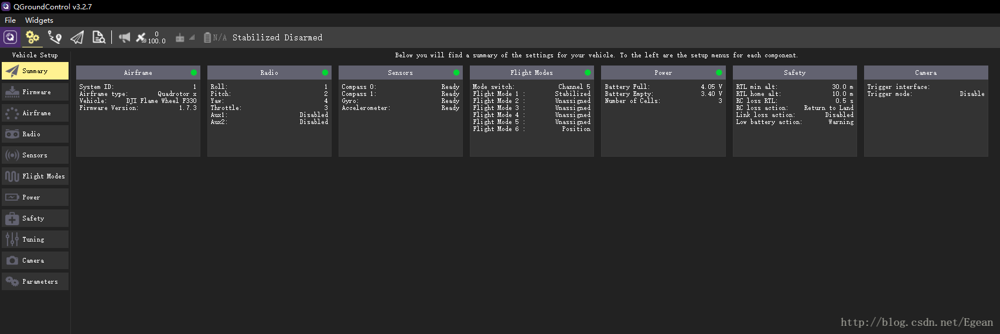
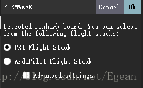
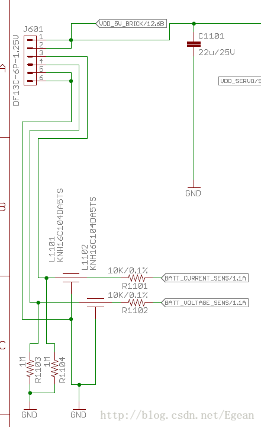
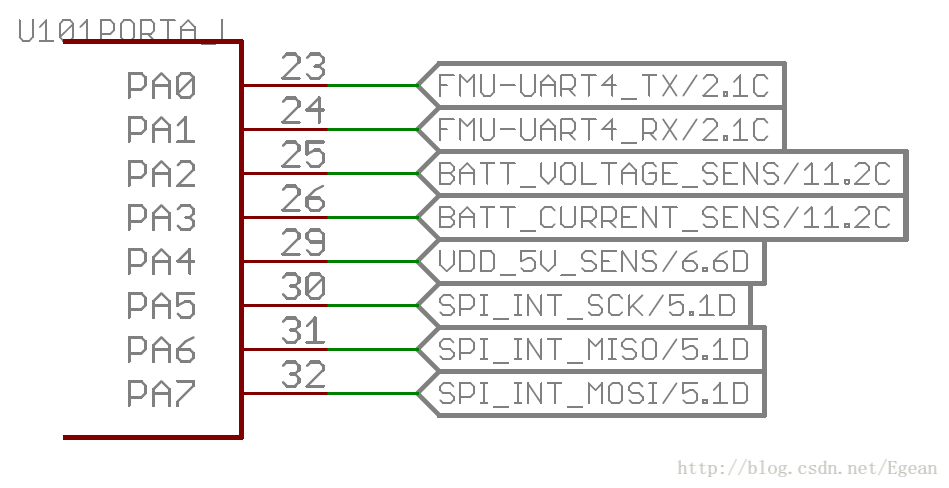
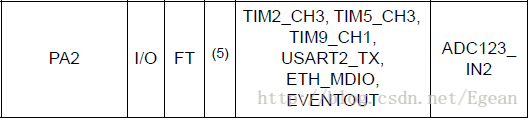
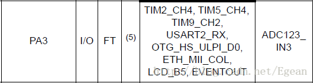

##1. 介绍
上一节把固件烧写好了，接下来进行传感器的校准了，传感器校准要使用官方的地面站，也就是QGC(QGroundControl，官网下载点击[这里](https://docs.qgroundcontrol.com/en/getting_started/download_and_install.html))。安装好QGC后打开，然后将pixhawk使用USB线连接到电脑，QGC上就可以显示当前板子的状态。 

我这里是校准好了的，所以有一个绿色的小点，没有校准应该是红色的，接下来进行传感器校准，校准可以参考[这个视频](https://www.bilibili.com/video/av18993395/)。 
因为我们已经烧写好固件了，所以跳过烧写固件即可。值得注意的是，pixhawk支持两种固件，一种是AMP的固件：Ardupilot Flight Stack，一种是PX4的固件：PX4 Flight Stack，这两种固件都可以通过地面站烧写。一般淘宝上买的为了方便都是刷的AMP固件，而我们之前编译的是PX4固件，之后的开发应该都是基于PX4开发。 

上面的视频里面是没有校准电调的，我也就没有校准，完成后就直接拿出去飞了。飞机虽然能够正常起飞，但是一直在小幅度的晃动，这个晃动似乎跟定点没什么关系，因为我打到自稳，晃动依然存在。所以怀疑电调是不是要重新校准了，所以下面开始校准电调。

##2. 电调校准
###2.1. 电调校准之前拆下螺旋桨！！！
###2.2. 使用QGC校准电调
将飞控重新连接地面站，点击Power，在ESC Calirabtion栏目点击Calirabtion，然后地面站提示插上飞机电源，然后我插上电源，电调上电，随后一阵乱叫，最后地面站报错：timeout waiting for bat。意思是等待插上电池时超时，就是说飞控没有检测到接上了电池。我试了很多次，都是这个结果。 
然后上google搜了一下，发现电调校准好像需要接电流计？想想也是，飞控和电调只通过PWM OUT接口连接，PWM OUT是输出接口，飞控怎么知道电调上电了呢？所以电流计应该是必须的，而我之前为了省钱，没有买电流计，而直接用电调的BEC供电。那么为了校准电调，只能想一些野路子了。

###2.3. 查看硬件电路
如果飞控通过电流计才能检测电池是否插上的话，那么电流计除了给飞控供电的功能以外，肯定还有检测电量的功能了，先查看pixhawk的电流计接口定义，也就是power接口。
| Pin	| Signal	| Volt| 
| ------------- |:-------------:| -----:| 
| 1 (red) | VCC | +5V | 
| 2 (blk) | VCC	| +5V | 
| 3 (blk) | CURRENT | +3.3V | 
| 4 (blk) | VOLTAGE | +3.3V |
| 5 (blk) | GND | GND |
| 6 (blk) | GND | GND |
如上表所示，1、2接口是电源，5、6是地，3是电流信号，4是电源信号。看来处理器就是通过3和4来监控电池的电流和电压情况的。那么这两个信号是什么类型呢？查看pixhawk的原理图，power接口如下图所示。 

这里验证了1、2是电源，5、6是地，而3、4分别接到了两个网络标号上：BATT_CURRENT_SENS & BATT_VOLTAGE_SENS 再次查找这两个网标。 

发现接到了处理器的PA2和PA3引脚，处理器型号是STM32F427VI，查看芯片是数据手册发现这两个引脚可以复用为AD功能。 

所以初步怀疑，这两个引脚就是两个AD转换通道，通过检测电压来监控当前的电池情况，也就是说，我们只要在这两个引脚上加上电压，PX4就认为电池接上了。
这下校准电调就简单了，**在power接口的4号引脚引出，接到一个3.3V电源上。这里我是接到一个单片机开发板的3.3V接口，开发板有一个开关可以控制。 接下来可以把飞控接上地面站了，然后同样点击电调校准，地面站提示接上电源，这时我们把电池接上，同时把开发板打开，给power的4号电压检测端口供电，然后电调滴滴两声，紧接着滴一声，就校准好了。**
这里说一下pixhawk的接口，pixhawk顶上的白色接口间距是1.25mm，需要购买对应插口的线，直接上淘宝搜索“1.25mm端子线”就能够搜索到，买来后在线的另外一端焊上杜邦线即可。

##3. 结论
AMP固件可以不用电流计校准，PX4固件不知道有没有这功能，我把AMP校准电调的方法在PX4上试了，是没有反应的。另外，我查看了飞控的电调校准的源码，其中确实是对4号端口检测电压来判断电池是否接上的，没有用到3号端口的电流计接口，这里就不展开了。
电调校准完就可以拿出去飞了，经过测试电调校准后飞机就不会出现抖动了，并且定点模式非常稳，就是yaw有点飘，可是受电机的影响。
飞行时注意：
### （1）一定要在没人的地方试飞，非常危险！
### （2）起飞使用自稳模式，飞稳后才调到定点模式！！
### （3）降落后马上上锁，若上锁失败，打到自稳模式再上锁！！！