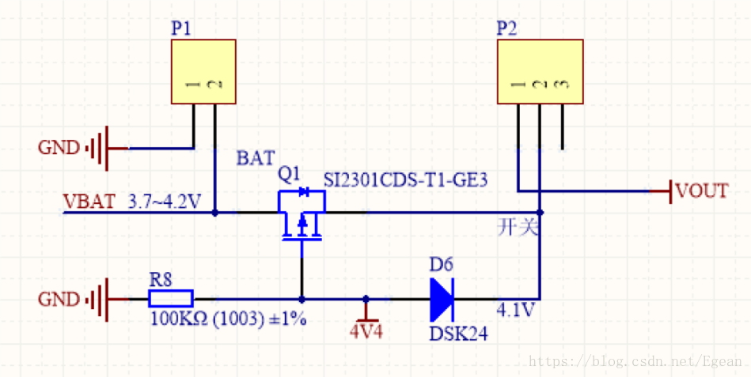

这里记录一种简单、易实现的电源自动切换电路，如下图所示：

这里Q1为P沟道mos管，`Vgs(th) = -0.7V`。P1为电池接口，输入电压为3.7V~4.2V，接在mos管的`D级`；4V4为USB接口经稳压管转换后的电压，接在mos管的`G级`，D6为肖特基二极管，正向压降为0.3V；VOUT为输出，经过开关P2接在mos管的`S级`。以下分析三种情况：

 1. 当VBAT接入，4V4没接入时，G级被下拉到地，VBAT经过寄生二极管到达S级，S级电压为3~3.5V，Vgs = -3到-3.5V，`Vgs < Vgs(th)`，mos管导通，输出电压VBAT。
 2. 当4V4接入，VBAT没接入时，Vg=4.4V，通过D6到达S级，S级电压为4.1V，此时`Vgs = 0.3V > Vgs(th)`，mos管关断，输出电压4.1V。
 3. 当VBAT和4V4同时接入时，和上面情况类似，由于mos管关断，VBAT不能到达S级，输出电压4.1V