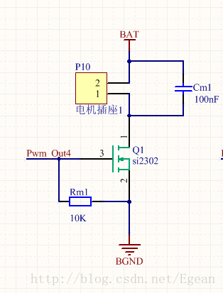
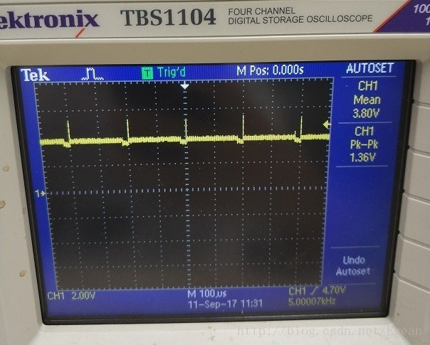
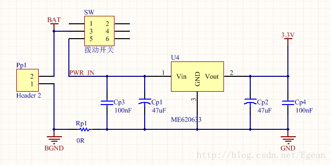
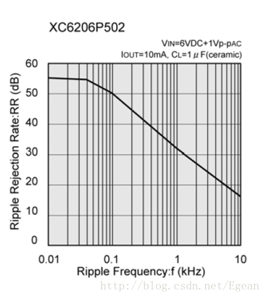

##问题
用STM32做了一个微型四轴的飞控，使用的是空心杯电机，使用一个MOS管驱动，但是现在电机只要运行起来，就会产生非常大的干扰，直接导致STM32复位或不运行。经过换电容，加二极管续流，换LDO芯片，加电感进行滤波，花费了大量时间，最后终于解决了这个问题。
##电机驱动部分
电机驱动我开始是使用的0.1uf电容进行电机的续流，但是后来发现干扰太大，换为了肖特基二极管进行续流，然而发现产生干扰的地方并不是此处。我们电机是使用MOS管将PWM信号进行放大的，PWM信号就是一系列的方波，这需要MOS管进行频繁的开关，在MOS进行开关时噪声就产生了，就是说该噪声是跟随PWM频率而变化的。这是驱动部分电路图以及我使用示波器观察到的噪声

##电源部分
从上面示波器输出可以看出，我使用的是1S锂电池，电压范围为3.7~4.2V，电源我直接使用了一个LDO将电压降下来，这就导致了上述那个电压尖峰直接让我的LDO停止工作了，这是电源电路

实际我选择LDO的型号是特瑞斯的XC6206，LDO有一项指标是PSRR，即Power Supply Rejection Ratio
，电源抑制比，查看该芯片数据手册：

