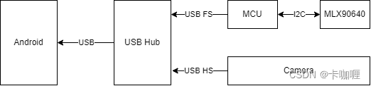
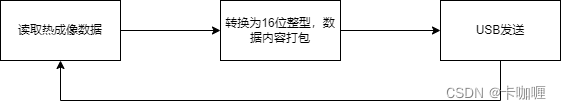
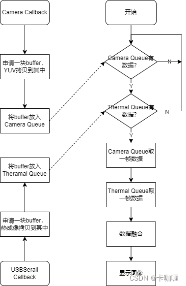
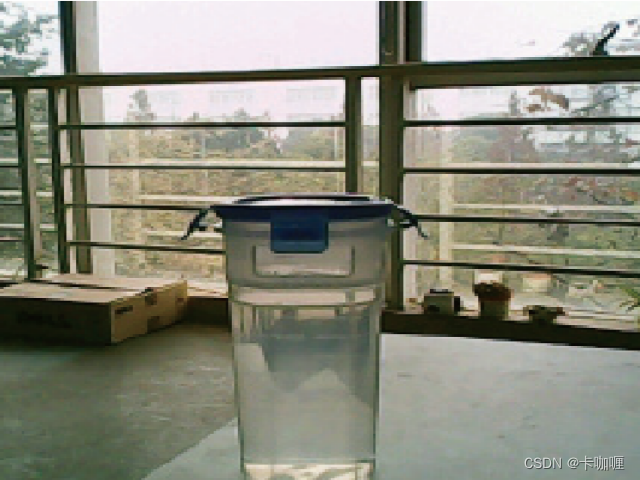
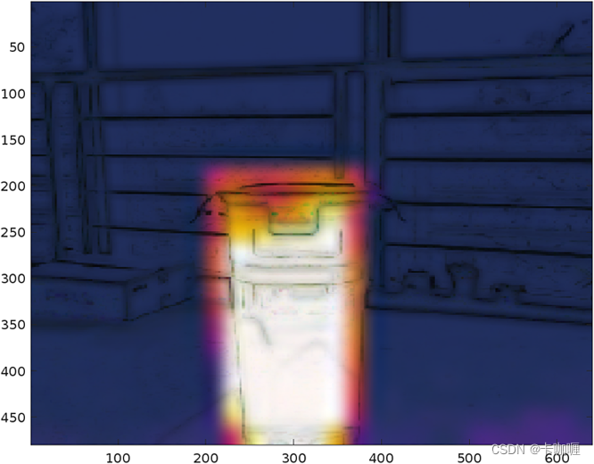
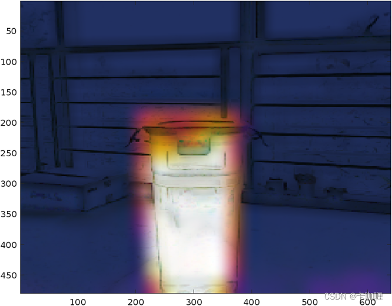
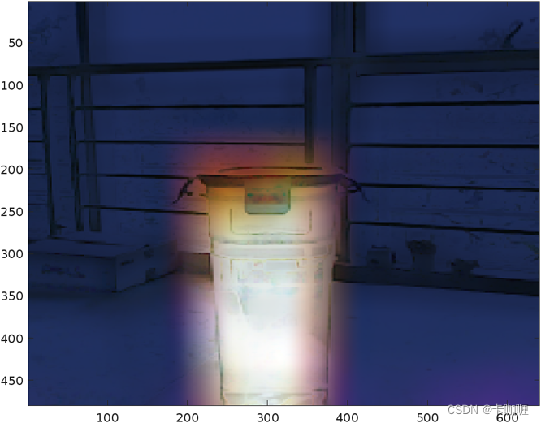

@[TOC](手机热成像详细设计书)
# 1 介绍
# 2 硬件框架
硬件框架如下图所示，MCU通过I2C接口读取热成像传感器数据，然后通过USB接口传向USB Hub，Camera为一个通用免驱USB摄像头，在Android手机上有两个设备，一个是Camera，一个是热成像传感，在Android手机应用层获取到两个传感器数据，通过一定算法进行融合，得到分辨率较高、质量较好的热成像图


## 2.1 硬件选型
### 2.1.1 MCU
此处MCU只需要读取I2C接口，然后打包通过USB传输即可，USB FS速率12M，远高于I2C接口速率，因此能够达到传输标准，此处可选择带USB FS和I2C的MCU即可，并且能方便买到开发板进行前期验证，价格尽可能低，综合以上可选择STM32F103C8T6，开发板价格10元以内，芯片价格5元以内
### 2.1.2 Camera
选用通用usb摄像头，参考[ElectronBot](https://github.com/peng-zhihui/ElectronBot)项目，可采用如下摄像头和Android手机直连，分辨率为640x480
https://item.taobao.com/item.htm?id=567717780577
### 2.1.3 USB Hub
USB Hub选用支持USB2.0 HS的芯片即可，这里选用国产的SL2.1A
https://item.szlcsc.com/2782347.html
# 3 软件框架
## 3.2 FW
### 3.2.1 开发环境
为简化开发进程，直接使用官方CubeIDE，其中包括CubeMX可直接进行管脚配置，USB库和I2C驱动代码直接由IDE生成，编译工具链为arm gcc
### 3.2.2 软件流程
软件分为两部分组成：mlx90640驱动、热成像数据传输协议，总的来说软件流程就是通过I2C从mlx90640读取数据，然后进行打包，最后使用USB发送，整个过程使用一个循环即可，其中mlx90640的温度测量范围为-40到300摄氏度，保留两位小数转换为整型为-4000到30000，可以用16位整型覆盖


#### 3.2.2.1 mlx90640驱动
参考文章：https://blog.csdn.net/qq_33904382/article/details/122799677
mlx90640官方已经提供驱动，只需要实现对应I2C读写操作，即可通过API来读取传感器数据，封装两个函数来读取传感器信息

```c
#define MLX90640_I2C_ADDR 0x33

static uint16_t eeMLX90640[832];  
static uint16_t frame[834];
static int status;

void mlx_param_init(paramsMLX90640* params)
{
	MLX90640_SetRefreshRate(MLX90640_I2C_ADDR, RefreshRate);
	printf("MLX90640_SetRefreshRate done\n");
	MLX90640_SetChessMode(MLX90640_I2C_ADDR);
	printf("MLX90640_SetChessMode done\n");

	MlxConfig_Check(params);
}

void mlx_data_read(paramsMLX90640* params, float data[768])
{
	int status = MLX90640_GetFrameData(MLX90640_I2C_ADDR, frame);
	if (status < 0) {
		printf("GetFrame Error: %d\r\n",status);
	}
	float vdd = MLX90640_GetVdd(frame, params);
	float Ta = MLX90640_GetTa(frame, params);
	float tr = Ta - TA_SHIFT; //Reflected temperature based on the sensor ambient temperature
	printf("vdd:  %f Tr: %f\r\n",vdd,tr);
	MLX90640_CalculateTo(frame, params, emissivity , tr, data);
	for(int i = 0; i < 768; i++) {
		if(i%32 == 0 && i != 0) {
			printf("\r\n");
		}
		printf("%2.2f ", data[i]);
	}
}
```
#### 3.2.2.2 数据协议
从传感器获取的数据需要通过USB发送，由于获取的温度为float型，实际需要精度仅需要小数点后两位即可，因此转换为整型可以节约带宽，mlx90640温度测量范围为-40到300摄氏度，可以用16位有符号整型，选用两个0x8000为起始码，后续跟768个温度数据。这里0x8000对应16位有符号型-32768，不在温度测量范围内，用两个0x8000目的是为了防止字节流传输数据冲突，如两个连续温度为0°和128°，按照小端传输为{ 0x00, 0x00, 0x80, 0x00 }，这里出现了 { 0x00, 0x80 }，在传输中可能被误识别为起始码
```c
#define SENSOR_RESOLUTION 768

static paramsMLX90640 g_mlx_param;
static float g_thermal_data[SENSOR_RESOLUTION ];
static int16_t g_send_data[SENSOR_RESOLUTION + 2];

uint32_t i;

mlx_param_init(&mlx_param);
mlx_data_read(&mlx_param, &g_thermal_data[2]);

g_send_data[0] = g_send_data[1] = (int16_t)0x8000;
for (i = 0; i < SENSOR_RESOLUTION; i++) {
	g_send_data[i + 2] = (int16_t)(g_thermal_data[i] * 100);
}
```
#### 3.2.2.3 USB发送
USB库由CubeIDE自动生成，因此USBCDC发送函数定义如下
```c
uint8_t CDC_Transmit_FS(uint8_t* Buf, uint16_t Len);
```
直接调用USBCDC发送数据即可
```c
CDC_Transmit_FS((uint8_t)g_send_data, sizeof(g_send_data));
```
注意这里的大小端问题，arm处理器默认为小端模式，低地址存低8位，高地址存高8位，所以实际传出的数据是先传低8位，再传高8位
## 3.3 Android
这里有两个USB设备，一个是USB串口，用于传输热成像数据，一个USB摄像头，用于传输图像数据，Android端主要完成数据读取、融合和显示功能
### 3.3.1 软件框架
Camera和热成像传感器的数据读取都有对应的库支持，两个库对数据的读取都采用了异步回调的方式，因此这里采用双buffer缓存的机制，以Camera为例：
1. 初始化一个长度为2的队列，当回调发生时，新申请一块buffer，将YUV数据拷贝到这块buffer中，然后将这块buffer放入队列
2. 起一个线程，不断从队列中读取数据，用于数据融合
3. 如果线程读取太慢，回调发现队列已经满，则从队列中取出一块buffer丢弃，然后再将新的buffer放入队列
4. 如果回调一直不来，线程会发现队列为空，则跳过下一次再读取
5. 因为每一次回调都会新申请一块buffer，因此buffer不存在并发问题
6. 队列添加和删除访问的都是同一个数据结构，存在并发问题，操作时需要注意上锁

如上所述，存在两个队列，一个存放YUV数据，一个存放热成像数据，通过一个线程来访问两个队列，当两个队列都有数据时才取出进行数据融合，综上所述，软件总体流程如下：


### 3.3.2 Camera数据读取和预览
Android对摄像头的支持使用[UVCAndroid](https://github.com/shiyinghan/UVCAndroid)，参考文章：https://blog.csdn.net/hanshiying007/article/details/124118486
该库基于[saki4510t/UVCCamera](https://github.com/saki4510t/UVCCamera)开发，提供了更为简单的接口。预览和数据读取参考其中的[CallbackDemo](https://github.com/shiyinghan/UVCAndroid/blob/main/demo/src/main/java/com/herohan/uvcdemo/SetFrameCallbackActivity.java)，这里需要重写其中的ICameraHelper.StateCallbackd，这里为方便后续计算，使用的格式是RGBX
```java
 private LinkedList<byte[]> mYUVQueue = new LinkedList<byte[]>();
 private static final int QUEUE_LEN = 2;
 
 private final ICameraHelper.StateCallback mStateListener = new ICameraHelper.StateCallback() {
		...
        @Override
        public void onCameraOpen(UsbDevice device) {
            if (DEBUG) Log.v(TAG, "onCameraOpen:");

            mCameraHelper.startPreview();

            Size size = mCameraHelper.getPreviewSize();
            if (size != null) {
                int width = size.width;
                int height = size.height;
                //auto aspect ratio
                mCameraViewMain.setAspectRatio(width, height);
            }

            mCameraHelper.addSurface(mCameraViewMain.getHolder().getSurface(), false);

            mCameraHelper.setFrameCallback(frame -> {
            	// 新申请一块buffer
                int[] rgbx = new byte[frame.remaining() / 4];
                // 拷贝yuv到buffer中
                frame.getInt(rgbx, rgbx.length);
				// yuv放到队列中
				synchronized(mYUVQueue) {
					if (mYUVQueue.size() >= QUEUE_LEN) {
						mYUVQueue.poll();  // 丢弃最后一个数据
					}
					mYUVQueue.offer(rgbx);
				}
			}, UVCCamera.PIXEL_FORMAT_RGBX);
        }
        ...
    };
```
### 3.3.3 热成像数据读取和预览
3.2中所述热成像数据通过USBCDC传输，在Android端看到的是一个虚拟串口，Android开发环境中，使用[felHR85/UsbSerial](https://github.com/felHR85/UsbSerial)提供虚拟串口的操作支持，创建一个虚拟串口对象如下所示
```java
mSerial = UsbSerialDevice.createUsbSerialDevice(myUsbDevice, myDeviceConnection);

// No physical serial port, no need to set parameters
mSerial.open();
mSerial.read(mCallback);
```
这里只是用虚拟串口传输数据，不需要通知下位机当前的波特率等配置。其中mCallback是读取数据的回调，回调中将热成像数据放入队列中，定义如下，注意由于一帧热成像的温度数据较多，已经超过了USB数据包的大小，因此这个回调会调用多次，因此需要涉及数据拼接和分割，UsbSerial中提供了该功能的ProtocolBuffer类
```java
private ProtocolBuffer mBuffer = new ProtocolBuffer(ProtocolBuffer.BINARY);
private LinkedList<byte[]> mThermalQueue = new LinkedList<byte[]>();

// 设置分隔符，也就是3.2.2.2中设置的起始码
mBuffer.setDelimiter(new byte[] { 0x00, 0x80, 0x00, 0x80 });

private final UsbSerialInterface.UsbReadCallback mCallback = new UsbSerialInterface.UsbReadCallback() {
    @Override
    public void onReceivedData(byte[] arg0) {
    	mBuffer.appendData(arg0);
    	while(mBuffer.hasMoreCommands()) {
			byte[] data = mBuffer.nextBinaryCommand();
			// 检查data的长度
			synchronized(mThermalQueue) {
				if (mThermalQueue.size() >= QUEUE_LEN) {
					mThermalQueue.poll();  // 丢弃最后一个数据
				}
				mThermalQueue.offer(data);
			}
		}
    }
};
```

### 3.3.5 数据融合
#### 3.3.5.1 数据获取
使用一个线程来获取数据，这里预计相机帧率比热成像帧率更高，等待 mYUVQueue 队列有数据时才进行数据融合，当 mThermalQueue 没有数据时，使用上一帧的数据，另外这里收到的热成像数据需要重新组合为浮点型的温度值
```java
byte[] yuv, thermal;

while (mYUVQueue.size() == 0);

synchronized(mYUVQueue) {
	yuv = mYUVQueue.poll();
}

if (mThermalQueue.size() != 0) {
	synchronized(mThermalQueue) {
		thermal = mThermalQueue.poll();
	}
}

float[] thermalMatrix = new float[32 * 24];
for (int i = 0; i < thermal.lenght; i += 2) {
	thermalMatrix[i / 2] = ((float)thermal[i] | (thermal[i + 1] << 8)) / 100;
}
```
热成像获取到的是各个像素的温度值，要转换成可视化的颜色，需要将温度值转为伪彩色，另外在数据融合之前，需要进行插值处理，这里直接在Android层进行图片的缩放
```java
private static Bitmap getThermalImage(float[] thermalMatrix, int width, int height) {
    float maxThermal = thermalMatrix[0];
    float minThermal = thermalMatrix[0];
    for (float t : thermalMatrix) {
        maxThermal = Math.max(maxThermal, t);
        minThermal = Math.min(minThermal, t);
    }

    Bitmap thermalImage = Bitmap.createBitmap(width, height, Bitmap.Config.ARGB_8888);
    int[] bitmapPixels = new int[thermalImage.getWidth() * thermalImage.getHeight()];
    thermalImage.getPixels(bitmapPixels, 0, thermalImage.getWidth(),
            0, 0, thermalImage.getWidth(), thermalImage.getHeight());
    for (int i = 0; i < bitmapPixels.length; i++) {
        //int gray = (int)((thermalMatrix[i] - minThermal) / (maxThermal - minThermal) * 255);
        int red = Math.abs(0 - gray);
        int green = Math.abs(127 - gray);
        int blue = Math.abs(255 - gray);
        bitmapPixels[i] = Color.argb(255, red, green, blue);
        //bitmapPixels[i] = Color.argb(255, gray,  gray, gray);
    }
    Log.i(TAG, "Max: " + maxThermal + " Min: " + minThermal);
    thermalImage.setPixels(bitmapPixels, 0, thermalImage.getWidth(),
            0, 0, thermalImage.getWidth(), thermalImage.getHeight());

    return thermalImage;
}

Bitmap thermalImage = getThermalImage(thermalMatrix, 32, 24);
Matrix matrix = new Matrix();
matrix.postScale(20, 20);
Bitmap resizeThermalImage = Bitmap.createBitmap(thermalImage, 0, 0, 
	thermalImage.getWidth(), thermalImage.getHeight(), matrix, true);

int newWidth = resizeThermalImage.getWidth();
int newHeight = resizeThermalImage.getHeight();
int[] thermData = new int[newWidth * newHeight];
resizeThermalImage.getPixels(thermData, 0, newWidth, 0, 0, newWidth, newHeight);
```
#### 3.3.5.2 融合算法
这里摄像头采集的是可见光的图像，分辨率是640x480，热成像采集的是温度分布，分辨率是32x24，融合算法的目的是通过参考可见光的图像，让热成像采集的温度图像分辨率更高，拥有更多的细节。本人非专业搞图像处理，这里只提出一种容易想到的算法，改算法基于一个假设：颜色相近的像素，大概率来自同一个物体，对应的温度也应该相近。该算法的流程如下：
1. 将热成像温度分布转换为伪彩色，然后通过线性插值扩大到640x480像素
2. 以当前像素点为中心，选定一个长宽为REF_LEN的方形区域
3. 假设当前像素的色度值为v，方形区域中每个像素的颜色为v_i
4. 计算当前像素和参考区域每个像素的差值delta_v_i
5. 计算系数矩阵，系数表示每个像素的权重，当delta_v_i >= 0时，k_i = 1 - delta_v_i / (abs(delta_v_i) + v)；当delta_v_i < 0时，k_i = 1 + delta_v_i / (abs(delta_v_i) + v)
6. 计算估计值矩阵，表示每个像素相对于当前像素温度的估计值，t_hat_i = k_i * t_i
7. 计算估计值矩阵的平均值，即当前像素的温度估计值
由以上算法可知，在参考值矩阵中，与当前像素值色度差值越小，对应的系数k_i也就越大，对应温度的估计值也就越大，对应的估计的温度也就越接近
使用以下图片进行matlab仿真，第一张是640x480的可见光照片，第二张是32x24的热成像温度值



当REF_LEN=17时，融合结果如下

当REF_LEN=33时，融合结果如下


当REF_LEN=65时，融合结果如下


设计一个类用于数据融合，考虑到算法效率，这里需要使用JNI，首先看 java 基础类，这里的 thermData 线性插值后的数据，分辨率是640x480
```java
public class CameraThermalDataFusion {
    static {
        System.loadLibrary("testlib");
    }

    CameraThermalDataFusion() {
    }

    public int[] calculate(int[] camData, int[] thermData) {
        int[] fusionData = new int[camData.length];
        getFusionImage(fusionData, camData, thermData);
        return fusionData;
    }

    private native void getFusionImage(int[] fusionData, int[] camData, int[] thermData);
}
```
再建立一个 cpp 的java对接层
```cpp
#include <jni.h>
#include <string>
#include <android/log.h>

#define LOGE(...) __android_log_print(ANDROID_LOG_ERROR, "jni_c", __VA_ARGS__)

extern "C"
JNIEXPORT void JNICALL
Java_com_example_thermalcamera_CameraThermalDataFusion_getFusionImage(JNIEnv *env, jobject thiz,
                                                          jintArray fusionData, jintArray camData, jintArray thermData)
{
	jint *fusion_data = (jint *)env->GetByteArrayElements(fusionData, 0);
	jint *cam_data = (jint *)env->GetByteArrayElements(camData, 0);
	jint *therm_data = (jint *)env->GetByteArrayElements(thermData, 0);

	/* 数据融合 */
	fusion_init(640, 480);
	fusion_get_image(fusion_data, cam_data, therm_data);

	env->ReleaseFloatArrayElements(fusionData, fusion_data, 0);
	env->ReleaseFloatArrayElements(camData, cam_data, 0);
	env->ReleaseFloatArrayElements(thermData, therm_data, 0);
}
```

设计一个 c 语言的算法层
```c
#include <math.h>

#define REF_LEN 8
#define ARGB_PIX_BYTE 4

enum { R, G, B, COLOR_MAX };

typedef struct {
	uint32_t width, height;
	uint32_t *result;
	uint32_t *cam;
	uint32_t *therm;
	uint32_t *ref_t[REF_LEN];
	uint32_t *ref_c[REF_LEN];
} image_data;

static image_data g_image;

void fusion_init(uint32_t width, uint32_t height)
{
	g_image.width = width;
	g_image.height = height;
}

static void get_ref_image(image_data *image, uint32_t x1, uin32_t x2, uint32_t y1)
{
	uint32_t i, j, n;

	for (i = x1; i <= x2; i++) {
		image->ref_c[i - x1] = &image->cam[i * image->width * ARGB_PIX_BYTE + y1];
		image->ref_t[i - x1] = &image->therm[i * image->width * ARGB_PIX_BYTE + y1];
	}
}

static void calculate_fustion_image(image_data *image, uint32_t ref_w, uint32_t ref_h, uint32_t pos)
{
	double sum[COLOR_MAX] = { 0 };
	double avg[COLOR_MAX];
	
	for (i = 0; i < ref_h; i++) {
		for (j = 0; j < ref_w; j++) {
			uint8_t cam[COLOR_MAX], ref_c[COLOR_MAX], ref_t[COLOR_MAX];
			int16_t delta_v[COLOR_MAX];
			double K;

			cam[R] = (image->cam[pos] >> 16) & 0xff;
			cam[G] = (image->cam[pos] >> 8) & 0xff;
			cam[B] = (image->cam[pos]) & 0xff;
			ref_c[R] = (image->ref_c[i][j] >> 16) & 0xff;
			ref_c[G] = (image->ref_c[i][j] >> 8) & 0xff;
			ref_c[B] = (image->ref_c[i][j]) & 0xff;
			ref_t[R] = (image->ref_t[i][j] >> 24) & 0xff;
			ref_t[G] = (image->ref_t[i][j] >> 16) & 0xff;
			ref_t[B] = (image->ref_t[i][j] >> 8) & 0xff;

			for (n = 0; n < COLOR_MAX; n++) {
				delta_v[n] = cam[n] - ref_c[n];
				if (delta_v[n] >= 0) {
					K = 1 - (double)delta_v[n] / (abs(delta_v[n]) + cam[n]);
				} else {
					K = 1 + (double)delta_v[n] / (abs(delta_v[n]) + cam[n]);
				}
				sum[COLOR_MAX] += (K * ref_t[n]);
			}
		}
	}
	avg[R] = sum[R] / (ref_w * ref_h);
	avg[G] = sum[G] / (ref_w * ref_h);
	avg[B] = sum[B] / (ref_w * ref_h);
	image->result[pos] = (((uint8_t)res[R]) << 16) | (((uint8_t)res[G]) << 8) | ((uint8_t)res[B]) | 0xff000000;
}

void fusion_get_image(uint32_t *fusion_data, uint32_t *cam_data, uint32_t *therm_data)
{
	int32_t i, j;
	uint32_t width = g_image.width;
	uint32_t height = g_image.height;

	g_image.cam = cam_data;
	g_image.therm = therm_data;
	g_image.result = fusion_data;

	for (i = 0; i < height; i++) {
		for (j = 0; j < width; j++) {
			uint32_t x1 = max(i - REF_LEN, 0);
			uint32_t y1 = max(j - REF_LEN, 0);
			uint32_t x2 = min(i + REF_LEN, height);
			uint32_t y2 = min(j + REF_LEN, width);
			
			get_ref_image(&g_image, x1, x2, y1);
			calculate_fustion_image(&g_image, y2 - y1 + 1, x2 - x1 + 1, i * width * ARGB_PIX_BYTE + j);
		}
	}
}
```
### 3.3.6 图像显示
在Android层使用一个TextureView绘制最终图像