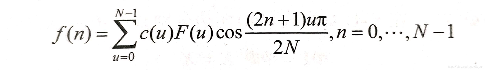
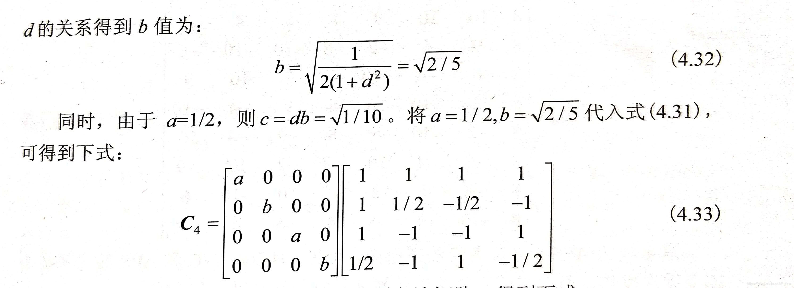

> 书是高文的《数字视频编码技术原理》（第二版），简单做下笔记
## 1. 概论
#### 1.1 色彩空间
常用的色彩空间表示方法有RGB和YUV。
1. RGB色彩空间是直接基于三原色来表达彩色图像，一个像素需要用三个样值表示，RGB三个基本色度对混合色度具有同样重要的作用，通常使用**同样的精度**来表示RGB的三个基本色度值。
 2. 人的视觉系统（HVS）对亮度的感知比色度的感知更加敏感，因此将色彩空间分为亮度（Y）和色度（U、V）两个基本成分，对亮度成分采用更高精度的采样能更好地适应人的HVS。YUV色彩空间就是根据这一原理得到的。根据对Y、U、V三个分量采样比例不同，可分为4：2：0，4：2：2，4：4：4等格式。
#### 1.2 视频数据冗余的类型
一般将视频数据冗余分为空间冗余、时间冗余和信息熵冗余三大类。
 1. 空间冗余是由于图像中空间连贯性影响，使得一块区域的光强度、色彩、饱和度非常相近从而产生的冗余。
 2. 时间冗余是视频相邻帧包含相同或类似的背景和运动物体，只是运动物体的位置略有不同，这种相邻帧间的数据有高度的相关性称为时间冗余。
 3. 信息熵（编码冗余）冗余是实际图像数据的每个像素采用相同的比特数来表示，而不是按照其信息熵来分配比特数，从而产生的冗余。
 4. 视觉冗余是指HVS对图像某些失真不敏感，即使丢失这些细微变化，人的HVS也察觉不到这些变化，这部分多出来的细节信息就是视觉冗余。
#### 1.3 去除冗余的方法
去除空间冗余有两种办法，一是基于预测估计的方法，利用周边的像素点来预测当前的像素的数值。而使用变换编码的方法，将空间域图像信号的像素矩阵变换到频域，根据不同频率信号对HVS的贡献进行比特数的重新分配，同时考虑视觉冗余去除其中过分精细的高频分量来实现压缩。
去除时间冗余一般是采用基于预测的方法，亦时域预测编码。
对于编码冗余取出一般对视频采用熵编码的方式。

------------------
## 2. 视频编码基础
#### 2.1 信息论基础
###### 2.1.1 一个信源
信息可以被看成一个随机变量序列。假设有N个事件，其中事件$i$发生的概率为$p_i$，则事件$i$的信息量$I_i$定义为：
$$
I_i=log_\alpha \frac{1}{p_i}=-\log_ap_i
$$
对底数$\alpha$的取值不同，单位也不同，通常$\alpha$的取值为2，相应信息量单位为比特（bit）；当$\alpha$为e时，相应的信息量单位为奈特（Nat）。由该公式可以看成，事件发生的概率越小，其信息量越大。
一个信源由N个随机事件组成，N个随机事件的平均信息量既是信息熵，一般用H表示：
$$
H = \sum_{i=1}^N p_iI_i = -\sum_{i=1}^N p_i\log_\alpha p_i
$$
信息熵从平均意义上表征总体信息的测度，也角色表征信源的平均不确定度。
###### 2.1.2 两个信源
对于两个信源，收到的平均信息熵定义为：
$$
H(X, Y) = -\sum_i\sum_jp(x_i, y_j)\log_2p(x_i, y_j)
$$
其中$p(x_i, y_j)$表示两个事件同时发生的概率。
互信息是表明两个信息之间的相关性，定于为：
$$
I(X; Y) = H(X) - H(X|Y)
$$
H(X|Y)称为条件熵：
$$
H(X|Y) =  -\sum_i\sum_jp(x_i, y_j)\log_2p(x_i| y_j)
$$
其中$p(x_i| y_j)$表示y事件已经发生时，x事件发生的概率。
#### 2.2 香农编码定律
不懂...
#### 2.3 视频编码技术
主流视频编码器采用技术按预测、变换、量化、熵编码和环路滤波次序进行。
###### 2.3.1 预测
基本思想是不直接对信号进行编码，而是用前一个信号的对当前信号做出预测，对当前信号与预测值的**差值**进行编码传输。
1. 帧内预测：帧间预测由相邻像素预测当前块像素值，可以有效去除块间冗余。
2. 帧间预测：相邻帧的场景存在一定相关性，通过运动估计来获取预测块的运动矢量，可以消除时间冗余。
###### 2.3.2 变换
对图像进行正交变换以去除空间像素之间的相关性。**正交变换使得原先分布在每个像素上的能量集中到频域的少数几个低频系数上**，这代表了图像的大部分信息。频率系数的这种特性有利于采用基于人的HVS特性进行量化的方法。
通过K-L变换可以找到最佳变化T，但是算法复杂度高，不利于实际应用。一般使用离散余弦变换（DCT变换）代替K-L变换。
另一种变换技术是离散小波变换（DWT），该技术具有多分辨率多频率分析的特性。
###### 2.3.3 量化
量化是降低数据表示精度的过程，通过量化可以减少需要编码的数据量，分为矢量量化和标量量化两种。矢量量化是对一组数据联合量化，标量量化独立量化每一个输入数据。量化是一种有损压缩技术。
###### 2.3.4 熵编码
量化时通常会进行Zigzag扫描将二维量化系数重新组织为一维系数。这种扫描使得非零系数尽可能出现在整个一维系数的前面，而后面的系数尽可能为零。
利用信源的信息熵进行码率压缩的方式称为熵编码，能够去除经预测和变换后仍然存在的统计冗余信息。常用的熵编码方法有两种：变长编码和算术编码。
变长编码基本思想是为出现概率大的符号分配短码字，出现概率小的分配长码字。
算术编码采用一个浮点数来代替一串输入符号。算术编码技术输入符号的联合概率，将输入符号序列映射为实数轴上一个小区间，区间的宽度等于该序列的概率值，之后在这个区间选择一个有效的二级制小数作为整个符号序列的编码字。
###### 2.3.5 环路滤波
重建图像经过滤波后被用作参考图像以编码将来的图像。

--------------------
## 3. 预测编码
主要叙述帧内预测和帧间预测。
#### 3.1 预测编码概述
###### 3.1.1 帧内预测
帧内预测是消除**空间冗余**的重要技术，以AVS1的帧内预测为例，介绍帧内预测参考块的生成过程。当前帧内预测块由其上边和左边的参考样本r和c来预测，分为5种预测模式：Intra_8*8_Vertical，Intra_8*8_Horizontal，Intra_8*8_DC，Intra_8*8_Down_Left和Intra_8*8_Down_Right，其算法如下：
```c
// 1. Intra_8*8_Vertical
predMatrix[x, y] = r[x+1];
// 2. Intra_8*8_Horizontal
predMatrix[x, y] = c[y+1];
// 3. Intra_8*8_DC
if(r[i]和c[i]都存在且已经解码)
	predMatrix[x, y] = ((r[x] + 2*r[x+1] + r[x+2] + 2) >> 2) +
		(c[y] + 2*c[y+1] + c[y+2] + 2) >> 2) >> 1;
else if(r[i]都存在且已经解码)
	predMatrix[x, y] = (r[x] + 2*r[x+1] + r[x+2] + 2) >> 2;
else if(c[i]都存在且已经解码)
	predMatrix[x, y] = c[y] + 2*c[y+1] + c[y+2] + 2) >> 2;
else
	predMatrix[x, y] = 2^(n-1);
// 4. Intra_8*8_Down_Left
PredMatrix[x, y] = (r[x+y=1] + 2*r[x+y+2] + r[x+y+3] + 2) >> 2
	+ (c[x+y+1] + 2*c[x+y+2] + c[x+y+3] + 2) >> 2) >> 1;
// 5. Intra_8*8_Down_Right
if(x = y)
	predMatrix[x, y] = (c[1] + 2*r[0] + r[1] + 2) >> 2;
else if(x > y)
	predMatrix[x, y] = (r[x-y+1] + 2*r[x-y] + r[x-y-1] + 2) >> 2;
else if(x < y)
	predMatrix[x, y] = (c[x-y+1] + 2*c[x-y] + c[x-y-1] + 2) >> 2;
```


###### 3.1.2 帧间预测
帧间预测利用相邻帧间的信息进行预测编码，包括向前预测（P帧）和双向预测（B帧）。目前帧间预测主要是通过进行基于块的运动估计来搜索匹配块。
#### 3.2 运动表示和估计
###### 3.2.1 基于像素的运动估计
基于像素的运动估计能提供精确的运动描述，如光流场。
###### 3.2.2 基于块的运动估计
基于块的运动估计目的是在参考图像中找到最佳的参考图像位置，即运动矢量，使得经过帧间预测后残差能量最小。运动估计算法不属于标准规定范围，其搜索算法包括全搜索和快速搜索两类。
快速搜索分为局部搜索算法和全局搜索算法。局部法有三步搜索法和六边形搜索法。
###### 3.2.3 全局运动估计
不懂...
#### 3.3 子像素插值
不懂...

-----------------
## 4. 变换编码
变换被认为是图像或视频中最有效的技术之一，将空域信号变换到频域信号，有效去除了信号的相关性。
#### 4.1 K-L变换
K-L变换又称为主成分变换、特征向量变换或Hotelling变换，是一种能使平稳信号的变换系数不相关的变换方法，同时也是在最小均方差意义下的最优变换。
在一维情况下，给定一维随机向量X，定义X的K-L变换为：
$$
\begin{bmatrix} y_1 \\ y_2 \\ \vdots \\ y_n \end{bmatrix} = \Phi^T\begin{bmatrix} x_1 \\ x_2 \\ \vdots \\ x_n \end{bmatrix}
$$
即$Y=\Phi^TX$。K-L变换是将X的所有分量投影在$\phi_k$得到频域映射$y_k$。$\phi_k$是K-L变换的变换系数矩阵，**由X的协方差矩阵的特征向量组成**，是一个正交矩阵。
给定X为N维随机向量，设$m_i$是X中第i个随机变量$x_i$的数学期望，即：
$$
m_i = E(x_i),i=1,2,\dots,N
$$
则X的数学期望可以表示为：
$$
m_x=E(X)=(m_1, m_2, \dots, m_N)^T
$$
利用向量X的数学期望，可以得到向量X的协方差矩阵U，即：
$$
U=E((X-m_x)(X-m_x)^T)
$$
设协方差矩阵U的特征向量$\phi_k$对应着其第k个特征值$\lambda_k$，则有$U\phi_k=\lambda_k\phi_k$。**如果U是对称矩阵**，其特征向量$\phi_k$是正交的，即满足：
$$
\phi_i\phi_j=\left\{
\begin{aligned}
1, i = j \\
0, i =\not j 
\end{aligned}
\right.
$$
通过将特征向量归一化可以得到正交矩阵$\Phi=(\phi_0, \phi_1, \dots, \phi_{N-1})$，该矩阵满足$\Phi^T\Phi=I$，并且$U\Phi=\Phi\Lambda$，这里$\Lambda=diag(\lambda_0, \dots, \lambda_{N-1})$，由于$\Phi$是正交矩阵，因此在上式两边同时乘以$\Phi^T$，可以得到：
$$
\Phi^TU\Phi=\Lambda
$$

#### 4.2 DCT变换
==DCT变换由不同余弦函数的和组成==，被广泛用于图像和视频编码中。DCT变换可以由离散傅里叶（DFT）变换导出，但是DCT变换的性能高于DFT。DFT需要复数运算，而DCT只需要实数计算，并且存在快速算法。
###### 4.2.1 一维DCT变换
将N个一维实数采样值变换为N个变换域上（？）的变换系数的过程称为一维DCT，其定义如下：
$$
F(u)=\frac2Nc(u)\sum^{N-1}_{n=0}f(n)\cos\frac{(2n+1)u\pi}{2N},u=0, \dots,N-1\\
c(u)=\left\{
\begin{aligned}
&\frac1{\sqrt2}, u=0 \\
&1, 其他
\end{aligned}
\right.
$$
逆变换IDCT为（懒得打公式了）



N点一维DCT/IDCT的模为$\frac2N$，将N点一维DCT/IDCT归一化：


###### 4.2.2 二维DCT变换


###### 4.2.3 DCT的编码性能
DCT将每个图像块表示为二维余弦函数的加权和，二维8x8DCT的余弦函数波形图如图4.1所示


图（a）是一个8x8图像块，包含64个像素值，==这些像素具有很强的相关性==，经过8x8DCT得到64个变换系数如图（b）所示，其中左上角的变换系数为DC系数，其余变换系数为AC系数。DC系数的值非常显著，距离DC系数越远，AC系数的值越小。
在视频编码中，通过量化操作使大部分高频系数量化为0，最后得到一个8x8稀疏变换量化系数块，这样编码时大大减少了编码的比特数。
###### 4.2.4 DCT的重要性质
1. 可分离性：函数的二维DCT变换可以通过对该函数进行两次一维DCT变换来等价实现，即输入数据的二维DCT变换等价于先对输入数据进行行变换，在对列进行变换。
2. 对称性：离散余弦函数时对称，使得DCT变换矩阵具有对称性。
3. 正交性：DCT的变换核时正交的。
4. 递归性：N点Ⅱ型DCT可以分解为一个N/2点Ⅱ型DCT和一个N/2点Ⅳ型DCT。

###### 4.2.5 快速DCT变换
基于DCT矩阵的稀疏因子分解和DCT的递归性运算操作。
###### 4.2.6 类DCT整数变换
实际中常采用整数近似的DCT代替浮点DCT来编码视频图像，不仅可以保持浮点变换的编码性能，而且能够大大减少计算复杂度，
H.264/AVC采用4x4整数变换，仅仅有平均0.02dB的性能损失，其推导过程如下：



H.264/AVC的4x4整数变换时一个低复杂度的整数变换，其变换核只需要简单的加法何移位就可以实现。
#### 4.3 DST变换
针对帧内预测残差信号的统计，随着预测方向的的变化以及预测距离的增加，残差信号的统计一般随预测方向变大。H.265/HEVC对4x4的亮度变换块采用4x4DST变换。
#### 4.4 小波变换
不懂。
###### 4.4.5 小波编码方法
二维图像的每行被低通滤波器何高通滤波器滤波处理，输出两个图像L和H。L和H分别是原图像水平方向上的低通和高通滤波，如图（a）所示，接着对L和H每一列也用低通滤波器和高通滤波器沿着垂直方向滤波，得到4个子图像$LL_0、LH_0、HL_0和HH_0$，如图（b）所示，至此图像经过了一级小波变换。其中高频子带图像包含了图像的高频信息，这些信息主要是图像边界或者噪声，能量很小，根据HVS特点，可以适当丢弃。

