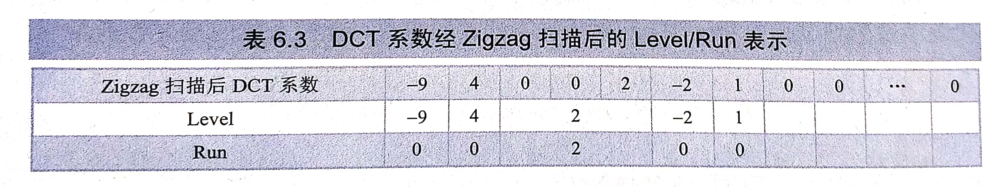

## 第五章 量化
量化主要应用于从连续的模拟信号到数字信号的转换，其作用主要是将信号的连续取值近似为多个离散值，==即量化相当于一个多对一的映射过程==，通过量化降低了数据量。

### 5.1 量化的基本原理
#### 5.1.1 基本概念
对于输入的连续信号X，量化映射Q对$[x_k, x_{k+1})$区间内的所有输入信号都用$y_k$来近似表示，即：
$$
Y=Q(X)=y_k,X\in[x_k,x_{k+1})
$$
这里==每个量化间隔的边界值$x_k$称为决策值，$y_k$称为量化值或重构值==。一个量化器表示的就是一系列的决策值和重构值组成。
信号的实际输入值x与 量化值Q(x)之间的误差称为**失真**，常用的衡量失真的测度为：
$$
d(x,Q(x))==Q_e^2=(x-Q(x))^2
$$
其中$Q_e$称为**量化误差**。
X的平均失真称为均方误差，它与量化误差$Q_e$的方差相同，即：
$$
MSE=E(d(X,Q(X)))=\int_{-\infin}^{\infin}(x-Q(x))^2p(x)dx\\
\sigma_{Q_e}^2=E(Q_e^2)=\int_{-\infin}^{\infin}(x-Q(x))^2p(x)dx=MSE
$$
p(x)为输入信号的概率密度函数，$\sigma_{Q_e}^2$称为量化噪声，对应于量化间隔表示为：
$$
\sigma_{Q_e}^2=E(Q_e^2)=\sum_{k=0}^{L-1}\int_{x_k}^{x_{k+1}}(x-y_k)^2p(x)dx
$$
其中L是重构值的个数。
==优化量化的目的是选择合适的$x_k$和$y_k$使得量化失真最小==。
优化量化器和输入信号的概率分别密切相关，下面列出典型的概率分别函数：
1. 均匀分布：
$$
p(x)=\left\{
\begin{aligned}
\frac1{b-a},&x\in(a,b) \\
0, &否则
\end{aligned}
\right.
$$
2. 高斯分布：
$$
p(x)=\frac1{\sqrt{2\pi}\sigma}e^{\frac{(x-u)^2}{2\sigma^2}}
$$
3. 拉普拉斯分布：
...
#### 5.1.2 标量量化
以均匀量化为例，均匀量化的特点是再整个频域范围内，各个量化间隔相等。若信号的取值范围为$[-x_{max}, x_{max}]$，量化级别为L，则每个量化间隔的大小$\Delta$为
$$
\Delta=2x_{max}/L=2x_{max}/2^R
$$
其中R为量化级别所需的比特数。\
均匀分布的量化误差q的取值范围为：
$$
-\Delta/2\le q \le \Delta/2
$$
$\Delta$又称为量化步长，对于均匀分布的信源，如果$\Delta$足够小，可以认为量化误差q再误差范围内服从均匀分布，即：
$$
p(q)=\left\{
\begin{aligned}
1/\Delta&,|q|\le\frac\Delta2 \\
0&, 其他
\end{aligned}
\right.
$$

==优化量化的目的是选择合适的$x_k$和$y_k$使得量化失真最小==。基于最小均方误差准则的量化器，即使MSE最小。根据微分求极值原理，需要如下两个条件成立：
$$
\begin{aligned}
\frac{\partial\sigma_q^2}{\partial x_k}&=\frac{\partial}{\partial x_k}(\int_{x_{k-1}}^{x_k}(x-y_{k-1})^2p(x)dx+\int_{x_k}^{x_{k+1}}(x-y_k)^2p(x)dx)\\
&=(x_k-y_{k-1})^2p(x_k)-(x_k-y_k)^2p(x_k)=0\\
\frac{\partial\sigma_q^2}{\partial y_k}&=\frac{\partial}{\partial y_k}\int_{x_k}^{x_{k+1}}(x-y_k)^2p(x)dx=-\int_{x_k}^{x_{k+1}}2(x-y_k)p(x)dx=0
\end{aligned}
$$
故有

$$
\begin{aligned}
x_k&=\frac{y_{k-1}+y_k}2 \\
y_k&=\frac{\int_{x_k}^{x_{k+1}}xp(x)dx}{\int_{x_k}^{x_{k+1}}p(x)dx}
\end{aligned}
$$

**式1表明最优判决值为两个相邻的最优量化值的中值，式2表面最优量化值为量化区间的重心**。由均匀分布的概率密度可以计算出均匀量化的判决值和量化值：
$$
\begin{aligned}
x_k&=k\times\Delta+x_{min}\\
y_k&=k\times\Delta+\Delta/2+x_{min}
\end{aligned}
$$
这里$x_{min}=-x_{max}$，该量化器如下图所示

> **扩展：**
> 通常用量化误差的方差$\sigma_q^2$与输入信号源的方差$\sigma_x^2$的比值来作为衡量量化性能的指> 标，即：
$$
\epsilon^2=\frac{\sigma_q^2}{\sigma_x^2}
$$
> $\epsilon^2$反应了单位输入信号的方差所对应的量化误差方差，常用它的另一种变化形式，即信噪比来反映量化失真的程度：
$$
SNR=10lg \frac1{\epsilon^2}=10lg\frac{\sigma_x^2}{\sigma_q^2}
$$
> 
#### 5.1.3 矢量量化
### 5.2 量化与码率控制
不懂
## 第六章 熵编码
熵编码的目标是去除信源符号在**信息表达**上的表示冗余，也称为信息熵冗余或者编码冗余。熵编码处于视频编码系统的末端，负责对编码过程中产生的变换系数、运动矢量等信息进行熵编码。
### 6.1 基本原理
每个信源符号所承载的**信息量**是熵，极限熵是表示该信息量所需要的最少比特数。
#### 6.1.1 信源的数学描述及信息熵测度
信息论的基本前提是信息的产生可以被模拟为一个概率过程，依照这个假设，我们用$p_F(f)$来表示信源的概率群分部函数，那么信源输出一个信源符号f，其信息量为：
$$
I(f)=log\frac1{p_F(f)}
$$
其中$I(f)$通常被称为信源符号f的**自信息**，如果$p_F(f)=1$（该符号总会出现），则$I(f)=0$，信源符号f没承载任何信息。就是说因为符号的出现没有不确定性，所有该符号不会传递信息。
上式中对数底数决定了衡量信息的单位，通常取底数为2，这时得到的信息量单位是比特。
信源发出的符号不同，所含有的信息量也不同。==自信息的概率平均值，即$I(f)$的数学期望为信源的信息熵==，即：
$$
H_1(F)=E\left[log\frac1{p_F(f)}\right]=-\sum_{f\in A}p_F(f)logp_F(f)
$$
信息熵$H_1(f)$是从平均意义上表示信源的总体信息测度，**其含义可以理解为信源F每输出一个符号所提供的平均信息量**。信息熵$H_1(F)$也称为一阶熵，如果信源符号服从均匀分布，也就是$p_F(f)=1/L,f\in A$，则$H_1(F)$会取得最大信息熵$H_{max}=logL$。
通常信源输出的是符号序列，信源的==N阶熵==定义如下：
$$
\begin{aligned}
H_N(F)&=H(F_1,F_2,\dots,F_N)\\
&=-\sum_{[f_1,f_2,\dots,f_n]\in A^N}p(f_1,f_2,\dots,f_N)logp(f_1,f_2,\dots,f_N)
\end{aligned}
$$
其中$p(f_1,f_2,\dots,f_N)$是N个连续符号的联合概率，N阶熵又称为==N阶联合熵==。
信源的N阶条件熵定义如下：
$$
\begin{aligned}
H_{C,N}(F)&=H(F_{N+1}|F_1,F_2,\dots,F_N)\\
&=-\sum_{[f_1,f_2,\dots,f_n]\in A^N}p(f_1,f_2,\dots,f_N)H(F_{N+1}|f_1,f_2,\dots,f_N)
\end{aligned}
$$
其中$F_1,F_2,\dots,F_N$称为$F_{N+1}$的上下文。
$$
\begin{aligned}
&H(F_{N+1}|f_1,f_2,\dots,f_N)\\
&=-\sum_{f_{N+1}\in A}p(f_{N+1}|f_1,f_2,\dots,f_N)logp(f_{N+1}|f_1,f_2,\dots,f_N)
\end{aligned}
$$
当N趋近于无穷时，可以证明$H_N(f)/N$和$H_{C,N}(F)$都存在且相等，这个极值被定义为极限熵，记为$\bar H(F)$，即：
$$
\bar H(F)=\lim_{N\to\infin}\frac1NH_N(F)=\lim_{N\to\infin}H_{C,N}(F)
$$
信息论中有如下关系被证明存在：
$$
\bar H_N(F)\le H_{C,N}(F)\le \frac1NH_N(F)\le H_1(F)
$$
当信源为独立同分布信源时，上式取等号。实际应用中，**信源输出的连续符号间存在相关性，各信源符号不是独立的，因此联合熵和条件熵要小于一阶熵，且当N趋近于无穷大时会逼近于极限熵。**
#### 6.1.2 变长编码
变长编码是将一个或固定数目的多个信源符号变换为一个码字，并且码字长度可变的编码方法，最经典的变长码是哈夫曼码，其基本思想是为信源输出的大概率符号分配短的码字，为小概率符号分配长的码字，从而达到编码信源符号平均码字最短的目的。
哈夫曼码的生成过程如下：
（1）将信源符号按照出现概率递减的顺序排列。
（2）将两个最小出现概率进行合并相加，得到的结果为新符号出现的概率。
（3）重复（1）和（2）直到出现的概率等于1。
（4）合并运算时，概率大的符号用码元0表示，概率小的用1表示
（5）由每个符号开始一直走到最后的1，将路线上遇到的0和1排列好，既是该符号的哈夫曼码字。
该过程如下图所示。

#### 6.1.3 算术编码
算术编码的本质是为整个输入符号序列分配一个码字，而不是给输入流中每个字符分别指定码字。算术编码是将输入符号序列映射为实数轴上(0,1]区间内的一个小区间，区间宽度等于该序列的概率值，之后在该区间内选择一个二进制小数作为整个符号序列的编码码字。如下图所示：

### 6.2 变换系数分布特性
#### 6.2.1 DCT系数的统计特性
视频编码的残差系数经DCT变换之后表现出低频系数幅值大，高频系数幅值小的规律
在视频编码中常用Zigzag扫描来将DCT系数由二维变化为一维，这个一维序列进一步用两种符号来表示：
 - Level：非零系数
 - Run：两个非零系数之间零的个数
### 6.3 典型的图像熵编码方法
下表给出了DCT系数的Level/Run表示：

### 6.4 典型的视频熵编码方法
不懂
#### 6.4.1 基于上下文的变长编码
#### 6.4.2 基于上下文的算术编码
#### 6.4.3 位平面编码
#### 6.4.4 零树编码
----
## 第七章 第一代视频编码标准
第一代视频编码标准包括H.261、H.263和MPEG-1、MPEG-2以及MPEG-4。
### 7.1 H.261
H.261是第一个主流视频编码标准，主要针对双工视频会议应用，传输码率在40kbps~2Mbps直接，能够对CIF和QCIF分辨率的视频进行编码。
H.261第一个版本正式颁布于1988年，于1993年被修订。H.261使用了预测/变换混合编码框架，包括基于运动补偿的帧间预测，基于离散余弦变换的空域变换编码、量化和熵编码。
#### 7.1.1 码流结构
H.261编码码流结构按照图像、组块层、宏块层、块层的结构组织。
 - 图像层由20比特的起始码（PSC）标志一幅图像的开始，后续包括时间参考信息（TR）、图像类型信息（PTYPE）、图形扩展插入信息（PEI）、图像备用信息（PSPARE）和组块数据。
 - 每个组块层由一个16比特的组块起始码（GBSC）标志一个组块的开始，随后包括组块号（GN）、组块量化信息（GQUANT）、组块扩展插入信息（GEI）以及备用信息（GSPARE）。组块由一个176x48图像区域内的33个宏块组成。
 - 宏块包括宏块地址信息（MBA）、宏块类型（MTYPE）、宏块量化信息（MQUANT）、差分运动矢量（MVD）、编码块模板（CBP）。一个16x16亮度块和两个8x8色度块，其中亮度块可再分为4个8x8块，以8x8块为单位进行块层数据传输。
#### 7.1.2 解码过程
### 7.2 H.263，H.263+及H.263++
H.263是继H.261成功定制后的一个新标准，主要是以更低的比特率达到更高的视频质量。H.263的编码基本原理与H.261相同，但提供了很多新的编码选项。
#### 7.2.1 码流结构
图像层，H.263的图形类型信息可以直接标记为I、P、PB帧类型。在宏块层H.263对P帧的宏块使用了跳过宏块编码技术，由COD字段指示是否跳过宏块。
#### 7.2.2 运动矢量检测
#### 7.2.3 PB帧
#### 7.2.4 子像素插值
#### 7.2.5 重叠块运动补偿
### 7.3 MPEG-1
MPEG-1是ISO/IEC MPEG 工作组开发的第一个视频压缩标准，主要应用于数组媒体图形的存储和检索，如VCD。
MPEG-1首次定义了I、P、B三种图形类型的编码结构，且采用了加权量化的方法。
### 7.4 MPEG-2
### 7.5 MPEG-4
-------
## 第八章 第二代视频编码技术
第二代视频编码技术包括H.264/AVC、AVS、VC-1、VP8。
### 8.1 H.264/AVC
该视频编码标准是ITU为了继续H.263的工作，进一步提高视频编码效率额提出的，于2001年正式发布第1版本，2005年发布第四版本。
为了更好支持网络传输，H.264/AVC中引入了面向IP包的编码机制，将编码码流分为视频编码层（VCL）和网络提取层（NAL）。H.264/AVC因有更高的压缩比、更好的IP和无线网络信道的适应性，在数字视频和通信领域得到越来越广泛的应用。
#### 8.1.1 帧内预测
H.264/AVC的帧内预测是在空域中进行的，基于块划分采用不同的预测方向作为相应的编码模式。在基本档次中，对于亮度预测可以采用基于4x4块的预测，也可以采用基于16x16块的预测。对于4x4块有9种亮度预测模式，对应16x16有4种亮度预测模式。如下图所示：

#### 8.1.2 帧间预测
使用多个参考图像能够进一步提升P帧的编码效率，即编码器在缓冲区中缓存多个已经编码的参考帧，然后从中选择一个具有最高编码效率的参考帧。在H.264/AVC中对多参考帧技术进行了大量研究。
H.264/AVC在运动预测中，采用了可变块大小的运动预测。
#### 8.1.3 整数变换与量化
在H.264基本档次中使用了4x4整数变换代替传统的DCT变换。整数变换具有计算复杂度低和编解码完全匹配等优点，同时量化与变换的归一化能够相结合。
#### 8.1.4 熵编码
H.264/AVC有两种熵编码方案：基于上下文的自适应变长编码方法（CAVLC）和基于上下文的自适应二元算术编码（CABAC）。
#### 8.1.5 环路滤波技术
## 8.2 AVS/AVS+